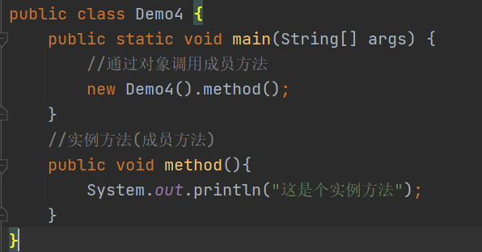
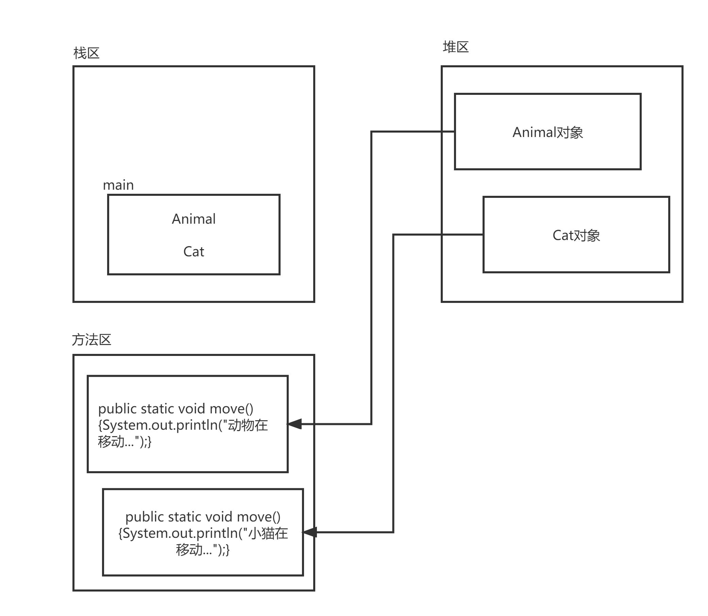
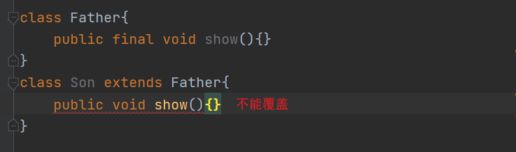
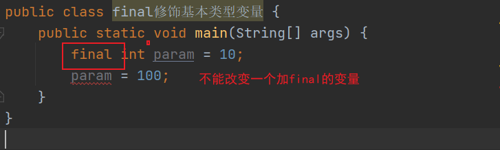
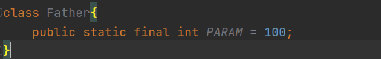
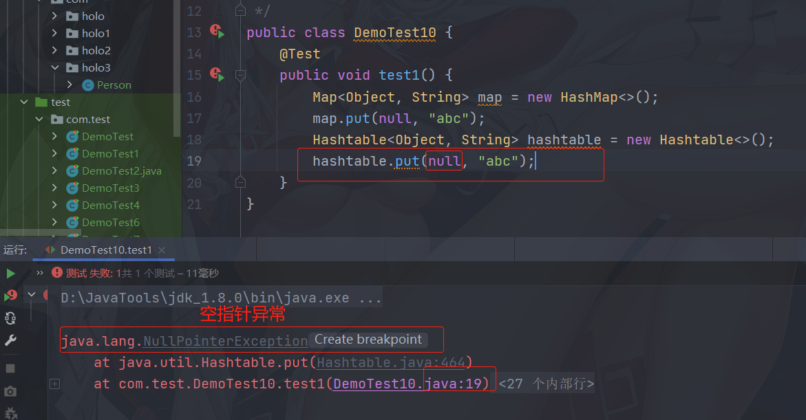
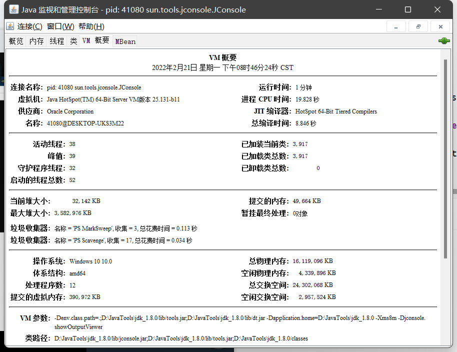
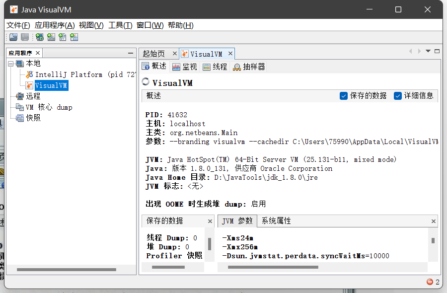
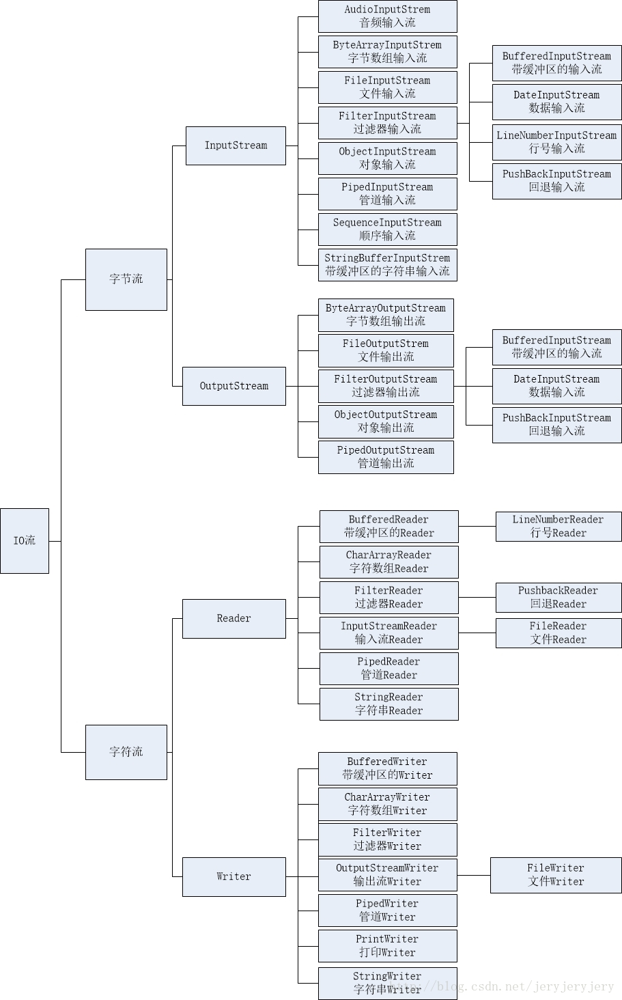
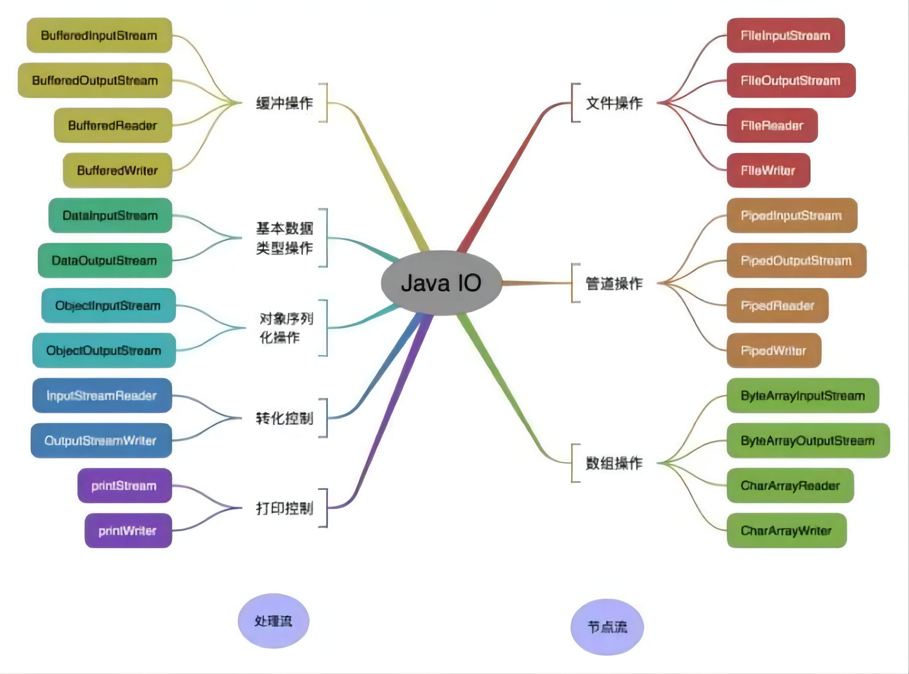

[点击Java大数据开发体系介绍导图](PDF/Day01_Java开发体系介绍.pdf)

[点击打开大数据介绍导图](PDF/Day01_大数据介绍.pdf)


# 1.1 计算机发展史

## 1.1.1语言分为3个阶段

机器语言->低级语言->高级语言

# 1.2 java的发展史


## 1.2.1 JavaSE、JavaEE、JavaME三者之间关系


## 1.2.2 java语言的特性

+ 简单性：相对于c++语言
+ 面向对象：纯面向对象语言
+ 可移植性：一次编译，到处执行
+ 健壮性：自动回收垃圾GC
+ 多线程
+ 安全性：开源

## 1.2.3 java的加载执行


# 1.3 第一个java程序

## 1.3.3 第一个程序HelloWorld.java

```java
// public 表示公有的
// class 类的关键字(java中的关键字都是小写的)
// HelloWorld表示类名称:注意：首字母必须大写(编码规范)
public class HelloWorld
{
	/*
		static 表示静态的
		void 表示方法没有返回值
		main 主方法名称
	 */
	public static void main(String[] args)
	{
		//输出消息，一句代码完成必须使用分号结束
	System.out.println("HelloWorld");
	}
}
```

## 1.3.4 java中的注释

1.单行注释 `//`
2.多行注释 `/*注释说明*/`
3.文档注释（doc） `/**注释说明*/`
**注意：单行和多行注释必须进入源代码后在可以看到**

## 1.3.5 面试题

+ 一个源文件可以编写多个类代码吗?
+ 答：可以。需要注意，public关键字只能出现一次


# 2.1纲要

+ 标识符
+ 关键字
+ 数据类型
+ 运算符
+ 控制语句
+ 方法的创建与使用
+ 递归问题

## 2.1.1标识符

+ 标识符：就是给类、方法、参数起名字

+ 1. java标识符的规则

  - 标识符：数字、字母、下划线、美元符号，其它的都不可以
  - 注意：数字不能做开头

  2. 关键字不能作为标识符名称使用

  3. 区分大小写
  4. 理论上没有长度限制

  案例：

  | 合格标识符 | 非法标识符             |
  | ---------- | ---------------------- |
  | _abc       | 3abc 数字不能开头      |
  | HelloWorld | hello-world 使用了-    |
  | public2    | public 关键字          |
  |            | hello world 使用了空格 |

  标识符命名时最好是“见名知意”，如果两个单词组成的单词，那么第二个单词的首字母必须大写，这种命名方式称为“驼峰式命名”

  ## 2.1.2 关键字

  + 注意：都是小写的

    | class           | extends   | implements | interface  | import         |
    | --------------- | --------- | ---------- | ---------- | -------------- |
    | package         | break     | case       | continue   | default        |
    | do              | if        | else       | for        | return         |
    | switch          | while     | false      | true       | null           |
    | boolean         | byte      | char       | short      | int            |
    | long            | float     | double     | try        | catch          |
    | throw           | throws    | finally    | abstact    | final          |
    | native          | private   | protected  | public     | static         |
    | synchronized    | transinet | volative   | instanceof | new            |
    | super           | void      | assert     | enum       | **goto保留字** |
    | **const保留字** |           |            |            |                |

    

    

# 2.2 数据类型

## 2.2.1 分为两类

+ 基本类型(8种)：
  - 数字类型
    + 整形：byte、short、int、long
    + 浮点：float、double
  - 字符类型：char
  - 布尔类型：boolean(true|false)
+ 引用类型(3种)
  - 类
  - 数组
  - 接口

## 2.2.2 八种数据类型的范围


+ 一个字节占8位，可以使用0补位，例如：0000 0001
+ 笔试题: i+1<1是否成立？
+ 答：成立，因为每种类型都有取值范围，**超出范围就会取反**

# 2.3 字符编码

| 字符编码           | 对应的编码方式                    |
| ------------------ | --------------------------------- |
| ISO-8859-1         | 也称为latin-1;主要用于西欧语言    |
| GB2312/GBK/GB18030 | 用户汉字的编码                    |
| Unicode            | 全球统一编码utf-8，utf-16，utf-32 |

utf-8是3个字节处理中文的，效率高，节省空间


乱码是因为中文正常占两个字节

# 2.4创建字符

```java
public class PrintChar
{
    public static void main(String[] args)
    {
        char param = "";
        System.out.print(param);
    }
}
```


### 2.4.1 IDE配置：-）

+ 调节字体
+ 创建包
+ **注意：创建包的原则是公司域名的倒写**

## 2.5变量

+ 变量就是java中一个最基本的单元；包括4个属性；
  - 变量的类型：基本类型或引用类型都可以
  - 变量的名称：符合标识符即可
  - 变量的值：如果是基本类型就是具体的值，如果是引用类型就是内存地址
  - 变量的存储单元：根据不同的类型决定在内存中开辟空间的大小(1Byte=8位) eg:0000 0000
+ 创建一个变量

```java
public class Demo{
    public static void main (String[] args){
        //创建了一个变量
        int i = 10;
    }
}
```

## 2.6数据类型

### 2.6.1整型

+ 分为：byte、short、int、long
+ 表示的方式：

  - 十进制：1，2，3，...
  - 八进制：以0开头：012
  - 十六进制：以0x开头：0x123
+ 在java中整型的默认类型就是int
+ 如果使用长整形：10L(大小写均可)

### 2.6.2 浮点

+ 浮点类型：单精度float；双精度：double
+ java中默认精度类型是double
+ 案例


+ 正确创建单精度

```java
public class Demo
{
    public static void main (String[] args)
    {
		//创建单精度，大小写均可
        float f = 2.0f;
        float f1 = 2.0F
    }
}
```

+ **笔试题：float和long谁大？**
  - 答：float大，因为，数字的大小是不按照字节数比较的

### 2.6.3布尔类型

+ boolean类型：true/false只能是这两个值，不能取其他的值
+ 案例：

### 2.6.4 基本类型的转换

+ java中基本类型可以转换，**但是**，**Boolean**类型比较特殊不能与其他类型转换；
+ 类型的转换分为：

  - 默认转换：小类型转大类型
  - 强制转换：大类型转小类型
+ 类型由小到大转换：

  - byte->short(char)->int->long->float->double
  - **注意：byte、short、char之间不会相互转换，首先转为int后再转换**
  - **注意：只要不超出范围，整型可以直接赋值给byte、short、char**
+ **总结：多种类型混合运算过程中，返回最大的类型**

案例1：

```java
public class Demo
{
    public static void main (String[] args)
    {
        //创建参数
        byte b = 100;
        //byte b1 = 1000;错误，超出范围
        //short b = 1000;错误，变量不能同名
        short s = 1000;//正确
        int i = 1000;//正确
        long l = i;//正确,因为int比long小，默认转换了
        //int i1 = l;错误，long比int大，超出范围了。精度丢失
        int i1 = (int)l; //正确，可以强制进行类型转换
        int i2 = 10/3; //正确，多种类型混合运算过程中，返回最大的类型
        long l1 = 10;
        //int f = l1/3;错误，返回的是long类型
        int i3 = (int)l1/3; //可以把long强制转为int类型
        //byte b1 = (byte)l1/3;错误，返回的是int类型
        byte b2 = (byte)(l1/3); //正确
    }
}
```

案例2：

```java
public class Demo
{
    public static void main (String[] args)
    {
        short s1 = 10;
        //short s2 = s1 + 1;错误,因为需要转为int后再运算
    }
}
```

案例3：

```java
public class Demo
{
    public static void main (String[] args)
    {
        char c1 = 'a';
        int i1 = c1 + 100;//正确char转为int以后在运算
        System.out.printlb(i1);
    }
}
```

## 2.7运算符


### 2.7.1 算数运算符

+ 案例1：++就是自身加一

```java
public class Demo
{
    public static void main (String[] args)
    {
        //创建变量
        int i = 10;
        i++ ; //自身加一
        System.out.println(i);
    }
}
```

+ 案例2：

```java
public class Demo
{
    public static void main (String[] args)
    {
        //创建变量
        int i = 10;
        //++在后表示先赋值，自身再加一
        int n = i++ ; 
        System.out.println(i);
        System.out.println(n)
    }
}
```

+ 案例3：

```java
public class Demo
{
    public static void main (String[] args)
    {
        //创建变量
        int i = 10;
        //++在前表示先加一在赋值
        int n = ++i ;
        System.out.println(i);
        System.out.println(n)
    }
}

```

+ 案例4：

```java
public class Demo
{
    public static void main (String[] args)
    {
        //创建变量
        int i = 10;
        //i++相当于i=i+1
        i = i+1;
        System.out.println(i);
    }
}
```

+ 案例5：


```java
public class Demo
{
    public static void main (String[] args)
    {
        //创建变量
        short i = 10;
        //正确，推荐使用 +=、-=、*=、/=，因为自动转为接收的类型
        i += 1;
        System.out.println(i);
    }
}
```

+ 案例6：

```java
public class Demo
{
    public static void main (String[] args)
    {
        //创建变量
        int i = 10;
        //正确，推荐使用 +=、-=、*=、/=，因为自动转为接收的类型
        i /= 3;
        System.out.println(i);
    }
}
```

+ 案例7：

```java
public class Demo
{
    public static void main (String[] args)
    {
        //创建变量
        int i = 10;
        int n = i % 3;//就是取余数
        System.out.println(n);
    }
}
```

使用场景：就是分页的使用


```java
public class Demo
{
    public static void main (String[] args)
    {
        //总记录数
        int total = 20;
        //每页显示9条
        int pageSize = 9;
        //总页码
        int pages = 1;
        if (total%pageSize==0)
        {
            pages = total/pageSize;
        }
        else
        {
            pages = total/pageSize+1;
        }
        System.out.printf("总页码:"+pages);
    }
}
```

### 2.7.2 关系运算符和布尔运算符

+ 与：两个操作数相与，如果都为true则返回true，否则返回false

+ 或：两个操作数相或，只要有一个为true则返回true

+ 非：取反

+ 异或：相异为true，就是两个操作数不同(一个true一个false)

+ **短路与&&** 和 **逻辑与&** 的区别？

  - **它们返回的结果是相同的，只是运算的过程不相同**
  - 短路与：如果左边为true那么计算右边，否则直接返回false
  - 逻辑与：无论左边是否为true都计算右边后再返回结果

+ **短路或||**和**逻辑或|**的区别？

  - 它们返回的结果是相同的，只是运算过程不同

+ 注意：短路与要求两侧必须是布尔类型，而逻辑与并不要求

+ 笔试题：4&7=？

  + 答：返回4，因为转为二进制后再运算；只有1遇到1返回1，其他都返回0

    4 0100

    7 0111

  ---->4 0100

```java
public class TestDemo {
    public static void main (String[] args) {
        //创建变量
        boolean op1 = 10>5;
        boolean op2 = 10<5;

        //输出
        System.out.println("op1 = " + op1);
        System.out.println("op2 = " + op2);

        //短路与，逻辑与
        System.out.println("op1&&op2 = " + (op1&&op2));
        System.out.println("op1&op2 = " + (op1&op2));

        //短路或，逻辑或
        System.out.println("op1||op2 = " + (op1||op2));
        System.out.println("op1|op2 = " + (op1|op2));

        //取反
        System.out.println("!op1 = " + !op1);

        //异或
        System.out.println("op1^op2 = " + (op1^op2));
        System.out.println("op^|op1 = " + (op1^op1));
    }
}
```

运行结果:

```java
op1 = true
op2 = false
op1&&op2 = false
op1&op2 = false
op1||op2 = true
op1|op2 = true
!op1 = false
op1^op2 = true
op^|op1 = false
```

### 2.7.3 条件运算符

+ 三元运算符

```java
public class TestDemo{
    public static void main(String[] args){
        //创建变量
        int i = 10;
        //三元运算符
        int n = i>30?1:-1;
        System.out.println(n);
      
        //三元运算符
        boolean bo = i%3==0?true:false;
        System.out.println(bo);
    }
}
```

运行结果:

```java
-1
false
```

## 2.8 控制语句

### 2.8.1 判断语句

#### 2.8.1.1 语法

+ if语句

```java
if (布尔类型) {
	一行或多行语句
}
如果只有一行语句，那么可以省略大括号

if (布尔类型)
    一行语句
```

+ if-else语句

```java
if (布尔类型) {
	一行或多行语句
}else{
    一行或多行语句
}
```

+ if-else if-else执行效率高，因为遇到一个true其他判断就被忽略不执行了

```java
if (布尔类型) {
	一行或多行语句
}else if{
    一行或多行语句
}else if{
	一行或多行语句
}else{
    一行或多行语句
}
```

#### 2.8.1.2 案例：只是用if，这种判断的效率低

```java
public class TestDemo{
    public static void main(String[] args){
        int age = 3;
        if(age>0&&age<=5){
            System.out.println("儿童");
        }

        if(age>5&&age<=10){
            System.out.println("小学生");
        }

        if(age>10&&age<=18){
            System.out.println("中学生");
        }
    }
}
```

#### 2.8.1.3 案例：使用if-else if -else效率高

```java
public class TestDemo{
    public static void main(String[] args){
        int age = 3;
        if(age>0&&age<=5){
            System.out.println("儿童");
        }else if(age>5&&age<=10){
            System.out.println("小学生");
        }else if(age>10&&age<=18){
            System.out.println("中学生");
        }else {
            System.out.println("大学生");
        }
    }
}
```

#### 2.8.1.4 案例：两个条件判断if-else

```java
public class TestDemo{
    public static void main(String[] args){
        int age = 3;
        if(3%2==0){
            System.out.println("偶数");
        }else{
            System.out.println("奇数");
        }
    }
}
```

### 2.8.2 switch分支语句

#### 2.8.2.1 格式

```java
switch(表达式){
    case 值:
        语句
    	break;
    case 值:
        语句
        break;
    default:
        语句
        break;
}
```

+ 表达式：byte、short、int、char、String
+ break：推荐使用；如果省略，那么从**符合条件的那一行**穿透
+ 如果所有条件都不满足执行default

```java
public class TestDemo{
    public static void main(String[] args){
        int key = 1;
        switch (key){
            case 0:
                System.out.println(0);
                break;
            case 1:
                System.out.println(1);
                break;
            case 2:
                System.out.println(2);
                break;
            case 3:
                System.out.println(3);
                break;
            default:
                System.out.println(-1);
                break;
        }
    }
}
```

运行结果：`1`

#### 2.8.2.2 不添加break那么从符合条件的那一行开始穿透

```java
public class TestDemo{
    public static void main(String[] args){
        int key = 1;
        switch (key){
            case 0:
                System.out.println(0);
            case 1:
                System.out.println(1);
            case 2:
                System.out.println(2);
            case 3:
                System.out.println(3);
            default:
                System.out.println(-1);
        }
    }
}
```

运行结果：

```java
1
2
3
-1
```

+ 笔试题

```java
public class TestDemo{
    public static void main(String[] args){
        int key = 1;
        int i = 10;
        switch (key){
            case 0:
                i++;
            case 1:
                i+=10;
            case 2:
                i--;
            case 3:
                i++;
        }
        System.out.println("i="+i);
    }
}
```

运行结果:`i=20`

+ 笔试题：输出-1，因为，default与位置无关

```java
public class TestDemo{
    public static void main(String[] args){
        int key = 10;
        switch (key){
            default:
                System.out.println(-1);
                break;
            case 0:
                System.out.println(0);
                break;
            case 1:
                System.out.println(1);
                break;
            case 2:
                System.out.println(2);
                break;
            case 3:
                System.out.println(3);
                break;
        }
    }
}
```

输出结果：`-1`

### 2.8.3 for循环

#### 2.8.3.1格式

```java
for (初始化;条件;步长){
    语句
} 
```

#### 2.8.3.2 案例

```java
public class TestDemo{
    public static void main(String[] args){
        for (int i=0;i<5;i++){
            System.out.println(i);                  
        }
    }
}
```

+ 笔试题：是否可以执行？答：可以执行，但是是个死循环

```java
public class TestDemo{
    public static void main(String[] args){
        for (;;){
            System.out.println("abc");
        }
    }
}
```

+ 循环的顺序

```java
public class TestDemo{
    public static void main(String[] args){
        for (int i=0;i<5;i++){
            System.out.println(i);
        }
    }
}
//等价于
public class TestDemo{
    public static void main(String[] args){
        int i=0;
        for (;i<5;){
            System.out.println(i);
            i++;
        }
    }
}
```

for循环流程图:


+ 笔试题：执行错误，因为，i变量属于for的语句块

```java
public class TestDemo{
    public static void main(String[] args) {
        for (int i = 0;; i < 5; i++) {
            i += 1;
        }
        System.out.println(i);
    }
}
```

+ 笔试题：正确

```java
public class TestDemo {
    public static void main(String[] args) {
        for (int i = 0; i < 5; i++) {
            System.out.println(i);
        }
    }
}
```

### 2.8.4 while循环

#### 2.8.4.1 格式

```java
while(布尔类型){
    语句;
    防止死循环;
}
```

```java
public class TestDemo {
    public static void main(String[] args) {
        int i = 0;
        while (i<5){
            System.out.println(i);
            i++;
        }
    }
}
```

### 2.8.5 do-while 循环

+ 特点：至少循环一次
+ 格式：

```java
public class TestDemo {
    public static void main(String[] args) {
        int i = 0;
        do {
            System.out.println(i);
            i++;
        }while(i<5); //必须注意结束使用分号
    }
}
```

+ 笔试题：输出 `5` `5`

```java
public class TestDemo {
    public static void main(String[] args) {
        int i = 10,n = 0;
        do {
            n++;
            i--;
        }while(n<5);
        System.out.println(i);
        System.out.println(n);
    }
}
```

### 2.8.6 跳出循环体

+ break :跳出当前循环体
+ continue：跳出本次循环
+ return：跳出所有循环体，因为方法弹栈

#### 2.8.6.1 break

```java
public class TestDemo {
    public static void main(String[] args) {
        for (int i = 0; i < 5; i++){
            if (i==2){
                break;
            }
            System.out.println(i);
        }
    }
}
```

运行结果：

```jav
0
1
```

+ 嵌套循环

```java
public class TestDemo {
    public static void main(String[] args) {
        for (int n = 0;n < 5; n++){
            for (int i = 0; i < 5; i++){
                if (i==2){
                    break;
                }
                System.out.println(i);
            }
                System.out.println("------外层------");
        }
    }
}
```

运行结果:

```java
0
1
------外层------
0
1
------外层------
0
1
------外层------
0
1
------外层------
0
1
------外层------
```

+ 跳出所有循环

```java
public class TestDemo {
    public static void main(String[] args) {
        //创建变量
        boolean flag = false;
        for (int n = 0;n < 5; n++){
            if (flag){
                break;
            }
            for (int i = 0; i < 5; i++){
                if (i==2){
                    flag = true;
                    break;
                }
                System.out.println(i);
            }
            System.out.println("------外层------");
        }
    }
}
```

运行结果：

```java
0
1
------外层------
```

#### 2.8.6.2 continue

```java
public class TestDemo {
    public static void main(String[] args) {
        for (int i = 0; i < 5; i++){
            if (i == 2){
                continue;
            }
            System.out.println(i);
        }
    }
}
```

运行结果:

```java
0
1
3
4
```

#### 2.8.6.3 return

```java
public class TestDemo {
    public static void main(String[] args) {
        for (int n = 0; n < 5; n++){
            for (int i = 0; i < 5; i++){
                if (i==2){
                    return;//方法弹栈
                }
                System.out.println(i);
            }
            System.out.println("------外层------");
        }
    }
}
```

运行结果:

```java
0
1
```

# 第三章 项目

## 3.1 需求

+ CRUD:添加；修改；删除；显示
+ 把数据存储在数组中
+ 存储的内容就是基本类型

## 3.2 数组

+ 特点：一组类型相同的数据
+ 数组的长度一旦确定就不能修改
+ 数组中的元素下标从零开始

### 3.2.1 数组案例

```java
 package com.holo.www;

public class TestDemo {
    public static void main(String[] args) {
        //创建数组
        int[] array = new int[3];
        //按照下标的位置添加即可
        array[0] = 100;
        array[1] = 200;

        //更新：就是替换下标位置的参数
        array[0] = 500;

        //删除：就是把制定位置的数据还原为默认值
        array[1] = 0;
    }
}
```

### 3.2.2 获取数组中的元素

```java
public class TestDemo {
    public static void main(String[] args) {
        int[] array = new int[3];
        array[0] = 100;
        array[1] = 200;
        array[2] = 300;
      
        //循环获取元素
        System.out.println("数组长度:"+ array.length);
      
        //获取元素 
        for (int index = 0;index< array.length;index++){
            System.out.println(array[index]);
        }
    }
  
}
```

### 3.2.3 接收控制台数据

```java
public class TestDemo {
    public static void main(String[] args) {
        //接收控制台的输入数据
        Scanner scanner = new Scanner(System.in);
        //提示信息
        System.out.println("请输入一个数字：");
        int i = scanner.nextInt();
        System.out.println("i"+i);
    }
}
```

## 3.3 完成项目功能--第一版

### 3.3.1 搭建开发环境

```java
public class TestDemo {
    public static void main(String[] args) {
        //创建控制台对象
        Scanner scanner = new Scanner(System.in);
        //创建一个数组，存储数据
        int[] array = new int[5];

        //为了跳出多分支创建一个布尔类型
        boolean flag = true;

        //提示信息
        System.out.println("1表示添加；2表示显示；3表示删除；4表示更改;5退出");
        //使用do-while
        do{
            //创建key
            int key = scanner.nextInt();
            switch (key) {
                case 1:
                    System.out.println("添加");
                    break;
                case 2:
                    System.out.println("显示");
                    break;
                case 3:
                    System.out.println("删除");
                    break;
                case 4:
                    System.out.println("更改");
                    break;
                case 5:
                    System.out.println("退出");
                    break;
            }
        }while (flag);
    }
}
```

### 3.3.2 功能实现

```java
public class TestDemo {
    public static void main(String[] args) {
        //创建控制台对象
        Scanner scanner = new Scanner(System.in);
        //创建一个数组，存储数据
        int[] array = new int[5];

        //为了跳出多分支创建一个布尔类型
        boolean flag = true;

        //提示信息
        System.out.println("1表示添加；2表示显示；3表示删除；4表示更改;5退出");
        //使用do-while
        do{
            //创建key
            int key = scanner.nextInt();
            switch (key) {
                case 1:
                    //通过循环获取一个空位置
                    for (int index = 0; index < array.length; index++){
                        if (array[index]==0){
                            //提示用户添加一个数据
                            System.out.println("请输入一个数字");
                            array[index] = scanner.nextInt();
                            System.out.println("添加成功");
                            //跳出循环体
                            break;
                        }
                    }
                    break;
                case 2:
                    for (int index = 0;index < array.length;index++){
                        int element = array[index];
                        if(element!=0){
                            System.out.println(element);
                        }
                    }
                    break;
                case 3:
                    //提示
                    System.out.println("请输入一个需要删除的数字");
                    int el = scanner.nextInt();
                    //循环查找
                    for (int index = 0;index < array.length; index++){
                        if (array[index] == el){
                            array[index] = 0;
                            System.out.println("删除成功");
                            //跳出循环体
                            break;
                        }
                    }
                    break;
                case 4:
                    //提示
                    System.out.println("请输入一个需要删除的数字");
                    int el1 = scanner.nextInt();
                    //循环查找
                    for (int index = 0; index < array.length;index++){
                        if (array[index]==el1){
                            System.out.println("请输入一个新的数字");
                            array[index]=scanner.nextInt();
                            System.out.println("更新成功");
                            //跳出循环体
                            break;
                        }
                    }
                    break;
                case 5:
                    flag = false;
                    break;
            }
        }while (flag);
    }
}
```

## 3.4 第二版 优化

```java
package com.holo;

import java.util.Arrays;
import java.util.Scanner;

public class TestDemo2 {
    public static void main(String[] args) {
        //创建控制台对象
        Scanner scanner = new Scanner(System.in);
        //创建一个数组，存储数据
        int[] array = new int[3];

        //为了跳出多分支创建一个布尔类型
        boolean flag = true;

        //提示信息
        System.out.println("1表示添加；2表示显示；3表示删除；4表示更改;5退出");
        //使用do-while
        do{
            //创建key
            int key = scanner.nextInt();
            switch (key) {
                case 1:
                    //创建一个变量：判断是否满了
                    boolean full = true;
                    //通过循环获取一个空位置
                    for (int index = 0; index < array.length; index++){
                        if (array[index]==0){
                            full = false;
                            //提示用户添加一个数据
                            System.out.println("请输入一个数字");
                            array[index] = scanner.nextInt();
                            System.out.println("添加成功");
                            //跳出循环体
                            break;
                        }
                    }
                    if (full){
                        System.out.println("已经加满了");
                    }
                    break;
                case 2:
                    for (int index = 0;index < array.length;index++){
                        int element = array[index];
                        if(element!=0){
                            System.out.println(element);
                        }
                    }
                    break;
                case 3:
                    //提示
                    System.out.println("请输入一个需要删除的数字");
                    int el = scanner.nextInt();
                    boolean f = true;
                    //循环查找
                    for (int index = 0;index < array.length; index++){
                        if (array[index] == el){
                            f = false;
                            array[index] = 0;
                            System.out.println("删除成功");
                            //跳出循环体
                            break;
                        }
                    }
                    if (f){
                        System.out.println("查无此数据，请重新输入");
                    }
                    break;
                case 4:
                    //提示
                    System.out.println("请输入一个需要删除的数字");
                    int el1 = scanner.nextInt();
                    boolean ff = true;
                    //循环查找
                    for (int index = 0; index < array.length;index++){
                        if (array[index]==el1){
                            ff = false;
                            System.out.println("请输入一个新的数字");
                            array[index]=scanner.nextInt();
                            System.out.println("更新成功");
                            //跳出循环体
                            break;
                        }
                    }
                    if (ff) {
                        System.out.println("查无此数据，请重新输入");
                    }
                    break;
                case 5:
                    flag = false;
                    break;
            }
        }while (flag);
    }
}
```

# 第四章 面向对象

## 4.1 方法

+ 方法：就是一种功能的体现。方法上可以复用的
+ 格式：

```java
方法的修饰符 返回类型 方法名称(参数){
	方法体
}
```

+ 方法的修饰符：public、private、protected、abstract、static、final
+ 返回类型：如果方法没有返回值那么使用void修饰，如果有返回类型那么方法的返回值必须是这种类型
+ 方法的名称：必须小写，符合标识符即可
+ 方法的参数：可以没有或者多个，使用多个逗号分隔符
+ 案例:

```java
package com.holo;

public class Demo {
    public static void main(String[] args) {
        method();
    }
    //自定义的一个方法
    public static void method() {
        System.out.println("这是一个没有返回和参数的方法");
    }
}
```

+ 含一个参数的方法

```java
package com.holo;

public class Demo1 {
    public static void main(String[] args) {
        method(1);
    }
    //自定义的一个方法
    public static void method(int key) {
        switch (key){
            case 1:
                System.out.println("执行了第一个语句");
            break;
            case 2:
                System.out.println("执行了第二个语句");
                break;
            default:
                System.out.println("执行了其他语句");
                break;
        }
    }
}
```

+ 含两个参数的方法

```java
package com.holo;

public class Demo2 {
    public static void main(String[] args) {
        method(1, 2);
    }

    public static void method(int i,int n) {
        System.out.println(i + n);
    }
}
```

+ 含有返回值的方法

```java
package com.holo;

public class Demo3 {
    public static void main(String[] args) {
        int sum = method(1, 2);
        System.out.println(sum);
    }

    public static int method(int i,int n) {
        return i+n;
    }
}
```

```java
运行结果: 3
```

## 4.2 方法的重载

### 4.2.1 重载的条件：

+ 在**同一个类**中，方法的**名称**是相同的，方法的**参数的类型**、**个数**、**顺序**有一个不同**即可，与方法的**返回类型**没有关系

### 4.2.2 案例

```java
public class Demo4 {
    public static void main(String[] args) {
        int methodInt = methodInt(1,2);
    }

    //因为没有重载，所以增加了记忆方法的困难
    public static int methodInt(int i, int n) {
        return i+n;
    }
    public static long methodInt(long i, int n) {
        return i+n;
    }
    public static double methodInt(double i, int n) {
        return i+n;
    }
}
```

### 4.2.3 使用了重载，减少记忆

```java
public class Demo5 {
    public static void main(String[] args) {
    sum(1.0,2);
}

    //因为没有重载，所以增加了记忆方法的困难
    public static int sum(int i, int n) {
        return i+n;
    }
    public static long sum(long i, int n) {
        return i+n;
    }
    public static double sum(double i, int n) {
        return i+n;
    }
}
```

### 4.2.4 重载的条件

+ 参数的**类型**不能相同


+ 参数的**个数**不能相同


+ 参数的**顺序**不能相同


## 4.3 递归

### 4.3.1 案例：求5以内的和

```java
public class Demo6 {
    public static void main(String[] args) {
        int sum = 0;
        for (int i = 0; i < 6; i++){
            sum += 1;
        }
        System.out.println(sum);
    }
}
```

### 4.3.2 案例：使用递归

+ 自身的调用：就是自己调用自己

```java
public class Demo7 {
    public static void main(String[] args) {
        int sum = rec(5);
        System.out.println(sum);
    }
    public static int rec(int i){
        if (i==1)
            return 1;
        return i+rec(i-1);
    }
}
```

运行结果：`15`

+ n的阶乘

```java
public static int rec(int n){
    if (n==1)
        return 1;
    return n+rec(n-1);
}
```

## 4.4 使用方法完成项目

### 4.4.1 第一版

```java
package com.holo;

import java.util.Scanner;

/**
 * @author Holo
 * @date 2022/1/11 15:10
 */
public class Demo9 {
    public static void main(String[] args) {
        //控制台对象
        Scanner scanner = new Scanner(System.in);
        //跳出循环体的标识
        boolean flag = true;
        //提示信息
        System.out.println("1.添加；2.显示；3.删除;4.更新;5.退出");
        //循环
        do {
            int key = scanner.nextInt();
            switch (key) {
                case 1:
                    System.out.println("请输入一个数字");
                    save(scanner.nextInt());
                    break;
                case 2:
                    findAll();
                    break;
                case 3:
                    System.out.println("请输入一个要删除的数字");
                    delete(scanner.nextInt());
                    break;
                case 4:
                    System.out.println("请输入需要更新的数字");
                    int i = scanner.nextInt();
                    System.out.println("请输入需要更新的新数字");
                    int n = scanner.nextInt();
                    update(i, n);
                    break;
            }
        } while (flag);

    }

    //创建数组
    static int[] array = new int[3];

    //获取数据下标
    public static int findByIndex(int element) {
        //通过判断element的值决定查找空位置还是对应元素的下标
        for (int index = 0; index < array.length; index++) {
            if (element == 0) {//获取空位置
                if (array[index] == 0) {
                    return index;
                }
            } else {//查询对应元素的下标
                if (array[index] == element) {
                    return index;
                }
            }
        }
        return -1;
    }

    //添加数据
    public static void save(int el) {
        //获取一个保存元素的空位置
        int index = findByIndex(0);
        //判断下标
        if (index != -1) {
            array[index] = el;
            System.out.println("操作成功");
        } else {
            System.out.println("满了");
        }
    }

    //显示数据
    public static void findAll() {
        for (int index = 0; index < array.length; index++) {
            int i = array[index];
            if (i != 0) {
                System.out.println(i);
            }
        }
    }

    //删除数据
    public static void delete(int el) {
        //根据元素获取下标
        int index = findByIndex(el);
        //判断
        if (index != -1) {
            array[index] = 0;
            System.out.println("操作成功");
        } else {
            System.out.println("查无此数据，请重新输入");
        }
    }

    //更新数据
    public static void update(int el, int taget) {
        //根据元素获取下标
        int index = findByIndex(el);
        //判断
        if (index != -1) {
            array[index] = taget;
            System.out.println("操作成功");
        } else {
            System.out.println("查无此数据，请重新输入");
        }
    }
}
```

### 4.4.2第二版

```java
package com.holo;

import java.util.Scanner;

public class Demo10 {
    public static void main(String[] args) {
        //控制台对象
        Scanner scanner = new Scanner(System.in);
        //跳出循环体的标识
        boolean flag = true;
        //提示信息
        System.out.println("1.添加；2.显示；3.删除;4.更新;5.退出");
        //循环
        do {
            int key = scanner.nextInt();
            switch (key) {
                case 1:
                    save(scanner);
                    break;
                case 2:
                    findAll();
                    break;
                case 3:
                    delete(scanner);
                    break;
                case 4:
                    update(scanner);
                    break;
            }
        } while (flag);
    }

    //创建数组
    static int[] array = new int[3];

    //获取数据下标:这是一个公共方法
    public static int findByIndex(int element) {
        //通过判断element的值决定查找空位置还是对应元素的下标
        for (int index = 0; index < array.length; index++) {
            if (element == 0) {//获取空位置
                if (array[index] == 0) {
                    return index;
                }
            } else {//查询对应元素的下标
                if (array[index] == element) {
                    return index;
                }
            }
        }
        return -1;
    }

    //添加数据
    public static void save(Scanner scanner) {
        //获取一个保存元素的空位置
        int index = findByIndex(0);
        if (index != -1) {
            System.out.println("请输入一个数字");
            array[index] = scanner.nextInt();
            System.out.println("操作成功");
        } else {
            System.out.println("满了");
        }
    }

    //显示数据
    public static void findAll() {
        for (int index = 0; index < array.length; index++) {
            int i = array[index];
            if (i != 0) {
                System.out.println(i);
            }
        }
    }

    //删除数据
    public static void delete(Scanner scanner) {
        System.out.println("请输入一个需要删除的数字");
        //根据元素获取下标
        int index = findByIndex(scanner.nextInt());
        //判断
        if (index != -1) {
            array[index] = 0;
            System.out.println("操作成功");
        } else {
            System.out.println("查无此数据，请重新输入");
        }
    }

    //更新数据
    public static void update(Scanner scanner) {
        System.out.println("请输入需要更新的数字");
        //根据元素获取下标
        int index = findByIndex(scanner.nextInt());
        //判断
        if (index != -1) {
            System.out.println("请输入需要更新的新数字");
            array[index] = scanner.nextInt();
            System.out.println("操作成功");
        } else {
            System.out.println("查无此数据，请重新输入");
        }
    }
}
```

## 4.5 面向过程与面向对象区别

+ c语言就是面向过程语言
+ 面向过程的特点：必须了解整个过程，每个步骤的因果关系。
+ 面向对象：将现实世界分为不同的对象，把各个对象协作起来就可以了。
  + 就是面对一个真实存在的
  + 面向对象的特性：实质就是面向抽象
    + 抽象：具有这一类事物的特征和特性
    + 面向对象符合人的思维

### 4.5.1 面向对象的特性

+ 封装
+ 继承
+ 多态

### 4.5.2 类与对象的概念

+ 类：对具有共性事物的抽象描述
  + 例如：学生类：学号、姓名、性别、年龄、班级
+ 对象（实例）：就是对类的具体化、实例化
  + 例如：学生对象：04982003031、朱少楷、男、20、三班


+ 以上的类图中都是属性，进一步细化


+ **结论：属性源自于一种状态，方法源自于一个功能(动作)**
  + 类=属性+方法
  + 类=成员+功能

### 4.5.3 类的定义

#### 4.5.3.1 类的格式：

```java
类的修饰符 class 类的名称 extends 父类名称 implements 接口名称{
    类体:属性+方法
}
```

+ 案例:

```java
public class Student {
    //学号
    int id;
    //姓名
    String name;
    //性别
    String sex;
    //地址
    String address;
    //年龄
    int age;  
}
```

+ 以上都是属性，也成为成员变量
+ 成员变量会默认初始化
+ **注意**：局部变量不能默认初始化，必须初始化

### 4.5.4 对象的创建和使用

+ 使用new关键字创建对象，才可以使用

```java
public class Demo0 {
    public static void main(String[] args) {
        //创建对象,把堆内存中的这个对象的内存地址赋值给参数student
        Student student = new Student();
        System.out.println("内存地址："+student);
    }
}
```

+ 属性默认值


+ 创建流程图


+ 具体的默认值

| 类型     | 默认值 |
| -------- | ------ |
| byte     | 0      |
| short    | 0      |
| int      | 0      |
| long     | 0      |
| float    | 0.0    |
| double   | 0.0    |
| boolean  | false  |
| char     | ''     |
| 引用类型 | null   |


#### 4.5.4.1 可以对成员变量进行赋值

+ 就是把默认值替换了


+ 一个类可以创建n个对象，并且每个对象的成员只属于当前对象
+ 只有通过对象才可以修改或者访问这个对象的成员(属性)

## 4.6 封装性

+ 属性私有化，细节被隐藏掉，安全性提高了
+ private关键字作用就是把属性保护起来了
  + 在本类中可以访问
  + 就只能自己使用
  + 就是为了安全，外界无法访问

### 4.6.1添加一个方法完成对成员(属性)的操作

+ 添加方法(功能)的目的，就是在使用的时候可以添加各种限制(条件，添加判断);
+ 方法就是对成员变量进行操纵的

案例：

```java
public class Demo {
	public static void main(String[] args) {
		Student student = new Student();
		// 通过方法把外面的数据添加到对象的成员上
		student.setAge(20);
		// 通过方法吧成员的数据获取
		int age = student.getAge();
		System.out.println(age);
	}
}

class Student {
	// 学号
	private int id;
	// 姓名
	private String name;
	// 性别
	private String sex;
	// 地址
	private String address;
	// 年龄
	private int age;

	// 添加年龄
	public void setAge(int nl) {
		// 判断
		if (nl > 0 && nl <= 300) {
			age = nl;
		} else {
			System.out.println("请添加范围内的数字");
		}
	}

	// 获取年龄
	public int getAge() {
		return age;
	}
}
```

**通过上面的案例，避免了直接操作对象的属性，这就是封账：让外界对类的内部知道的越少越好**;

**结论：封装属性，暴露方法**

## 4.7 构造方法(构造器、构造函数)

+ 构造方法就是创建对象

### 4.7.1 格式

+ 构造方法的修饰符：private public protected
+ 构造方法和普通方法一样都可以进行重载
+ 构造方法特点：
  + 与类同名
  + 构造方法不能有任何返回类型，既没有返回值，关键字void也不能加；如果添加了void那么就不是构造方法了，而是普通方法
  + 任何类都有构造方法，如果没有显式的编写，在创建对象是，系统会分配一个默认的无参数构造方法；如果显式的定义了构造方法，系统就不会创建默认的无参数构造方法了。

### 4.7.2 案例：无参构造方法

```java
public class Demo1 {

	public static void main(String[] args) {
		Student student = new Student();

	}

}
class Student{
	//系统默认分配了一个无参数的构造方法
}
```

```java
public class Demo1 {
	public static void main(String[] args) {
		Student student = new Student();
	}
}
class Student{
	//无参数构造方法
	public Student() {
		System.out.println("无参数构造方法");
	}
}
```

+ 添加void那么就变为普通方法

```java
class Student{
	//无参数构造方法
	public void Student() {
		System.out.println("无参数构造方法");
	}
}
```

### 4.7.3 显式编写构造方法

+ 创建对象时，系统不会在分配默认的构造方法

```java
public class Demo1 {
	public static void main(String[] args) {
		Student student = new Student();
	}
}

class Student {
	public Student() {
		System.out.println("无参数构造方法");
	}

	public Student(int i) {
		System.out.println("有参数构造方法");
	}
}
```

### 4.7.4 含参数构造方法可以直接对成员初始化

```java
public class Student {
    private int id;
    private String name;
    private String sex;
    public Student(int i,String username,String xb){
        id = i;
        name = username;
        sex = xb;
    }
}
```

+ 初始化

```java
public class Demo {
    public static void main(String[] args) {
        new Student(1001,"张三","男");
    }
}
```

+ 有参构造方法


## 4.8 对象的引用

### 4.8.1 java内存的主要划分


### 4.8.2 内存的表示

+ 主方法main压入栈，就创建一个student对象

```java
public class Demo2 {
	public static void main(String[] args) {
		Student student = new Student(1001, "张三", "男");
	}
}
```


+ 对student这个对象中的成员赋值

```java
public class Demo2 {
	public static void main(String[] args) {
		Student student = new Student(1001, "张三", "男");
	}
}

class Student {
	private int id;
	private String name;
	private String sex;
	public Student(int i, String username, String xb) {
		id = i;
		name = username;
		sex = xb;
	}
}
```


### 4.8.3 当不使用new关键字时，出现问题


### 4.8.4 this关键字

+ this表示当前对象
+ 如果堆中有n个对象，会有n个this指向对应的对象

### 4.9.1 局部变量

+ 当局部变量与成员变量名称相同时，可以使用this加以区分，因为就近原则

```java
public class Demo2 {
	public static void main(String[] args) {
		//通过构造函数构造对象
		Student student = new Student();
		student.setName("张三");
		System.out.println();
	}
}

class Student {
	// 姓名
	private String name;

	public void setName(String name) {
		// 就把name参数的数值赋值给当前成员的成员变量了
		this.name = name;
	}
}
```

+ 自动生成setter和getter方法


### 4.9.2 可以调用其他的构造方法

+ 注意：调用构造函数是必须在首行

#### 4.9.2.1 这样调用构造方法是错误的，因为，创建了垃圾对象

```java
package com.holo;
public class Demo {
    public static void main(String[] args) {
        Student student = new Student();
    }
}
class Student {
    public Student() {
        System.out.println("无参数");
        //这样调用构造方法是错误的，因为，创建了垃圾对象
        new Student(1);
    }
    public Student(int i) {
        System.out.println("1参数");
    }
    public Student(int i,int n) {
        System.out.println("2参数");
    }
}
```

#### 4.9.2.2 这样调用时正确的

```java
public class Demo {
    public static void main(String[] args) {
        Student student = new Student();
    }
}
class Student {
    public Student() {
        this(10);
        System.out.println("无参数");
    }
    public Student(int i) {
        this(10,20);
        System.out.println("1参数");
    }
    public Student(int i,int n) {
        System.out.println("2参数");
    }
}
```

### 4.9.3 this可以调用其他成员方法

```java
public class Demo {
    public static void main(String[] args) {
        Student student = new Student();
        student.show();
    }
}

class Student {
    public void show() {
        System.out.println("show-method");
        this.save();
    }

    public void save() {
        System.out.println("save-method");
    }
}
```

+ 调用成员方法也可以不适用this关键字(**推荐**)

```java
class Student {
    public void show() {
        System.out.println("show-method");
        save();
    }

    public void save() {
        System.out.println("save-method");
    }
}
```

### 4.9.4 JavaBean

+ bean就是一种**特殊**的类
+ 含有setter和getter方法
+ 可以看做一个数据的载体

```java
public class Student{
    private int id;
    private String name;
    private String sex;
    private int age;

    public int getId() {
        return id;
    }

    public void setId(int id) {
        this.id = id;
    }

    public String getName() {
        return name;
    }

    public void setName(String name) {
        this.name = name;
    }

    public String getSex() {
        return sex;
    }

    public void setSex(String sex) {
        this.sex = sex;
    }

    public int getAge() {
        return age;
    }

    public void setAge(int age) {
        this.age = age;
    }
}
```

## 4.9 项目-优化

### 4.9.1 需求:

+ 对学生信息完成CRUD
+ 使用数组存储学生信息(学生对象)

### 4.9.2 技术

+ javase+数组+循环
+ 技术分析：
  + 创建一个可以存放学生类型的数组
  + 创建保存学生的方法save()
  + 显示学生的方法:findAll()
  + 删除学生的方法:delete()
  + 更新学生的方法：
    + 查询到需要更新的学生:findById()
    + 更新学生的信息:update()只更新姓名
  + 根据学生的**学号**查找在数组中这个学生对应的下标:findByIndex()

### 4.9.3 编码实现

```java
package com.holo;

import java.util.Scanner;

public class Demo {
    //创建一个学生数组
    static Student[] array = new Student[3];

    /**
     * TODO 按照学号查找对应学号的下标,如果sid=0表示需要找空位置完成添加
     *
     * @param sid 表示学号
     * @return 下标
     */

    public static int findByIndex(int sid) {
        for (int index = 0; index < array.length; index++) {
            //根据下标获取对应的学生对象
            Student student = array[index];
            //判断是否存在
            if (sid == 0) {
                if (student == null) return index;
            } else {
                if (student != null && student.getId() == sid) return index;
            }
        }
        return -1;
    }

    /**
     * TODO 保存学生信息
     *
     * @param student 学生对象(地址)
     */
    public static void save(Student student) {
        //获取一个空位置
        if (student != null) {
            int index = findByIndex(0);
            if (index != -1) {
                array[index] = student;
                System.out.println("保存成功");
            } else {
                System.out.println("满了");
            }

        } else {
            System.out.println("请添加学生信息");
        }

    }

    /**
     * TODO 显示学生信息
     */
    public static void findAll() {
        //遍历数组中学生的信息
        for (int index = 0; index < array.length; index++) {
            //获取学生对象
            Student student = array[index];
            if (student != null) {
                System.out.println(
                        "学号：" + student.getId() + "\t" +
                                "姓名：" + student.getName() + "\t" +
                                "性别：" + student.getSex() + "\t" +
                                "年龄：" + student.getAge() + "\t");
            }
        }
    }

    /**
     * TODO 删除学生
     *
     * @param sid 学号
     */
    public static void delete(int sid) {
        //获取学生在数组中的位置
        int index = findByIndex(sid);
        //判断
        if (index != -1) {
            array[index] = null;
            System.out.println("操作成功");
        } else {
            System.out.println("查无此学生，请重新输入");
        }
    }

    public static void update(int sid, String name) {
        //按照学号查找对应的下标
        int index = findByIndex(sid);
        //判断
        if (index != -1) {
            //获取这个学生
            Student student = array[index];
            //修改姓名
            student.setName(name);
            System.out.println("操作成功");
        } else {
            System.out.println("查无此学生，请重新输入");
        }
    }

    /**
     * TODO 测试方法
     *
     * @param args
     */
    public static void main(String[] args) {
        //控制台对象
        Scanner scanner = new Scanner(System.in);
        //跳出循环体
        boolean flag = true;
        //提示
        System.out.println("1添加；2显示；3删除；4更新；5退出");
        //循环
        do {
            //key
            int key = scanner.nextInt();
            switch (key) {
                case 1://调用方法
                    Student student = new Student();
                    //提示信息
                    System.out.println("请输入学号:");
                    student.setId(scanner.nextInt());
                    System.out.println("请输入姓名");
                    student.setName(scanner.next());
                    System.out.println("请输入性别");
                    student.setSex(scanner.next());
                    System.out.println("请输入年龄");
                    student.setAge(scanner.nextInt());
                    save(student);
                    break;
                case 2://调用方法
                    findAll();
                    break;
                case 3://调用方法
                    System.out.println("请输入学号");
                    delete(scanner.nextInt());
                    break;
                case 4:
                    System.out.println("请输入学号");
                    int sid = scanner.nextInt();
                    System.out.println("请输入姓名");
                    String name = scanner.next();
                    //更新
                    update(sid, name);
                    break;
                case 5:
                    flag = false;
                    break;


            }
        } while (flag);
    }
}

class Student {
    private int id;//学号
    private String name;//学生姓名
    private String sex;//学生性别
    private int age;//学生年龄

    public int getId() {
        return id;
    }

    public void setId(int id) {
        this.id = id;
    }

    public String getName() {
        return name;
    }

    public void setName(String name) {
        this.name = name;
    }

    public String getSex() {
        return sex;
    }

    public void setSex(String sex) {
        this.sex = sex;
    }

    public int getAge() {
        return age;
    }

    public void setAge(int age) {
        this.age = age;
    }
}
```

### 4.9.4 编码实现-优化版

#### 4.9.4.1 扩展

+ 返回字符串

```java
package com.holo;

import java.util.UUID;

public class Demo1 {
    public static void main(String[] args) {
        String str = UUID.randomUUID().toString();
        System.out.println(str);

    }
}
```

+ 返回long

```java
package com.holo;

import java.util.UUID;
import java.util.zip.CRC32;

public class Demo1 {
    public static void main(String[] args) {
        String str = UUID.randomUUID().toString();
        CRC32 crc32 = new CRC32();
        crc32.update(str.getBytes());
        //获取
        long value = crc32.getValue();
        System.out.println(value);

    }
}
```

```java
package com.holo;

import java.util.Scanner;
import java.util.UUID;
import java.util.zip.CRC32;

public class Demo {
    //创建一个学生数组
    static Student[] array = new Student[3];

    /**
     * TODO 按照学号查找对应学号的下标,如果sid=0表示需要找空位置完成添加
     *
     * @param sid 表示学号
     * @return 下标
     */

    public static int findByIndex(int sid) {
        for (int index = 0; index < array.length; index++) {
            //根据下标获取对应的学生对象
            Student student = array[index];
            //判断是否存在
            if (sid == 0) {
                if (student == null) return index;
            } else {
                if (student != null && student.getId() == sid) return index;
            }
        }
        return -1;
    }

    /**
     * TODO 保存学生信息
     *
     * @param student 学生对象(地址)
     */
    public static void save(Student student) {
        //获取一个空位置
        if (student != null) {
            int index = findByIndex(0);
            if (index != -1) {
                array[index] = student;
                System.out.println("保存成功");
            } else {
                System.out.println("满了");
            }

        } else {
            System.out.println("请添加学生信息");
        }

    }

    /**
     * TODO 显示学生信息
     */
    public static void findAll() {
        //遍历数组中学生的信息
        for (int index = 0; index < array.length; index++) {
            //获取学生对象
            Student student = array[index];
            if (student != null) {
                System.out.println(
                        "学号：" + student.getId() + "\t" +
                                "姓名：" + student.getName() + "\t" +
                                "性别：" + student.getSex() + "\t" +
                                "年龄：" + student.getAge() + "\t");
            }
        }
    }

    /**
     * TODO 删除学生
     *
     * @param sid 学号
     */
    public static void delete(int sid) {
        //获取学生在数组中的位置
        int index = findByIndex(sid);
        //判断
        if (index != -1) {
            array[index] = null;
            System.out.println("操作成功");
        } else {
            System.out.println("查无此学生，请重新输入");
        }
    }

    public static void update(int sid, String name) {
        //按照学号查找对应的下标
        int index = findByIndex(sid);
        //判断
        if (index != -1) {
            //获取这个学生
            Student student = array[index];
            //修改姓名
            student.setName(name);
            System.out.println("操作成功");
        } else {
            System.out.println("查无此学生，请重新输入");
        }
    }

    public static long getValue(){
        //不重复
        String str = UUID.randomUUID().toString();
        CRC32 crc32 = new CRC32();
        crc32.update(str.getBytes());
        //获取
        long value = crc32.getValue();
        return value;
    }
    /**
     * TODO 测试方法
     *
     * @param args
     */
    public static void main(String[] args) {
        //控制台对象
        Scanner scanner = new Scanner(System.in);
        //跳出循环体
        boolean flag = true;
        //提示
        System.out.println("1添加；2显示；3删除；4更新；5退出");
        //循环
        do {
            //key
            int key = scanner.nextInt();
            switch (key) {
                case 1://调用方法
                    Student student = new Student();
                    //提示信息
                    student.setId((int)getValue());
                    System.out.println("请输入学号:");
                    student.setId(scanner.nextInt());
                    System.out.println("请输入姓名");
                    student.setName(scanner.next());
                    System.out.println("请输入性别");
                    student.setSex(scanner.next());
                    System.out.println("请输入年龄");
                    student.setAge(scanner.nextInt());
                    save(student);
                    break;
                case 2://调用方法
                    findAll();
                    break;
                case 3://调用方法
                    System.out.println("请输入学号");
                    delete(scanner.nextInt());
                    break;
                case 4:
                    System.out.println("请输入学号");
                    int sid = scanner.nextInt();
                    System.out.println("请输入姓名");
                    String name = scanner.next();
                    //更新
                    update(sid, name);
                    break;
                case 5:
                    flag = false;
                    break;


            }
        } while (flag);
    }
}

class Student {
    private int id;//学号
    private String name;//学生姓名
    private String sex;//学生性别
    private int age;//学生年龄

    public int getId() {
        return id;
    }

    public void setId(int id) {
        this.id = id;
    }

    public String getName() {
        return name;
    }

    public void setName(String name) {
        this.name = name;
    }

    public String getSex() {
        return sex;
    }

    public void setSex(String sex) {
        this.sex = sex;
    }

    public int getAge() {
        return age;
    }

    public void setAge(int age) {
        this.age = age;
    }
}
```

## 5.1 静态关键字 static

### 5.1.1 修饰

+ 可以修饰变量、方法、代码块
+ 特点：
  + 使用static修饰的**类**可以直接加载执行，所以，static修饰的变量也称为**类变量**
  + static修饰的代码块称为静态代码块，JVM加载类的时候，会执行静态代码块中的内容


### 5.1.2 采用静态变量实现累加器

+ 没有采用静态变量，而是成员变量，所以不会实现累加器的效果，**因为**，成员变量属于当前对象，不会被共享

```java
package com.holo;

public class Demo {
    public static void main(String[] args) {
        //创建对象
        Student student1 = new Student();
        Student student2 = new Student();
        //获取成员变量
        System.out.println(student1.getCount());
        System.out.println(student2.getCount());
    }
}

class Student{
    //创建成员变量(属性)
    private int count;

    //创建构造方法
    public Student(){
        count++;
    }

    //获取属性

    public int getCount() {
        return count;
    }
}
```

运行结果:

```java
1
1
```


+ 采用静态变量完成累加器的功能

```java
package com.holo;

public class Demo1 {
    public static void main(String[] args) {
        //创建对象
        Student student1 = new Student();
        Student student2 = new Student();
        //获取成员变量
        System.out.println(student1.getCount());
        System.out.println(student2.getCount());
    }
}

class Student{
    //静态变量
    private static int count;

    //创建构造方法
    public Student(){
        count++;
    }

    //获取属性

    public int getCount() {
        return count;
    }
}
```

运行结果:

```java
2
2
```


+ static 声明的变量通过该类new出的对象，都可以“共享”
+ 类也可以直接访问，所以，我们称为“类变量”
+ 类直接调用

```java
package com.holo;

public class Demo2 {
    public static void main(String[] args) {
        System.out.println(Student.count);
    }
}

class Student{
    //静态变量
   public static int count;
}
```

运行结果: `0`

### 5.1.3 笔试题

#### 5.1.3.1 静态方法中是否可以访问实例变量、实例方法或this关键字？

答: 不能，因为**静态修饰**的在**类加载器**就初始化了，而对象这时候还不存在。


+ 我们可以改善下代码

  + 把方法改为static修饰

    

  + 使用对象调用

    

  + 不能在静态中直接使用this

    

#### 5.1.3.2 静态方法的初始化顺序

+ 就是按照static修改的顺序执行

```java
public class Demo6 {
    static {
        System.out.println(1);
    }

    static {
        System.out.println(2);
    }

    static {
        System.out.println(3);
    }
   public static void main(String[] args) {
        System.out.println(4);
    }
}
```

输出：

```java
1
2
3
4
```

```java
public class Demo6 {
    public static void main(String[] args) {
        System.out.println(4);
    }
    static {
        System.out.println(1);
    }

    static {
        System.out.println(2);
    }

    static {
        System.out.println(3);
    }
}
```

输出:

```java
1
2
3
4
```

#### 5.1.3.3 执行的顺序

+ 1静态块 2语句块 3构造方法

```java
public class Demo7 {
    public static void main(String[] args) {
        //创建对象时：1静态块 2语句块 3构造方法
        Student student = new Student();
    }
}
class Student{
    //构造方法
    public Student(){
        System.out.println("构造方法");
    }
    //静态块
    static {
        System.out.println("静态块");
    }
    //语句块
    {
        System.out.println("语句块");   
    }
}
```

## 5.2 设计模式

+ 设计模式：就是一种可以反复利用的解决方案
+ 设计模式是1995年，由GoF4人组提出
+ 设计模式：23种
+ 从结构上分为：

  + 创建型
  + 结构型
  + 行为型

### 5.2.1 单例模式

+ 单例模式：就是单实例(一个对象)的一种模式，也称为"反模式"
+ 优缺点:

  + 优点：堆中只创建一个对象，使用堆内存少，成本低
  + 缺点：因为对象是被共享的，所以，有安全问题
+ 创建单例模式：

  + 构造方法私有化
  + 创建一个私有的、静态的、本类型对象
  + 创建一个私有的、静态的、返回本类型的方法
  + **自律模式**

```java
package com.holo;

public class Demo8 {
    public static void main(String[] args) {
        Student student1 = Student.getInstance();
        Student student2 = Student.getInstance();
        //比较两个对象的内存地址
        System.out.println(student1 == student2);
    }
}
//单例模式:饿汉式
class Student {
    //创建一个私有的、静态的对象
    private static Student student = new Student();

    //私有化
    private Student() {
    }

    //创建一个公有的、静态的、返回本类型
    public static Student getInstance() {
        return student;
    }

    //成员方法
    public void method() {
        System.out.println("成员方法");
    }
}
```

+ 单例模式：
  + 饿汉式：推荐使用
  + 懒汉式：加锁-->变为自旋锁

```java
//懒汉式
class Student {
    //创建一个私有的、静态的对象
    private static volatile Student student = null;

    //私有化
    private Student() {
    }

    //创建一个公有的、静态的、返回本类型
    public synchronized static Student getInstance() {
        if (student == null){
            student = new Student();
        }
        return student;
    }

    //成员方法
    public void method() {
        System.out.println("成员方法");
    }
}
```

+ 可以调用成员方法

```java
package com.holo;

public class Demo10 {
    public static void main(String[] args) {
        Student student1 = Student.getInstance();
        //可以通过单例对象调用成员方法了
        student1.method();
    }
}
//单例模式
class Student {
    //创建一个私有的、静态的对象
    private static Student student = new Student();

    //私有化
    private Student() {
    }

    //创建一个公有的、静态的、返回本类型
    public synchronized static Student getInstance() {
        return student;
    }

    //成员方法
    public void method() {
        System.out.println("成员方法");
    }
}
```

## 5.3 优化项目

### 5.3.1 分类完成功能

+ 使用数组模拟数据库：可以创建一个单独的类
+ 实现功能CRUD：独立的类完成
+ 前端：独立类完成

### 5.3.2 开发

+ 开发流程图：开发就是这个过程的倒过程

#### 5.3.2.1 创建实体类：即JavaBean

 [点击打开Student.java](.\Projects\IDEA\Project_Day11\src\com\holo\Student.java) 

#### 5.3.2.2 创建数据库类：就是管理数组的

 [点击打开DataBaseHolo.java](.\Projects\IDEA\Project_Day11\src\com\holo\DataBaseHolo.java) 

#### 5.3.2.3 业务类service

 [点击打开StudentService.java](.\Projects\IDEA\Project_Day11\src\com\holo\StudentService.java) 

#### 5.3.2.4 前端控制类

+ action:负责接收用户的数据，并且封装到实体类对象中
  +  [点击打开StudentAction.java](.\Projects\IDEA\Project_Day11\src\com\holo\StudentAction.java) 
+ 前端
  +  [点击打开StudentFront.java](.\Projects\IDEA\Project_Day11\src\com\holo\StudentFront.java) 

#### 5.3.2.5 工具类

[点击打开StudentUtils.java](.\Projects\IDEA\Project_Day11\src\com\holo\StudentUtils.java) 

+ 提供一个不重复的id
+ 提供一个日期

## 5.4 类的继承

### 5.4.1 继承：

+ 实现了代码重用率；例如：A继承B，那么，A就拥有B的所有特性；

+ Java中的类是单继承性

+ 继承的关键字extends

+ 继承优先

+ 案例：class A extends B{}

### 5.4.2 代码重用率

```java
package com.holo1;

public class Demo {

    public static void main(String[] args) {
        Student student = new Student();
        //可以直接调用父类对象的方法
        student.setAge(11);
        System.out.println(student.getAge());
    }
}

class Student extends Person {
    private int sid;

    public int getSid() {
        return sid;
    }

    public void setSid(int sid) {
        this.sid = sid;
    }
}

class User extends Person {
    private int uid;

    public int getUid() {
        return uid;
    }

    public void setUid(int uid) {
        this.uid = uid;
    }
}

class Person {
    private String username;
    private String sex;
    private int age;

    public String getUsername() {
        return username;
    }

    public void setUsername(String username) {
        this.username = username;
    }

    public String getSex() {
        return sex;
    }

    public void setSex(String sex) {
        this.sex = sex;
    }

    public int getAge() {
        return age;
    }

    public void setAge(int age) {
        this.age = age;
    }

}
```

运行结果:`11`

+ 当创建子类对象时，父类对象先被创建出来(无父即无子)，子类会默认调用父类的构造方法；

```java
package com.holo1;

public class Demo1 {
    public static void main(String[] args) {
        Student student = new Student();
    }
}

class Student extends Person {
    public Student() {
        System.out.println("子类构造方法");
    }
}

class Person {
    public Person() {
        System.out.println("父类构造方法");
    }
}
```

运行结果:

```
父类构造方法
子类构造方法
```

### **5.4.3** **类的重写**(覆盖)-都是对方法

+ **重载：**
  - 在同一个类中
  - 方法名称相同
  - 只跟方法的参数：个数、顺序、类型不同即可
  - 与方法的修饰符和返回类型无关

+ **重写：**
  - 必须是子类和父类有继承关系
  - 覆盖只能出现在子类中
  - 在子类中被覆盖的方法，必须与父类的方法“完全”一样，也就是说方法名称、返回类型、方法、参数，要完全一致
  - 子类方法的访问权限不能小于父类方法的访问权限
  - 子类不能抛出比父类更多的异常，但是，可以抛出父类异常的子异常
  - 父类的静态方法不能被子类覆盖
  - 父类的私有方法不能被覆盖
  - 覆盖针对的是“方法”而非”属性“
  - 重写就是改变了父类的行为

#### 5.4.3.1 案例：

```java
public class Demo2 {
    public static void main(String[] args) {
        Animal cat = new Cat();
        cat.move();
    }
}

class Animal {
    public void move() {
        System.out.println("动物在移动...");
    }
}

class Cat extends Animal {
    public void move() {
        System.out.println("小猫在移动...");
    }
}
```

运行结果:**`小猫在移动...`**

通过上面的案例，可以看到，**父类指向子类的引用**，**子类改变了父类的行为**。

多态就是多种形态：

+ overload(重载)是多态的一种，属于**编译期绑定**，就是**静态绑定**；

+ override(重写)是**运行期间绑定**的(**后期绑定**)

多态存在的条件：

1. `有继承`

2. `有覆盖`

3. `父类指向子类的引用`

#### 5.4.3.2 对静态方法覆盖

```java
public class Demo3 {
    public static void main(String[] args) {
        Animal cat = new Cat();
        cat.move();
    }
}

class Animal {
    public static void move() {
        System.out.println("动物在移动...");
    }
}

class Cat extends Animal {
    public static void move() {
        System.out.println("小猫在移动...");
    }
}
```

运行结果:

```
动物在移动...
```

+ 静态方法不产生覆盖



#### 5.4.3.3 成员方法可以覆盖，但是成员变量不能被覆盖

```java
package com.holo1;

public class Demo4 {
    public static void main(String[] args) {
        Animal cat = new Cat();
        cat.move();
        System.out.println(cat.name);
    }
}

class Animal {
    public String name = "动物";

    public void move() {
        System.out.println("动物在移动...");
    }
}

class Cat extends Animal {
    public String name = "小猫";

    public void move() {
        System.out.println("小猫在移动...");
    }
}
```

运行结果:

```
小猫在移动...
动物
```

## 5.5 super关键字

### 5.5.1 作用

+ `super`指的是父类对象
+ 调用**父类的构造方法**
+ 调用**父类的成员对象**

**注意**：`super`只能应用于**成员**方法和构造方法中，不能应用在`static`静态方法中，如果在构造方法中使用(和`this`相同)必须放在首行。

### 5.5.2 为什么会有`super`关键字?

+ 因为子类创建对象时必须调用父类的构造方法，先把父类构造完成，因为子类依赖于父类；*无父即无子*;

+ 子类有时也调用父类的成员方法;
+ **特殊注意**：
  + 我们在很多时候创建子类对象时，并不显示的编写构造方法的，那么，默认调用的就是父类的无参构造方法。
  + 构造方法可以被`overload`[重载]，不能被`override`[重写(覆盖)]

### 5.5.3 案例：

#### 5.5.3.1 调用父类的默认构造方法

+ 先创建父类对象后再创建子类对象

```java
package com.holo;

public class 调用父类的无参构造方法 {
    public static void main(String[] args) {
        //创建子类对象
        Son son = new Son();
    }
}

class Father{
    public Father(){
        System.out.println("父类的无参数构造方法");
    }
}

class Son extends Father{
    public Son(){
        //super();
        System.out.println("子类的无参数构造方法");
    }
}
```

运行结果:

```
父类的无参数构造方法
子类的无参数构造方法
```

#### 5.5.3.2 调用指定的构造方法

+ 调用父类的2个参数的构造方法

```java
package com.holo;

public class 调用父类的2个参数的构造方法 {

    public static void main(String[] args) {
        //创建子类对象
        Son son = new Son();
    }
}

class Father {
    public Father() {
        System.out.println("父类的无参数构造方法");
    }
    public Father(int i){
        System.out.println("父类的1参数构造方法");
    }
    public Father(int i,int n){
        System.out.println("父类的2参数构造方法");
    }
}

class Son extends Father {
    public Son() {
        super(1,2);
        System.out.println("子类的无参数构造方法");
    }
}

```

运行结果:

```
父类的2参数构造方法
子类的无参数构造方法
```

#### 5.5.3.3 笔试题

+ 创建子类时调用哪个构造方法

```java
public class 笔试题1 {
    public static void main(String[] args) {
        Son son = new Son();
    }
}

class Father {
    public Father(int i) {
        System.out.println("父类的1参数构造方法");
    }

    public Father(int i, int n) {
        System.out.println("父类的2参数构造方法");
    }
}

class Son extends Father {
    public Son() {
        System.out.println("子类的无参构造方法");
    }
}
```

答:**错误**，因为子类创建对象时，如果没有使用`super`调用父类的构造方法，那么，就是调用**父类的无参数构造方法**，而父类**没有**这个构造方法.

+ 运行结果为多少？

```java
package com.holo;

public class 面试题2 {
    public static void main(String[] args) {
        //创建子类对象
        Son son = new Son(10);
    }
}

class Father {
    public Father() {
        System.out.print(1);
    }

    public Father(int i) {
        System.out.print(2);
    }

    static {
        System.out.print(3);
    }

    {
        System.out.print(4);
    }
}

class Son extends Father {
    public Son() {
        System.out.print(5);
    }

    public Son(int i) {
        System.out.print(6);
    }

    static {
        System.out.print(7);
    }

    {
        System.out.print(8);
    }
}

```

运行结果:`374186`。

​		优先级:`静态块>语句块>构造方法`

## 5.6 final关键字

+ `final`表示最终的，不能改变的

### 5.6.1 作用

+ 采用`final`修饰的类不能被继承了
+ 采用`final`修饰的变量:
  + 基本类型：变量的值不能改变
  + 引用类型：引用的地址不能改变，到那时，被指向的对象中的属性是可以修改的

+ 采用`final`修饰的方法不能被覆盖了
+ 采用`final`修饰的变量必须显示初始化
+ 构造方法不能被`fianl`修饰

### 5.6.2 案例

#### 5.6.2.1 `fianl`修饰的类不能被继承


#### 5.6.2.2 `final`修饰的方法不能被覆盖



#### 5.6.2.3 `final`修饰基本类型变量

 

+ **常量** 用全大写表示，是规范



+ 必须初始化 


#### 5.6.2.4 `final`修饰引用类型地址不能被改变


+ 可以修改对象中的属性

```java
package com.holo;

public class 可以修改对象中属性 {
    public static void main(String[] args) {
        final Father father = new Father();
        //修改属性
        father.setUsername("爸爸");
        father.setUsername("爸比");
    }
}
class Father{
    private String username;

    public String getUsername() {
        return username;
    }

    public void setUsername(String username) {
        this.username = username;
    }
}
```

## 5.7 抽象类

+ **重点：****抽象类不能创建对象**,但是，**有构造方法**，因为子类在创建对象时必须调用父类的构造方法

### 5.7.1 抽象类

+ 使用`abstract`修饰的类即为抽象类
+ 使用`abstract`修饰的方法即为抽象方法
+ 抽象类中可以有抽象方法也可以没有
+ 如果类中有抽象方法，那么这个类一定是抽象类
+ 抽象方法不能使用`final`修饰
+ 子类继承了抽象类，那么必须实现所有的抽象方法
+ 如果子类继承了抽象父类，并且，没有实现抽象方法，那么这个子类也一定是一个抽象类

### 5.7.2 抽象类的作用

+ 在抽象类中可以添加公有的代码(就是相同的代码)
+ 在抽象类中可以约束

### 5.7.3 案例：

#### 5.7.3.1 抽象父类

+ 子类调用对象时也调用了抽象父类的构造方法

```java
package com.holo;

public class 抽象父类 {
    public static void main(String[] args) {
        new Son();
    }
}

abstract class Father {
    private int id;
    private String username;

    public Father() {
        System.out.println("默认父类无参构造方法");
    }

    public Father(int i) {

    }

    public int getId() {
        return id;
    }

    public void setId(int id) {
        this.id = id;
    }

    public String getUsername() {
        return username;
    }

    public void setUsername(String username) {
        this.username = username;
    }
}

class Son extends Father {

}
```

#### 5.7.3.2 在抽象父类中添加约束

+ 添加一个抽象方法，子类必须要实现

```java
package com.holo;

public class 添加一个抽象方法_子类必须要实现 {
    public static void main(String[] args) {

    }
}

abstract class Father {
    //抽象方法
    public abstract void show();

    public abstract void save();

    //实现的方法
    public void update() {
        System.out.println("实现的方法");
    }
}

class Son extends Father {


    @Override
    public void show() {

    }

    @Override
    public void save() {

    }
}
```

#### 5.7.3.3 抽象父类不能使用final修饰

+ 因为这样很矛盾(final与abstract关键字冲突)


## 5.8 接口

+ 接口就是标准，关键字是`interface`
+ 面向对象编程，就是面向接口编程

### 5.8.1 接口分类

#### 5.8.1.1 普通接口：

+ 接口中的方法都是 `public abstract`
+ 接口中可以有实现的方法
+ 接口中的变量都是常量 `public static final`

+ 接口不能实例化，接口中没有构造方法的概念
+ 接口间可以多继承，但是，接口之间不能实现
+ 实现接口的关键字 `implements`

+ 类可以实现多个接口，并且，需要实现接口中所有的抽象方法

#### 5.8.1.2 函数式接口

+ 使用标签：`FunctionInterface`修饰的
+ 接口中可以有实现的方法
+ 接口中只能有且只有一个必须实现的方法

### 5.8.2 创建接口

```java
public interface StudentManager {
    public abstract void save();
    public static final int ABC = 100;
    //实现的方法：使用default关键字就是要覆盖的
    default void delete(){
        System.out.println("这是一个删除方法");
    }
}
```

+ 编写接口时可以省略 `public abstarct`或`static final`

```java
public interface StudentManager {
    void save();
    int ABC = 100;
}
```

#### 5.8.2.2 接口中的变量都是常量，所以不能修改


#### 5.8.2.3 接口之间不能实例化


#### 5.8.2.4 接口之间可以多继承

```java
interface A{
    void mertod1();
}
interface B{
    void method2();
}
interface C extends A,B{}
```

#### 5.8.2.5 接口间不能实现


#### 5.8.2.6 接口直通通过类实现，并且，需要实现所有的抽象方法

```java
interface A {
    void method1();
}

interface B {
    void method2();
}

interface C extends A, B {
}

class CImp implements C {

    @Override
    public void method1() {
        
    }

    @Override
    public void method2() {

    }
}
```

#### 5.8.2.7 一个类可以同时实现多个接口

```java
interface A {
    void method1();
}

interface B {
    void method2();
}
//实现接口
class CImp implements A,B {

    @Override
    public void method1() {

    }

    @Override
    public void method2() {

    }
}
```

#### 5.8.2.8 皆有父类也要实现接口，继承优先

```java
class Father {
}

interface A {
    void method1();
}

interface B {
    void method2();
}

//实现接口
class CImp extends Father implements A, B {

    @Override
    public void method1() {

    }

    @Override
    public void method2() {

    }
}
```

#### 5.8.2.9 笔试题：抽象类可以实现接口

+ 无非就是添加接口中的抽象方法

```java
interface A {
    void show();
}

//父类
abstract class Father implements A {
}

//实现抽象方法
class CImpl extends Father {

    @Override
    public void show() {
        
    }
}
```

### 5.8.3 接口进一步应用

#### 5.8.3.1 接口的本质

+ 本质就是抽象
+ 采用接口可以很明确的声明了所提供的服务
+ 解决了类的单继承的问题
+ **重要**：实现了可插拔性

#### 5.8.3.2 开发一个系统，需要使用两种数据库：MySQL，Oracle

+ 第一种：不使用接口
  + 代码不能灵活使用，当我们需求改变了需要改动大量的代码，这样还会导致代码重构，因为项目没有扩展性。

```java
public class 不使用接口 {
    public static void main(String[] args) {
        //使用MySQL数据库
        StudentMysql studentMysql = new StudentMysql();
        studentMysql.save1();
        
        //使用Oracle数据库
        StudentOracle studentOracle = new StudentOracle();
        studentOracle.save2();

    }
}

//操作MySQL
class StudentMysql {
    public void save1() {
        System.out.println("保存数据--mysql");
    }

    public void show1() {
        System.out.println("显示数据--mysql");
    }
}

class StudentOracle {
    public void save2() {
        System.out.println("保存数据--Oracle");
    }

    public void show2() {
        System.out.println("显示数据--Oracle");
    }
}
```

+ 第二种：使用接口
  + 体现了扩展性和灵活性
    + 只有符合标准都可以随时更换
    + 面向接口编程(因为，以后做每一件事都要遵守标准和规范)


```java
public class 使用接口 {
    public static void main(String[] args) {
        StudentMysqlImpl iStudent = new StudentMysqlImpl();//new StudentOracleImpl();
        iStudent.save();
        iStudent.delete();
        iStudent.update();
    }
}
//定义接口
interface Istudent{
    void save();
    void delete();
    void update();
}
//操作MySQL
class StudentMysqlImpl implements Istudent{
    @Override
    public void save(){
        System.out.println("保存数据--mysql");
    }

    @Override
    public void delete() {
        System.out.println("删除数据--mysql");
    }

    @Override
    public void update() {
        System.out.println("更新数据--mysql");
    }
}

//操作MySQL
class StudentOracleImpl implements Istudent{
    @Override
    public void save(){
        System.out.println("保存数据--Oracle");
    }

    @Override
    public void delete() {
        System.out.println("删除数据--Oracle");
    }

    @Override
    public void update() {
        System.out.println("更新数据--Oracle");
    }
}
```

## 5.9 类之间的关系

### 5.9.1 泛化关系(实线空箭头)

+ 类和类之间的继承及接口之间的继承


### 5.9.2 实现关系：类对接口的实现(虚线空箭头)


### 5.9.3 关联关系(实线实箭头)

+ 类与类之间的连接，一个类作为另一类的属性和方法使用，例如：实例变量（成员属性）


### 5.9.4 聚合关系(实线空菱形)

+ 聚合关系是关联关系的一中，是较强的一种关联关系；例如：汽车和轮胎，一个代表整体，一个代表局部


### 5.9.5 合成关系/组装关系(实线实菱形)

+ 合成关系是关联关系的一中，比聚合关系强的一种关系：例如：人和四肢


### 5.9.6 依赖关系:是比关联关系弱的一中关系(虚线实箭头)


## 6.0 is-a、is-like-a、has-a

### 6.0.1 is-a：接口中有的方法，类中必须实现

```java
interface A{
    void method();
}

class AImpl implements A{

    @Override
    public void method() {
        
    }
}
```

### 6.0.2 is-like-a：接口中有的方法，类中必须实现，并且，类中也有自己的方法

```java
interface A {
    void method1();
}

class AImpl implements A {

    @Override
    public void method1() {

    }

    public void method2() {
        
    }
}
```

### 6.0.3 has-a：一个类作为另一类的属性使用

```java
class B{}

class A{
    private B b;
}
```

## 6.1 `Object`类

+ `Object`类是所有类的父类(基类、超类)

+ 自定义类不显示的继承`Object`，那么，默认基类就是`Object`

### 6.1.1 案例

```java
public class Demo {
    public static void main(String[] args) {
        Person person = new Person();
        System.out.println(person.toString());
    }
}

class Person{
    @Override
    public String toString() {
        return super.toString();
    }
}

```

运行结果:`com.holo.Person@4554617c`


+ 相当于

### 6.1.2 toString方法


+ 源代码

```java
public String toString() {
    return getClass().getName() + "@" + Integer.toHexString(hashCode());
}
```

+ **注意：在输出对象的参数的时候，调用或不调用toString方法默认都在执行toString方法**`return getClass().getName() + "@" + Integer.toHexString(hashCode());`

#### 6.1.2.1 我们在调用对象的时候，都习惯把toString方法重写(覆盖)

```java
public class Demo {
    public static void main(String[] args) {
        Person person = new Person();
        person.setUsername("朱少楷");
        person.setSex("男");
        person.setAge(19);
        System.out.println(person);
    }
}

class Person{
    private String username ;
    private String sex;
    private int age;

    public String getUsername() {
        return username;
    }

    public void setUsername(String username) {
        this.username = username;
    }

    public String getSex() {
        return sex;
    }

    public void setSex(String sex) {
        this.sex = sex;
    }

    public int getAge() {
        return age;
    }

    public void setAge(int age) {
        this.age = age;
    }

    @Override
    public String toString() {
        return "Person{" +
                "username='" + username + '\'' +
                ", sex='" + sex + '\'' +
                ", age=" + age +
                '}';
    }
}
```

运行结果:`Person{username='朱少楷', sex='男', age=19}`

### 6.1.3 finalize方法

+ 垃圾回收器(Garbage Collection) GC
  + 当对象不再使用了，那么，GC会将其回收
  + 垃圾回收在后台运行，我们没有办法命令立刻回收，但是可以通知
  + 垃圾回收前必须调用的方法就是finalize，不建议使用这个方法

+ 案例

```java
public class GC {
    public static void main(String[] args) {
        //创建对象
        Person person = new Person();
        //不使用了
        person = null;
        //通知垃圾回收器
        System.gc();
    }
}
class Person{
    @Override
    protected void finalize() throws Throwable {
        System.out.println("垃圾回收前被调用了");
    }
}
```

+ 扩展

```java
public class GC {
    public static void main(String[] args) {
        //创建对象
        Person person = new Person();
        //使用对象后
        person = null;
    }
}
```

**问**：在使用玩后是否需要把对象设置为`null`

**答**:不需要设置为null，因为，在方法中的参数都是在压栈时存在，弹栈时不存在。

### 6.1.4 ==与equals方法

#### 6.1.4.1 等号“==”

+ 基本类型：比较的是“值”
+ 引用类型：比较的是“址”(内存地址)

案例一：

```java
public class 等号 {
    public static void main(String[] args) {
        int a = 100;
        int b = 200;
        int c = 100;
        System.out.println(a==b);
        System.out.println(a==c);
    }
}
```

运行结果:

```java
false
true
```

案例二：

```java
public class 比较引用类型 {
    public static void main(String[] args) {
        //创建对象
        Monkey 六耳猕猴 = new Monkey();
        六耳猕猴.setUsername("齐天大圣");
        六耳猕猴.setAge(19);

        //创建对象
        Monkey 灵明石猴 = new Monkey();
        灵明石猴.setUsername("齐天大圣");
        灵明石猴.setAge(19);

        //比较
        System.out.println(六耳猕猴);
        System.out.println(灵明石猴);
        System.out.println(六耳猕猴 == 灵明石猴);
    }
}

class Monkey {
    private String username;
    private int age;

    public String getUsername() {
        return username;
    }

    public void setUsername(String username) {
        this.username = username;
    }

    public int getAge() {
        return age;
    }

    public void setAge(int age) {
        this.age = age;
    }
}
```

运行结果：

```
com.holo.Person@4554617c
com.holo.Person@74a14482
false
```


案例三：引用类型进一步完善

+ equals方法默认使用的是“==”

```java
//JDK的源代码
public boolean equals(Object obj) {
        return (this == obj);
}
```

+ 需要把引用类型中的值比较一下：username和age的“值”相同，那么，就认为是同一个


+ String源代码

```java
public boolean equals(Object anObject) {
    if (this == anObject) {
        return true;
    }
    if (anObject instanceof String) {
        String anotherString = (String)anObject;
        int n = value.length;
        if (n == anotherString.value.length) {
            char v1[] = value;
            char v2[] = anotherString.value;
            int i = 0;
            while (n-- != 0) {
                if (v1[i] != v2[i])
                    return false;
                i++;
            }
            return true;
        }
    }
    return false;
}
```

+ 覆盖Object中的equals方法

```java
public class 引用类型完善 {
    public static void main(String[] args) {
        //创建对象
        Monkey 六耳猕猴 = new Monkey();
        六耳猕猴.setUsername("齐天大圣");
        六耳猕猴.setAge(19);

        //创建对象
        Monkey 灵明石猴 = new Monkey();
        灵明石猴.setUsername("齐天大圣");
        灵明石猴.setAge(19);

        //比较
        System.out.println(六耳猕猴 == 灵明石猴);
        System.out.println(六耳猕猴.equals(灵明石猴));
    }
}

class Monkey {
    private String username;
    private int age;

    public String getUsername() {
        return username;
    }

    public void setUsername(String username) {
        this.username = username;
    }

    public int getAge() {
        return age;
    }

    public void setAge(int age) {
        this.age = age;
    }

    @Override
    public boolean equals(Object anObject) {
        if (this == anObject) {
            return true;
        }
        //判断是否为指定的类型
        if (anObject instanceof Monkey) {
            Monkey another = (Monkey) anObject;
            //判断username和age
            if (age == another.getAge() && username.equals(another.getUsername())) {
                return true;
            }
        }
        return false;
    }
}
```

运行结果:

```java
false
true
```

+ `instanceof`判断类型试用的
+ 注意：强制类型转换
  + 将父类转为子类“向下转型”，是不安全的
  + 将子类转为父类“向上转型”，是安全的

## 6.2 访问权限

| 修饰符    | 类的内部 | 同一个包 | 子类(同包) | 任何位置 |
| --------- | -------- | -------- | ---------- | -------- |
| public    | Y        | Y        | Y          | Y        |
| private   | Y        | N        | N          | N        |
| protected | Y        | Y        | Y          | N        |
| default   | Y        | Y        | N          | N        |

## 6.3 内部类

### 6.3.1 分类

+ 实例内部类：必须持有外部的引用(实例)
+ 静态内部类：不需要持有外部的引用
+ 局部内部类：在方法中使用

### 6.3.2 实例内部类

+ 必须持有外部的引用（实例）：就是内外两个对象都创建
+ 内部不能定义static成员，只能是实例成员

```java
public class 实例内部类 {
    public static void main(String[] args) {
        A a = new A();
        a.methodA();
        A.B b = a.new B();
        b.methodB();
        
    }
}
class A{
    //成员方法
    public void methodA(){
        System.out.println("A-method");
    }
    class B{//内部类
        public void methodB(){
            System.out.println("B-method");
            //可以调用外部的成员方法
            methodA();
        }
    }
}
```

运行结果:

```
A-method
B-method
A-method
```

第二种方式:

```java
public class 实例内部类2 {
    public static void main(String[] args) {
        A.B b = new A().new B();
        b.methodB();
    }
}
class A{
    //成员方法
    public void methodA(){
        System.out.println("A-method");
    }
    class B{//内部类
        public void methodB(){
            System.out.println("B-method");
            //可以调用外部的成员方法
            methodA();
        }
    }
}
```

运行结果:

```
B-method
A-method
```

### 6.3.3 静态内部类

+ 不需要持有外部的引用
+ 静态内部类可以访问外部的静态变量，如果需要访问外部的成员变量必须通过外部的对象方法

+ 案例

```java
public class 静态内部类 {
    public static void main(String[] args) {
        //不需要创建外部对象，直接创建内部对象即可
        A.B b = new A.B();
        b.methodB();
        //可以直接调用静态方法
        System.out.println(A.B.i);
    }
}

class A {
    //静态方法
    public static void methodA() {
        System.out.println("A-method");
    }

    static class B {//内部类
        public static int i = 100;

        public void methodB() {
            System.out.println("B-method");
            //可以调用外部的成员方法
            methodA();
        }
    }
}
```

### 6.3.4 局部内部类

+ 就是在方法中创建的类，和局部变量的使用是相同的

```java
public class 局部内部类 {
    public static void main(String[] args) {
        //创建对象，调用成员方法
        new A().methodA(100);
    }
}

class A {
    public void methodA(int i) {
        //相当于定义了一种只在方法内使用的类
        class B {
            public void methodB() {
                System.out.println("I-->" + i);
            }
        }
        //在方法内使用
        B b = new B();
        b.methodB();
    }
}
```

### 6.3.5 扩展：匿名内部类

+ 接口作为方法的参数使用了

```java
public class 匿名内部类 {
    public static void main(String[] args) {
        B b = new B();
        //调用方法，匿名实现接口中的方法
        b.exec(new A() {
            @Override
            public Object callback() {
                return "匿名实现";
            }
        });

    }
}

interface A {
    Object callback();
}

class B {
    //成员方法
    public Object exec(A a) {
        return a.callback();
    }
}
```

+ 使用lambda函数实现

```java
public class lambda函数实现 {
    public static void main(String[] args) {
        A a = ()->"lambda函数实现";
        //调用
        Object back = a.callBack();
        System.out.println(back);
    }
}
interface A{
    Object callBack();
}
```

# 第五章 数组

## 5.1 数组概要

+ 数组是一种引用类型


+ 数组是一组数据的集合
+ 数组作为引用类型
+ 数组中的元素可以是"基本类型",也可以是"引用类型",**但是**,必须是同一种类型
+ 数组的长度(元素的个数)是一个属性表示的,`length`表示的就是长度
+ 数组的长度一旦确定后,就无法修改了
+ 数组的元素是有下标的,并且从`0`开始,最大的下标值是`length-1`

## 5.2 一维数组的创建和使用

### 5.2.1 创建一维数组

#### 5.2.1.1 第一种 (推荐) :

```java
int[] array = new int[2]; 
```

#### 5.2.1.2 第二种:

```java
int array[] = new int[2];
```

#### 5.2.1.3 动态创建数组和静态创建数组

##### 5.2.1.3.1 动态创建数组

+ 动态创建数组:默认在堆中开辟了三个位置,并且,默认元素的值就是该类型的默认值


+ 可以在实际开发中按照下标添加对应的数据元素


+ 可以通过循环的方式获取元素

  + 案例1:

    ```java
    public class holo {
        public static void main(String[] args) {
            //动态创建数组
            String array[] = new String[3];
            //按照下标
            array[0] = "朱";
            array[1] = "少";
            array[2] = "楷";
            //循环获取元素值
            for (int index = 0; index < array.length; index++) {
                System.out.println(array[index]);
            }
        }
    }
    ```

  + 案例2:

    ```java
    public class holo {
        public static void main(String[] args) {
            //动态创建数组
            String array[] = new String[3];
            //按照下标
            array[0] = "朱";
            array[1] = "少";
            array[2] = "楷";
            //循环获取元素值
            for (String element : array) {
                System.out.println(element);
            }
        }
    }
    ```

  + 案例3:lambda函数的方式

    ```java
    public class holo {
        public static void main(String[] args) {
            //动态创建数组
            String array[] = new String[3];
            //按照下标
            array[0] = "朱";
            array[1] = "少";
            array[2] = "楷";
            
            Arrays.stream(array).forEach(System.out::println);
        }
    }
    ```

  + 必须注意元素的下标,因为,会出现一个**运行期**的异常

  

##### 5.2.1.3.2 静态创建数组

+ 就是初始化的时候就把数组中的元素由默认值添加为指定的数值了

```java
public class 静态创建数组 {
    public static void main(String[] args) {
        //静态创建数组
        int [] array = {1,2,3,4,5};
        //输出
        for (int index = 0; index < array.length; index++) {
            System.out.println(array[index]);
        }
    }
}
```

运行结果:

```
1
2
3
4
5
```

```java
public class 静态创建数组 {
    public static void main(String[] args) {
        //静态创建数组
        int [] array = {1,2,3,4,5};
        //输出
//        for (int index = 0; index < array.length; index++) {
//            System.out.println(array[index]);
//        }
        Arrays.stream(array).forEach(System.out::println);
    }
}
```

运行结果:

```
1
2
3
4
5
```

## 5.3 二维数组的创建和使用

+ 二维数组就是两个一维数组

### 5.3.1 创建二维数组的三种方式

```java
public class 二维数组的创建 {
    public static void main(String[] args) {
        //在类型的后面添加中括号
        int[][] array0 = new int[2][3];
        //在变量名称的后面添加中括号
        int array1[][] = new int[2][3];
        //扩展
        int[] array2[] = new int[2][3];
    }
}
```

### 5.3.2 动态创建二维数组


```java
public class 动态创建二维数组 {
    public static void main(String[] args) {
        //动态创建二维数组:2行3列
        int[] array[] = new int[2][3];
        //添加元素
        array[0][0]=1;
        array[0][1]=2;
        array[0][2]=3;

        array[1][0]=4;
        array[1][1]=5;
        array[1][2]=6;

        //通过嵌套循环获取元素
        for (int row = 0; row < array.length; row++) {
            for (int column = 0; column < array[row].length; column++) {
                System.out.println("array["+row+"]["+column+"]="+array[row][column]);
            }
        }
    }
}
```

运行结果:

```
array[0][0]=1
array[0][1]=2
array[0][2]=3
array[1][0]=4
array[1][1]=5
array[1][2]=6
```

### 5.3.4 高维创建二维数组

#### 5.3.4.1 静态方式创建

```java
public class 高维创建二维数组 {
    public static void main(String[] args) {
        int[][] array = {{1}, {2, 3}, {4, 5, 6}};
        //遍历
        for (int row = 0; row < array.length; row++) {
            for (int column = 0; column < array[row].length; column++) {
                System.out.println("array[" + row + "][" + column + "]=" + array[row][column]);
            }
        }
    }
}
```

运行结果:

```
array[0][0]=1
array[1][0]=2
array[1][1]=3
array[2][0]=4
array[2][1]=5
array[2][2]=6
```

#### 5.3.4.2 动态方式创建

```java
public class 高维创建二维数组_动态方式 {
    public static void main(String[] args) {
        //高维创建,可以不确定列数
        int[][] array = new int[3][];
        
        //在使用元素时,必须创建出来了
        array[0] = new int[1];
        array[0][0] = 1;

        array[1] = new int[2];
        array[1][0] = 2;
        array[1][1] = 3;

        array[2] = new int[3];
        array[2][0] = 4;
        array[2][1] = 5;
        array[2][2] = 6;

        //遍历
        for (int row = 0; row < array.length; row++) {
            for (int column = 0; column < array[row].length; column++) {
                System.out.println("array[" + row + "][" + column + "]=" + array[row][column]);
            }
        }

    }
}
```

运行结果:

```
array[0][0]=1
array[1][0]=2
array[1][1]=3
array[2][0]=4
array[2][1]=5
array[2][2]=6
```

## 5.4 数组的排序

### 5.4.1 冒泡排序

+ 案例:对3,1,6,2,5进行排序

> 左边和右边两个相邻的数据进行比较
>
> 如果右边的小于左边的数据那么进行一次交换
>
> 如果右边的大于左边的数据那么不进行数据交换 
>
> 公式:
>
> > + 可以看到比较了n-1次,那么第二遍n-2,以此类推
> > + $(n-1)+(n-2)+...=(n-1)*n/2$
> > + 所以对上面的数据进行排序的次数(比较次数):$(5-1)*5/2=10$
> > + 比较的次数称为时间复杂度(10),临时使用的变量称为空间复杂度(1)


+ 冒泡排序编码案例:

```java
public class BubbleSort {
    public static void main(String[] args) {
        //创建数组
        int[] array = {3, 1, 6, 2, 5};
        //循环比较
        for (int i = array.length - 1; i > 0; i--) {
            for (int j = 0; j < i; j++) {
                //判断
                if (array[j] > array[j + 1]) {
                    //必须使用一个临时变量保存一下j位置的元素
                    int temp = array[j];
                    //交换位置
                    array[j] = array[j + 1];
                    array[j + 1] = temp;
                }
            }
        }
        //输出排序后的元素
        for (int index = 0; index < array.length; index++) {
            System.out.println(array[index]);
        }
    }
}
```

### 5.4.2 选择排序

+ 选择排序对冒泡排序进行改进;使**交换次数**减少了,**但是**,**比较次数**没有减少
+ 原理:找到一个元素后一次与后面的元素比较,找到最小的元素放到前面


+ 选择排序代码案例

```java
public class SelectionSort {
    public static void main(String[] args) {
        //创建数组
        int[] array = {3, 10, 6, 2, 5, 1};
        //循环比较:选择排序的方式
        for (int i = 0; i < array.length; i++) {
            //设置一个最小的下标值,获取该元素
            int min = i;
            //循环获取最小的元素
            for (int j = i + 1; j < array.length; j++) {
                //判断比较的结果
                if (array[j] < array[min]) {
                    //更换最小的元素对应的下标
                    min = j;
                }
            }
            //找到最小的元素后交换位置
            if (min != i) {
                int temp = array[i];
                array[i] = array[min];
                array[min] = temp;
            }
        }
        //输出排序后的元素
        for (int index = 0; index < array.length; index++) {
            System.out.println(array[index]);
        }
    }
}
```

## 5.5 数组的搜索

### 5.5.1 二分法(折半查找)

+ **注意**:在使用二分法时,数组必须已经**排完序**了

| 元素 | 11   | 12   | 13   | 14   | 15   | 16   | 17   | 18   | 19   | 20   |
| ---- | ---- | ---- | ---- | ---- | ---- | ---- | ---- | ---- | ---- | ---- |
| 下标 | 0    | 1    | 2    | 3    | 4    | 5    | 6    | 7    | 8    | 9    |

+ 就是把最小下标+最大下标求和后除2,就可以判断需要的数据是在前一半还是后一半

+ 二分查找代码案例:

  ```java
  public class BinarySearch {
      public static void main(String[] args) {
          //创建数组
          int[] array = {11, 12, 13, 14, 15, 16, 17, 18, 19, 20};
          //使用二分查找
          int index = binarySearch(array, 20);
          System.out.println(index);
      }
  
      //获取下标的值
      public static int binarySearch(int[] array, int value) {
          //开始的下标
          int begin = 0;
          //结束的下标
          int end = array.length - 1;
          //循环
          while (begin <= end) {
              //折半
              int mid = (begin + end) / 2;
              //判断
              if (value == array[mid]) {
                  return mid;
              } else if (value > array[mid]) {//数据在后一半
                  //开始的下标变化
                  begin = mid + 1;
              } else if (value < array[mid]) {//数据在前一半
                  //结束的下标变化
                  end = mid - 1;
              }
          }
          return -1;
      }
  }
  ```

### 5.5.2 笔试题

+ 10万瓶水,其中有1瓶有毒,有10只小强,如果小强喝了有毒的水后3秒后死亡,问如何找到这瓶水
+ 答:使用折半+推算

## 5.6 Arrays工具类

### 5.6.1 通过工具类对数组进行排序

```java
public class Arrays排序 {
    public static void main(String[] args) {
        //创建数组
        int[] array = {3,1,6,2,5};
        //工具类对数组排序
        Arrays.sort(array);
        for (int i = 0; i < array.length; i++) {
            System.out.println(array[i]);
        }
    }
}
```

### 5.6.2 使用工具类对数组进行二分法

```java
public class Arrays二分法 {
    public static void main(String[] args) {
        //创建数组
        int[] array = {3,1,6,2,5};
        //查找元素对应的下标
        int index = Arrays.binarySearch(array, 6);
        System.out.println(index);
    }
}
```

+ 注:binarySearch()方法源码中,未查找到对应元素下标后,返回$-(数组长度+1)$

+ binarySearch()源码

  ```java
      private static int binarySearch0(int[] a, int fromIndex, int toIndex,
                                       int key) {
          int low = fromIndex;
          int high = toIndex - 1;
  
          while (low <= high) {
              int mid = (low + high) >>> 1;
              int midVal = a[mid];
  
              if (midVal < key)
                  low = mid + 1;
              else if (midVal > key)
                  high = mid - 1;
              else
                  return mid; // key found
          }
          return -(low + 1);  // key not found.
      }
  ```

+ 例如:

  ```java
  public class Arrays二分法 {
      public static void main(String[] args) {
          //创建数组
          int[] array = {3,1,6,2,5};
          //查找元素对应的下标
          int index = Arrays.binarySearch(array, 20);
          System.out.println(index);
      }
  }
  ```

查找20对应的下标后,未找到对应下标,运行结果为:`-6`

# 第六章 异常

## 6.1 什么是异常

```java
public class 什么是异常 {
    public static void main(String[] args) {
        int i = 10;
        int n = 0;
        //使用除法
        int result = i / n;
        System.out.println(result);
    }
}
```


+ 错误的原因就是因为被0除
+ 这种信息被Java的运行环境爆出来了,这就是Java的异常体系
+ 注意:Java的异常都是**"类"**

## 6.2 异常的分类

### 6.2.1 异常分类图


### 6.2.2 异常分类

+ Error错误,如果程序出现Error,那么将无法恢复,只能重新启动应用.例如:OutOfMemeoryError

+ **受控异常**(一般性异常;**编译期异常**):这种异常出现时,必须显示的处理,因为,不处理程序无法运行


+ **非受控异常**(**运行期异常**)


### 6.2.3 `try`、`catch`、`finally`

+ 异常的捕获和处理采用`try-catch`完成

```java
try {
}catch (OneException e){
    
}catch (TwoException e){
    
}finally {
    
}
```

+ `try`中包含任何可能产生异常的代码

+ `try`后面可以是一个`catch`或者多个`catch`;`catch`就是捕获异常的
  + 如果try代码块中出现了异常,那么,立刻跳转到catch语句块中
  + 在try中出现异常的语句后面的代码不会执行了
+ `finally`表示:无论上面的代码是否有异常出现都必须执行的代码块

+ `try`可以直接使用finally

```java
try {
}finally {
}
```

#### 6.2.3.1 案例

```java
public class try_catch {
    public static void main(String[] args) {
        int i = 10;
        int n = 0;
        try {
            //业务代码
            //因为,这一行代码被0除,所以,下一行代码不会被执行
            int result = i / n;
            System.out.println(result);
        } catch (ArithmeticException e) {
            //e表示ArithmeticException类的局部变量
            System.out.println("不能被0除");
        }
    }
}
```

运行结果:

``` 
不能被0除
```

#### 6.2.3.2 可以使用两种方式输出异常信息系

+ 获取异常的描述信息

```java
public class 获取异常的描述信息 {

    public static void main(String[] args) {
        int i = 10;
        int n = 0;
        try {
            //业务代码
            //因为,这一行代码被0除,所以,下一行代码不会被执行
            int result = i / n;
            System.out.println(result);
        } catch (ArithmeticException e) {
            //e表示ArithmeticException类的局部变量
            String message = e.getMessage();
            System.out.println("异常的描述信息:" + message);
        }

    }
}
```

运行结果:

```
异常的描述信息:/ by zero
```

+ 获取异常堆栈信息(适合程序调试阶段)

```java
public class 获取异常堆栈信息 {
    public static void main(String[] args) {
        int i = 10;
        int n = 0;
        try {
            //业务代码
            //因为,这一行代码被0除,所以,下一行代码不会被执行
            int result = i / n;
            System.out.println(result);
        } catch (ArithmeticException e) {
            //e表示ArithmeticException类的局部变量
            e.printStackTrace();
        }
    }
}
```

运行结果:

#### 6.2.3.3 受控异常

```java
public class 受控异常 {
    public static void main(String[] args) {
        try {
            FileInputStream fileInputStream = new FileInputStream("");
        } catch (FileNotFoundException e) {
            e.printStackTrace();
        }
    }
}
```

#### 6.2.3.4 `finally`关键字

+ 特点:无论执行是否正常,都必须执行的代码段

```java
public class finally关键字 {
    public static void main(String[] args) {
        try {
            FileInputStream fileInputStream = new FileInputStream("");
        } catch (FileNotFoundException e) {
            e.printStackTrace();
        } finally {
            System.out.println("必须执行的代码");
        }
    }
}
```

运行结果:

+ 使用场景:释放资源

  > 例如:1.关闭数据库连接
  >
  > ​		 2.关闭数据流

+ 深入`finally`

  + **原因:在`return`执行`finally`代码块,但是,返回的是10,因为a变量已经在弹栈过程中了**

```java
public class 深入finally {
    public static void main(String[] args) {
        int result = method();
        System.out.println(result);
    }

    public static int method() {
        int a = 10;
        try {
            return a;
        } finally {
            System.out.println("在return之前执行");
            a = 100;
        }
    }
}
```

运行结果: 

```
在return之前执行
10
```

+ 深入`finally`

```java
public class 深入finally_2 {
    public static void main(String[] args) {
        int result = method();
        System.out.println(result);
    }

    public static int method() {
        int a = 10;
        try {
            a = 200;
        } finally {
            a = 100;
        }
        return a;
    }
}
```

运行结果:

```
100
```

#### 6.2.3.5 final、finally、finalize的区别?

+ final:

  1. 修饰类不能继承

  2. 修饰参数:

     > 基本类型:值不能修改
     >
     > 引用类型:地址(对象)不能修改
     >
     > static final修饰变量

+ finally:代码段无论如何都必须执行

+ finalize():垃圾回收前调用的方法

## 6.3 如何声明异常

+ 在方法中可以使用throws声明异常,如何声明的异常为受控异常,那么,在调用方法的时候必须处理

### 6.3.1 声明异常;处理异常

```java
public class 声明异常 {
    public static void main(String[] args) {
        //调用方法的时候处理异常
        try {
            method();
        } catch (FileNotFoundException e) {
            e.printStackTrace();
        }
    }

    public static void method() throws FileNotFoundException {//声明异常
        FileInputStream fileInputStream = new FileInputStream("Demo.txt");
    }
}
```

### 6.3.2 还是使用声明异常(不推荐)

```java
public class 声明异常 {
    public static void main(String[] args) throws FileNotFoundException {
        method();
    }

    public static void method() throws FileNotFoundException {//声明异常
        FileInputStream fileInputStream = new FileInputStream("Demo.txt");
    }
}
```

### 6.3.3 声明非受控异常

```java
public class 声明非受控异常 {
    public static void main(String[] args) {
        //可以不缩写try-catch,因为是个非受控异常
        method();
        //建议缩写异常处理
        try {
            method();
        } catch (ArithmeticException e) {
            e.printStackTrace();
        }
    }

    public static void method() throws ArithmeticException {//声明异常
        int i = 10;
        int n = 0;
        int result = i / n;
        System.out.println(result);
    }
}
```

## 6.4 手动抛出异常

+ 使用throw关键字抛出异常
  + 相当于return,下面的代码不被执行
  + 可以抛出受控异常或非受控异常

### 6.4.1 自定义一般性异常

```java
public class 自定义一般性异常 {
    public static void main(String[] args) {
        //测试
        method(1, 1);
    }

    public static void method(int i, int n) {
        try {
            if (n == 0) {
                //手动抛出
                throw new MyException("不能为0");
            }
            if (!(n > 0 && n <= 100)) {
                throw new MyException("必须在1-100之间");
            }
            int result = i / n;
            System.out.println("result=" + result);
        } catch (Exception e) {
            e.printStackTrace();
        }
    }
}

//自定义异常类
class MyException extends Exception {
    public MyException() {
        super();
    }

    public MyException(String message) {
        super(message);
    }

    public MyException(String message, Throwable cause) {
        super(message, cause);
    }

    public MyException(Throwable cause) {
        super(cause);
    }

    protected MyException(String message, Throwable cause, boolean enableSuppression, boolean writableStackTrace) {
        super(message, cause, enableSuppression, writableStackTrace);
    }
}
```

运行结果：

```
result=1
```

### 6.4.2 自定义运行期异常

```java
public class 自定义运行期异常 {
    public static void main(String[] args) {
        //测试
        method(1, 1);
    }

    public static void method(int i, int n) {
        if (n == 0) {
            //手动抛出
            throw new MyException("不能为0");
        }
        if (!(n > 0 && n <= 100)) {
            throw new MyException("必须在1-100之间");
        }
        int result = i / n;
        System.out.println("result=" + result);
    }
}

//自定义异常类
class MyException extends RuntimeException {
    public MyException() {
        super();
    }

    public MyException(String message) {
        super(message);
    }

    public MyException(String message, Throwable cause) {
        super(message, cause);
    }

    public MyException(Throwable cause) {
        super(cause);
    }

    protected MyException(String message, Throwable cause, boolean enableSuppression, boolean writableStackTrace) {
        super(message, cause, enableSuppression, writableStackTrace);
    }
}
```

### 6.4.3 throws和throw的区别

+ throws:声明异常(不处理,谁使用谁处理)
+ throw:抛出异常(抛出自定义异常) 

## 6.5 异常的捕获顺序

+ 捕获的顺序:从小到大
+ 案例:

```java
public class 异常的捕获顺序 {
    public static void main(String[] args) {

        try {
            FileInputStream fileInputStream = new FileInputStream("");
        } catch (FileNotFoundException e) {
            e.printStackTrace();
        } catch (IOException e) {
            e.printStackTrace();
        } catch (Exception e) {
            e.printStackTrace();
        }
    }
}
```

## 6.6 方法覆盖(重写)与异常

+ 子类不能抛出比父类更多的异常,可以抛出父类异常的子异常

### 6.6.1 自定义异常类和接口

- [ ] ```java
  public class 自定义异常类和接口 {
      //自定义异常类
      class UserNotFound extends IOException {
      }
  
      class PasswordException extends UserNotFound {
      }
      
      class RegisterException extends Exception{
      }
  
      //创建接口
      interface UserDao {
          //编写一个方法
          void show() throws UserNotFound;
      }
  
  }
  ```

### 6.6.2 第一种情况(正确),实现类抛出的异常和接口中抛出的异常相同

```java
class UserDaoTmpl implements UserDao {
    @Override
    public void show() throws UserNotFound {
    }
}
```

### 6.6.3 第二种情况(正确),可以抛出父类异常的子异常

```java
class UserDaoTmpl implements UserDao {
    @Override
    public void show() throws UserNotFound, PasswordException{}
}
```

### 6.6.4 第三种情况(错误),不能抛出比父类更多的异常

```java
class UserDaoTmpl implements UserDao {
    @Override
    public void show() throws UserNotFound, RegisterException {
    }
}
```

## 6.7 总结

### 6.7.1 受控异常、非受控异常的区别:

+ 受控异常:必须显示的处理;
+ 非受控异常: 可以不用显示处理,运行时不需要处理、直接由JVM捕获

### 6.7.2 异常的关键字

+ `try`把有可能出现问题的代码编写在此
+ `catch`异常捕获
+ `finally`代码无论如何都必须执行
+ `throws`声明异常,但不处理(一般都是底层代码)
+ `throw`手动抛出异常(自定义异常)

### 6.7.3 方法覆盖与异常

+ **子类不能抛出比父类更多的异常,可以抛出父类异常的子异常**

# 第七章 常用类

[Ctrl点击此处打开JDK1.8API文档](.\JDK1.8API\jdk1.8_zh&en.CHM) 

## 7.1 `String`

### 7.1.1 `String`类是不可变类

+ `String`对象创建后不可以修改

+ 案例:

```java
public class String是不可变类 {
    public static void main(String[] args) {
        String s1 = "a";
        String s2 = "b";
        s1 = s1 + s2;
        System.out.println(s1);
    }
}
```

运行结果:`ab`


+ 从上图可以看到String对象赋值后不能再修改了。这就是不可变对象,如果对字符串修改,那么将会创建新的对象.

+ 注意:只要使用`" "`赋值的字符串,那么在编译期将会放到方法区的常量池中

+ 常量池中不允许出现重复的对象

### 7.1.2 String s1 = new String (“abc”);

+ 分别在**堆**和**常量池**中创建了2个对象,.返回**堆中的地址**

```java
public class 创建String对象 {
    public static void main(String[] args) {
        /**
         在堆中必须创建一个对象,并且返回的地址就是堆中对象的地址
         但是,常量池中也会创建一个对象,如果常量池中已经存在了abc对象,那么,就不在创建了
         */
        String s2 = new String("abc");
    }
}
```


### 7.1.3 一共创建了几个对象

```java
public class 一共创建了3个对象 {
    public static void main(String[] args) {
        String s1 = "abc";
        String s2 = new String("abc");
        String s3 = new String("abc");
    }
}
```

+ 一共创建了3个对象:堆中创建了2个对象,常量池中创建了1个对象


```java
public class 比较 {
    public static void main(String[] args) {
        String s1 = "abc";
        String s2 = new String("abc");
        String s3 = new String("abc");
		//3个参数分别指向了不同的对象的地址
        
        //比较地址
        System.out.println(s1 == s2);
        System.out.println(s2 == s3);
        //因为,String已经重写了equals方法,进行了基本类型的值得比较
        System.out.println(s1.equals(s2));
    }
}
```

运行结果:

```
false
false
true
```

## 7.2 String的常用方法

### 7.2.1 使用测试方法:单元测试junit

+ 创建源码测试包


+ 编写测试方法

```java
public class Demo {
    //编写一个测试方法
    public int sum(int i, int n) {
        return i + n;
    }
}
```

```java
package com.holo.test;

import com.holo.Demo;
import junit.framework.TestCase;

public class DemoTest extends TestCase {

    //测试方法
    public void test1() {
        Demo demo = new Demo();
        int sum = demo.sum(1, 1);
        System.out.println(sum);
    }
}
```

+ 可以使用`断言`进行逻辑测试

### 7.2.2 字符串常用的方法

 [点击打开](.\Projects\IDEA\Project_Day18\test\com\holo\test\DemoTest.java) 

```java
package com.holo.test;

import com.holo.Demo;
import junit.framework.TestCase;

public class DemoTest extends TestCase {

    //测试方法
    public void test1() {
        Demo demo = new Demo();
        int sum = demo.sum(1, 1);
        //使用断言方法
        assertEquals(sum, 2);
    }

    //toCharArray:把字符串转为字符数组
    public void test2() {
        String s1 = "abc";
        //转为数组
        char[] array = s1.toCharArray();
        //循环
        for (int i = 0; i < array.length; i++) {
            System.out.println(array[i]);
        }
    }

    //charAt方法:根据字符索引返回
    public void test3() {
        String s1 = "abc";
        System.out.println(s1.charAt(0));
    }

    //codePointAt返回对应字符的Unicode码
    public void test4() {
        String s1 = "abc";
        int i = s1.codePointAt(0);
        System.out.println(i);
    }

    //concat拼接字符串
    public void test5() {
        String s1 = "java";
        System.out.println(s1 + "\thello,world");
        //使用concat()方法拼接
        System.out.println(s1.concat("\thello,world"));
    }

    //endWith:判断字符串是否包含指定的后缀
    public void test6(){
        String s1 = "java";
        System.out.println(s1.endsWith("a"));
        System.out.println(s1.endsWith("ava"));
        System.out.println(s1.endsWith("java"));
    }

    //startsWith:判断字符串是否包含指定的前缀
    public void test7(){
        String s1 = "java";
        System.out.println(s1.startsWith("java"));
        System.out.println(s1.startsWith("j"));
    }
}
```

```java
    //equalsIgnoreCase:比较两个字符串,忽略大小写
    public void test8() {
        String s1 = "java";
        String s2 = "JAVA";

        System.out.println(s1.equals(s2));
        System.out.println(s1.equalsIgnoreCase(s2));
        //原理
        System.out.println(s1.toLowerCase().equals(s2.toLowerCase()));
    }

    //getBytes() 转为字节数组
    public void test9() {
        String s1 = "java";
        byte[] bytes = s1.getBytes();
        for (int i = 0; i < bytes.length; i++) {
            System.out.println(bytes[i]);
        }
    }

    //hashCode:获取哈希吗
    public void test10() {
        String s1 = "java";
        System.out.println(s1.hashCode());
    }

    //indexOf:获取指定字符或字符串第一次出现的位置(下标)
    public void test11() {
        String s1 = "java";
        System.out.println(s1.indexOf("av"));
    }

    //lastIndexOf获取指定字符或字符串最后一次出现的位置(下标)
    public void test12() {
        String s1 = "java.java";
        System.out.println(s1.lastIndexOf("."));
    }

    //subString截取字符串
    public void test13() {
        String s1 = "java.txt";
        //修改文件名称
        int index = s1.lastIndexOf(".");
        //截取
        String substring = s1.substring(index);
        //新名称
        String name = UUID.randomUUID() + substring;
        System.out.println(name);
    }

    //subString:截取字符串
    public void test14() {
        String s1 = "hadoop";
        System.out.println(s1.substring(1, 3));//左开右闭
    }

    //isEmpty():是否为空
    public void test15() {
        String s1 = "hadoop";
        System.out.println(s1.isEmpty());
    }

    //join:拼接
    public void test16() {
        String str = String.join(",", "java", "hello", "world");
        System.out.println(str);
    }

    //length()获取字符串长度的方法
    /*注意:1.数组的length是属性;
          2.字符的length()是方法
     */
    public void test17() {
        String s = "java";
        System.out.println(s.length());
    }

    //replace() 替换
    public void test18() {
        String s = "AAAA1111BBBB2222CCCC";
        String replace = s.replace("1", "");
        System.out.println(replace);
    }

    public void test19() {
        String uuid = UUID.randomUUID().toString();
        System.out.println(uuid);
        String replace = uuid.replace("-", "");
        System.out.println(replace);
    }


    //replaceAll()替换:可以使用正则表达式
    public void test20() {
        String s = "AAAA1111BBBB2222CCCC";
        String replaceAll = s.replaceAll("1{4}", "");
        System.out.println(replaceAll);
    }

    public void test21() {//将数字替换为-
        String s = "AAAA1111BBBB2222CCCC";
        String s1 = s.replaceAll("\\d", "-");
        System.out.println(s1);
    }

    public void test22() {//将非数字替换为-
        String s = "AAAA1111BBBB2222CCCC";
        System.out.println(s.replaceAll("\\D", "-"));
    }

    //split()按照指定分隔符返回字符串数组
    public void test23() {
        String s = "hello;java;scala;hive;flink;spark;hadoop";
        String[] array = s.split(";");
        for (int i = 0; i < array.length; i++) {
            System.out.println(array[i]);
        }
    }

    public void test24() {//可以使用正则表达式
        String s = "hello,java.scala/hive?flink;spark:hadoop";
        String[] array = s.split("\\W");
        for (int i = 0; i < array.length; i++) {
            System.out.println(array[i]);
        }
    }

    //转为大小写
    public void test25() {
        String s = "HELLO,JAVA";
        System.out.println(s.toLowerCase());
        String s1 = "hello,java";
        System.out.println(s.toUpperCase());
    }

    //转为字符串
    public void test26() {
        UUID uuid = UUID.randomUUID();
        //转字符串
        System.out.println(uuid.toString());
    }
```

## 7.3 StringBuffer和StringBuilder

### 7.3.1 StringBuffer

+ StringBuffer和StringBuilder称为字符串缓冲区；原理：预先申请一块内存存储字符序列,如果存满了,会重新改变缓冲区的大小,以容纳更多的字符串
+ StringBuffer是可变对象,String是不可变对象,这是它们最大的区别
+ 以后在拼接字符串时就不能使用String而要使用StringBuffer或StringBuilder

### 7.3.2 不能这样拼接字符串

```java
@Test
public void test1() {
    String str = "";
    for (int i = 0; i < 10; i++) {
        //这样拼接字符串的方式会产生大量垃圾对象
        str += i;
    }
    System.out.println(str);
}
```

### 7.3.3 推荐使用StringBuilder拼接字符

```java
@Test
public void test2() {
    StringBuilder stringBuilder = new StringBuilder();
    for (int i = 0; i < 10; i++) {
        //推荐使用
        stringBuilder.append(i);
    }
    System.out.println(stringBuilder);
}
```

### 7.3.4 StringBuffer和StringBuilder区别

#### 7.3.4.1 StringBuffer

+ 是线程安全的,就是多线程的
+ 效率比较低
+ [点击查看StringBuffer帮助文档](https://www.matools.com/file/manual/jdk_api_1.8_google/java/lang/StringBuffer.html)
+ 

#### 7.3.4.2 StringBuilder

+ 单线程
+ 执行效率高
+ [点击查看StringBuilder帮助文档](https://www.matools.com/file/manual/jdk_api_1.8_google/java/lang/StringBuilder.html)
+ 

### 7.3.5 StringBuffer源代码

+ 初始化的长度:16个字符


+ 扩容的容量(原来的基础上2倍+2)


+ 最大的容量


#### 7.3.5.1 笔试题

```java
StringBuilder stringBuilder = new StringBuilder(20);
```

+ 扩容了几次?
+ 答:扩容了0次

### 7.3.6 StringBuilder中的常用方法

+ 使用deleteCharAt()方法

```java
@Test
public void test3() {
    StringBuilder stringBuilder = new StringBuilder();
    //拼接数字
    for (int i = 0; i < 10; i++) {
        stringBuilder.append(i).append(",");
    }
    //去掉最后一个逗号
    stringBuilder.deleteCharAt(stringBuilder.toString().length()-1);
    System.out.println(stringBuilder);
}
```

+ 字符串截取

```java
@Test
public void test4() {
    StringBuilder stringBuilder = new StringBuilder();
    //拼接数字
    for (int i = 0; i < 10; i++) {
        stringBuilder.append(i).append(",");
    }
    //去掉最后一个逗号
    String s = stringBuilder.toString();
    String substring = s.substring(0, s.length() - 1);
    System.out.println(substring);
}
```

+ 在代码中去掉

```java
@Test
public void test5() {
    StringBuilder stringBuilder = new StringBuilder();
    //拼接数字
    for (int i = 0; i < 10; i++) {
        stringBuilder.append(i);
        //判断
        if (i != 9) {
            stringBuilder.append(",");
        }
    }
    System.out.println(stringBuilder);
}
```

+ 笔试题:把字符串逆序输出

```java
@Test
public void test6(){
    String str = "hadoop";
    StringBuilder stringBuilder = new StringBuilder(str);
    //调用方法
    StringBuilder reverse = stringBuilder.reverse();
    System.out.println(reverse);

}
```

## 7.4 基本类型对应的包装类型

### 7.4.1 包装类型提供了更多的实用方法

+ 类型转换
+ 包装类型都是`final`修饰的

| 基本类型 | 包装类型      |
| -------- | ------------- |
| byte     | Byte          |
| short    | Short         |
| int      | **Interger**  |
| long     | Long          |
| float    | Float         |
| double   | Double        |
| char     | **Character** |
| boolean  | Boolean       |

### 7.4.2 类层次结构


#### 7.4.2.1 类型转换的方法

+ 除Boolean和Character以外,其他包装类都有转为包装类和基本类型的方法

```java
@Test
public void test7() {
    String str = "100";
    //转为包装类型
    Integer integer = Integer.valueOf(str);
    //转为基本类型
    int i = Integer.parseInt(str);
}
```

#### 7.4.2.2 自动拆装箱

+ 自动将基本类型转为对象-装箱
+ 自动将对象转为基本类型-拆箱

+ 笔试题

```java
@Test
public void test8() {
    //取值的范围是按照byte的范围获取的
    Integer i = 128;
    Integer n = 128;
    System.out.println(i == n);
}
```

运行结果:

```
false
```

## 7.5 日期类

```java
@Test
public void test9(){
    //传统的日期类不建议使用,因为,效率低
    Date date = new Date();
    System.out.println(date);
    //设置日期格式:HH表示24小时制,hh表示12小时制
    SimpleDateFormat simpleDateFormat = new SimpleDateFormat("yyyy-MM-dd HH:mm:ss");
    System.out.println(simpleDateFormat.format(date));
}
```

运行结果

```
Fri Feb 11 21:09:42 CST 2022
2022-02-11 21:09:42
```

---

```java
@Test
public void test10() {
    //获取日期
    LocalDate date = LocalDate.now();
    System.out.println(date);
    //获取时间
    LocalTime time = LocalTime.now();
    System.out.println(time);
}
```

运行结果:

```
2022-02-11
21:15:14.629
```

---

```java
@Test
public void test11() {
    //获取日期时间
    LocalDateTime dateTime = LocalDateTime.now();
    System.out.println(dateTime);
}
```

运行结果:

```
2022-02-11T21:17:02.469
```

---------------------------------

```java
@Test
public void test12(){
    //获取日期时间
    LocalDateTime dateTime = LocalDateTime.now();
    //使用标准化格式
    DateTimeFormatter formatter = DateTimeFormatter.ISO_LOCAL_DATE_TIME;
    //格式化
    System.out.println(formatter.format(dateTime));
}
```

运行结果:

```
2022-02-11T21:21:31.375
```

----

```java
@Test
public void test13(){
    //获取日期时间
    LocalDateTime dateTime = LocalDateTime.now();
    //自定义格式化
    DateTimeFormatter formatter = DateTimeFormatter.ofPattern("yyyy-MM-dd HH:mm:ss");
    //格式化
    System.out.println(formatter.format(dateTime));
}
```

运行结果:

```
2022-02-11 21:25:59
```

----


### 7.5.3 添加时间


```java
@Test
public void test14(){
    //指定日期时间
    LocalDateTime dateTime = LocalDateTime.of(2002, 8, 17, 12, 00);
    System.out.println(dateTime);
}
```

运行结果:

```
2002-08-17T12:00
```

-------

```java
@Test
public void test15(){
    //添加年、月、日
    LocalDateTime dateTime = LocalDateTime.now();
    LocalDateTime plusDays = dateTime.plusDays(13);
    System.out.println(plusDays);
}
```

运行结果

```
2022-02-24T21:34:29.250
```

---

### 7.5.4 减少时间

```java
@Test
public void test16() {
    //减少年、月、日
    LocalDateTime dateTime = LocalDateTime.now();
    LocalDateTime minusDays = dateTime.minusDays(11);
    //打印自定义格式日期
    System.out.println(DateTimeFormatter.ofPattern("yyyy-MM-dd HH:mm:ss").format(minusDays));
}
```

运行结果:

```java
2022-01-31 21:44:25
```


---

### 7.5.5 其他的日期方法

```java
@Test
    public void test17() {
        //获取日期中的:年/月/日/时....
        LocalDateTime dateTime = LocalDateTime.now();
        System.out.println(DateTimeFormatter.ofPattern("yyyy-MM-dd HH:mm:ss").format(dateTime));
        System.out.println("getYear()-------->" + dateTime.getYear());
        System.out.println("getMonth()------->" + dateTime.getMonth());
        System.out.println("getMonthValue()-->" + dateTime.getMonthValue());
        System.out.println("getHour()-------->" + dateTime.getHour());
        System.out.println("getDayOfYear()--->" + dateTime.getDayOfYear());
        System.out.println("getDayOfMonth()-->" + dateTime.getDayOfMonth());
        System.out.println("getDayOfWeek()--->" + dateTime.getDayOfWeek());
    }
```

运行结果:

```
2022-02-11 21:54:53
getYear()-------->2022
getMonth()------->FEBRUARY
getMonthValue()-->2
getHour()-------->21
getDayOfYear()--->42
getDayOfMonth()-->11
getDayOfWeek()--->FRIDAY
```

---

```java
@Test
public void test18(){
    //时间戳
    System.out.println("长整型时间戳:" + System.currentTimeMillis());
}
```

运行结果:

```
长整型时间戳:1644587819347
```

---

```java
@Test
public void test19() {
    //默认的时区时间
    System.out.println("本地的时区:" + LocalDateTime.now());
    Instant instant = Instant.now();
    //我们的时区和标准默认的时区相差8个小时
    System.out.println("默认的时区:" + instant);
    //必须添加上相差的8个小时
    OffsetDateTime offsetDateTime = instant.atOffset(ZoneOffset.ofHours(8));
    System.out.println("我们的时区:" + offsetDateTime);
    //获取时间戳
    System.out.println("获取实践戳:"+ offsetDateTime.toEpochSecond());
}
```

运行结果:

```
本地的时区:2022-02-11T22:05:57.415
默认的时区:2022-02-11T14:05:57.416Z
我们的时区:2022-02-11T22:05:57.416+08:00
获取实践戳:1644588357
```

---

```java
@Test
public void test20(){
    //计算时间差
    LocalDateTime datetime1 = LocalDateTime.of(2022, 8, 11, 22, 07);
    LocalDateTime datetime2 = LocalDateTime.of(2022, 8, 17, 11, 00);

    //求差
    Duration duration = Duration.between(datetime1, datetime2);
    System.out.println(duration.toDays());
    System.out.println(duration.getSeconds());
}
```

运行结果:

```
5
478380
```

---

```java
@Test
public void test21() {
    //计算日期差
    LocalDate datetime1 = LocalDate.of(2022, 8, 11);
    LocalDate datetime2 = LocalDate.of(2022, 8, 17);

    //求差,日期求差用Period
    Period between = Period.between(datetime1, datetime2);
    System.out.println("天数" + between.getDays());
    System.out.println("月数" + between.toTotalMonths());
}
```

```
天数6
月数0
```

---

```java
@Test
public void test22() {
    //时间校准器
    LocalDateTime dateTime = LocalDateTime.now();
    //获取这个月最后一天
    LocalDateTime with = dateTime.with(TemporalAdjusters.lastDayOfMonth());
    System.out.println(with);
}
```

运行结果:

```
2022-02-28T22:22:35.037
```

---

```java
@Test
public void test23() {
    //查看时区
    Set<String> set = ZoneId.getAvailableZoneIds();
    set.forEach(System.out::println);
}

@Test
public void test24() {
    //指定时区
    LocalDateTime dateTime = LocalDateTime.now();
    ZonedDateTime zonedDateTime = dateTime.atZone(ZoneId.of("Asia/Shanghai"));
    System.out.println(zonedDateTime);
}
```

**test24**运行结果:

```
2022-02-11T22:27:38.731+08:00[Asia/Shanghai]
```

## 7.5 数字类

### 7.5.1 货币类型 DecimalFormat

+ 案例: 千进位符

```java
@Test
public void test1() {
    //货币格式
    DecimalFormat decimalFormat = new DecimalFormat("###,###.##");
    String format = decimalFormat.format(123456.12547);
    System.out.println(format);//123456.13
}
```

+ 案例:规定小数的位数

```java
@Test
public void test2() {
    //货币格式
    DecimalFormat decimalFormat = new DecimalFormat("###,###.000000");
    String format = decimalFormat.format(123456.332);
    System.out.println(format);//123,456.332000
}
```

### 7.5.2 使用财务数据 BigDecimal

+ 可以使用财务数据的专用方法

```java
@Test
public void test3() {
    //财务数据
    BigDecimal v1 = new BigDecimal(20);
    BigDecimal v2 = new BigDecimal(30);
    //相加
    BigDecimal add = v1.add(v2);
    System.out.println(add);//50
```

## 7.6 Random随机数

### 7.6.1 随机数的范围 0-1

```java
@Test
public void test4() {
    for (int i = 0; i < 5; i++) {
        System.out.println(random);
        double random = Math.random();
        //0.8145461676629191
        //0.5063139382435713
        //0.022291936593875183
        //0.9098999456499665
        //0.4524165674492039
    }
}
```

### 7.6.2 工具包下的随机数

```java
@Test
public void test5() {
    Random random = new Random();
    for (int i = 0; i < 5; i++) {
        //可以指定随机数的范围
        int n = random.nextInt(10);
        System.out.print(n);
        // 43959
    }
}
```

## 7.7 Enum枚举类型

+ 枚举就是为了定义标准,枚举中的参数都是常量

### 7.7.1 案例

```java
public void test7() {
    int i = 10;
    if (i >= 10) {
        System.out.println(Msg.SUCCESS);
    } else {
        System.out.println(Msg.FAILURE);
    }
    //SUCCESS
}

//创建枚举类
enum Msg {
    SUCCESS, FAILURE;
}
```

### 7.7.2 枚举的真实使用场景

```java
//枚举类
public enum Msg {
    DEL("删除", 1), SHOW("显示", 0);
    private String message;
    private Integer flag;

    //含参数的构造方法
    private Msg(String message, int flag) {
        this.message = message;
        this.flag = flag;
    }

    public String getMessage() {
        return message;
    }

    public Integer getFlag() {
        return flag;
    }
}
```

+ 使用

```java
package com.holo;

public class Demo {
    public static void main(String[] args) {
        //获取标识及对应的数字
        String message = Msg.DEL.getMessage();
        Integer flag = Msg.SHOW.getFlag();
        //显示
        System.out.println(message);
        System.out.println(flag);
    }
}
```

### 7.8 实体类:JavaBean

+ 注意:实体类的属性必须是包装类型,因为,我们只需要判断null或者非null即可

```java
public class Person {
    private String username;
    private String sex;
    private Integer age;

    public String getUsername() {
        return username;
    }

    public void setUsername(String username) {
        this.username = username;
    }

    public String getSex() {
        return sex;
    }

    public void setSex(String sex) {
        this.sex = sex;
    }

    public Integer getAge() {
        return age;
    }

    public void setAge(Integer age) {
        this.age = age;
    }
}
```

# 第八章 集合

+ 因为数组的长度一旦确定就不能修改了,而集合可以看做是一种可变的数组


## 8.1 集合分类

[Java 集合框架 | 菜鸟教程](https://www.runoob.com/java/java-collections.html)

[Java集合框架详解（全） - 冰湖一角 - 博客园](https://www.cnblogs.com/bingyimeiling/p/10255037.html)

[ JAVA collection集合教程_许秀军的博客-CSDN博客_collection集合](https://blog.csdn.net/qq_34379645/article/details/79740578)

### 8.1.1 Map集合


+ 是一种无序且以键值(key/value)方式存储的集合类型;key不能重复,value是可以重复的对象(身份证号-姓名)

### 8.1.2 Collection集合


#### 8.1.2.1 List集合

+ 是一个有序且可以存储重复数据的集合

#### 8.1.2.2 Set集合

+ 是一个无序且不能重复的集合;因为,它底层就是Map结构

## 8.2 List 集合

### 8.2.1 概述

+ List :有序可重复
  1. ArrayList:底层基于数组结构,查询速度快,随机插入和删除比较慢
  2. LinkedList:底层基于双向链表结构,查询慢,随机插入和删除比较快

```java
@Test
public void test8() {
    //不建议使用类进行实例化;因为没有灵活性
    ArrayList list = new ArrayList();
    //推荐使用接口指向实现类:具有灵活性
    Collection list1 = new LinkedList();
    Collection list2 = new HashSet();
    //最推荐的就是使用直接接口
    List list3 = new ArrayList();
    List list4 = new LinkedList();
}
```

### 8.2.2 集合的使用元素都是引用类型


+ 案例

```java
@Test
public void test9() {
    List list = new ArrayList();
    list.add(1);
    //等价于
    list.add(new Integer(1));
}
```

### 8.2.3 遍历集合

```java
@Test
public void test10() {
    List list = new ArrayList();
    //添加元素
    list.add(1);
    list.add(3);
    list.add(5);
    list.add(4);
    list.add(5);
    //遍历:有序输出,就是输入的顺序(※不是排序)
    for (int i = 0; i < list.size(); i++) {
        Object el = list.get(i);
        System.out.print(el);
        //13545
    }
}
```

+ ArrayList集合默认的长度?


+ ArrayList集合如何扩容?


+ 加强for循环

```java
@Test
public void test11() {
    List list = new ArrayList();
    //增加元素
    list.add(1);
    list.add(3);
    list.add(5);
    list.add(4);
    list.add(5);
    //遍历:有序输出,就是输入的顺序(※不是排序)
    for (Object o : list) {
        System.out.println(o);
    }
}
```

+ lambda

```java
@Test
public void test12() {
    List list = new ArrayList();
    //增加元素
    list.add(1);
    list.add(3);
    list.add(5);
    list.add(4);
    list.add(5);
    //遍历:有序输出,就是输入的顺序(※不是排序)
    list.forEach(System.out::println);
}
```

+ 使用迭代器(运行效率高)

```java
@Test
public void test13() {
    List list = new ArrayList();
    //增加元素
    list.add(1);
    list.add(3);
    list.add(5);
    list.add(4);
    list.add(5);
    //遍历:有序输出,就是输入的顺序(※不是排序)
    Iterator iterator = list.iterator();
    while (iterator.hasNext()) {
        Object o = iterator.next();
        System.out.println(o);
    }
}
```

## 8.3 项目:学生管理

### 8.3.1 需求分析

+ 就是针对学生实体(对象)的CRUD进行业务操作

### 8.3.2 技术架构

+ 循环+实体类+集合(模拟数据库)

### 8.3.3 代码编写code

+ 业务层: service+接口
+ 控制层:action
+ 前端:main主方法+scanner完成用户的数据模拟输入

### 8.3.4 功能实现

+ 分包+分类+分方法


+ 包的名称:
  + com.holo.domain 实现类可能与数据库中的表有对应关系或没有
  + com.holo.beans 实体类就是载体,就是封装数据的,与数据库中表没有对应关系
  + com.holo.entity 实体类与数据库中表有对应关系
  + com.holo.pojo 这一类的试题是含有业务处理方法的,不单单是封装数据的


#### 8.3.4.1 编写实体类

```java
package com.holo.domain;

/**
 * @author Holo
 * @date 2022/2/16 16:54
 */

//必须使用引用类型
public class Student {
    private String sid; //学号:唯一不能重复的
    private String username;
    private String sex;
    private Integer age;
    private String dateTime;

    public String getSid() {
        return sid;
    }

    public void setSid(String sid) {
        this.sid = sid;
    }

    public String getUsername() {
        return username;
    }

    public void setUsername(String username) {
        this.username = username;
    }

    public String getSex() {
        return sex;
    }

    public void setSex(String sex) {
        this.sex = sex;
    }

    public Integer getAge() {
        return age;
    }

    public void setAge(Integer age) {
        this.age = age;
    }

    public String getDateTime() {
        return dateTime;
    }

    public void setDateTime(String dateTime) {
        this.dateTime = dateTime;
    }

    @Override
    public String toString() {
        return "Student{" +
                "sid='" + sid + '\'' +
                ", username='" + username + '\'' +
                ", sex='" + sex + '\'' +
                ", age=" + age +
                ", dateTime='" + dateTime + '\'' +
                '}';
    }
}
```

#### 8.3.4.2 编写工具类

```java
package com.holo.utils;

import java.text.Format;
import java.time.LocalDateTime;
import java.time.format.DateTimeFormatter;
import java.util.UUID;
import java.util.zip.CRC32;

/**
 * @author Holo
 * @date 2022/2/16 16:58
 */

//工具类
public class StudentUtils {
    //私有化构造方法,不让外界创建对象
    private StudentUtils() {
    }
    //获取不重复学号
    public static String getKeyString(){
        return UUID.randomUUID().toString().replace("-", "");
    }

    //获取数字类型的学号
    public static long geyKeyLong(){
        CRC32 crc32 = new CRC32();
        crc32.update(UUID.randomUUID().toString().getBytes());
        return crc32.getValue();
    }

    //使用日期模拟学号
    public static String getKeyStringDate() {
        //获取当前的日期(就是服务器的日期)
        LocalDateTime now = LocalDateTime.now();
        //设置日期格式
        DateTimeFormatter formatter = DateTimeFormatter.ofPattern("yyyyMMddHHmmss");
        return formatter.format(now);
    }

    //获取日期
    public static String getDate() {
        //获取当前的日期(就是服务器的日期)
        LocalDateTime now = LocalDateTime.now();
        //设置日期格式
        DateTimeFormatter formatter = DateTimeFormatter.ofPattern("yyyy-MM-dd HH:mm:ss");
        return formatter.format(now);
    }
}
```

#### 8.3.4.3 编写业务处理层

+ 接口

```java
package com.holo.service;

import com.holo.domain.Student;
import java.util.List;

/**
 * @author Holo
 * @date 2022/2/16 17:14
 */
public interface StudentService {
    //添加学生
    void save(Student student);

    //显示学生
    List findAll();

    //按照id查找学生
    Student findById(String id);

    //更新学生
    void update(Student student);

    //删除学生
    void delete(String id);
}
```

+ 实现类

```java
package com.holo.service;

import com.holo.domain.Student;
import com.holo.utils.StudentUtils;

import java.util.ArrayList;
import java.util.Iterator;
import java.util.List;

/**
 * @author Holo
 * @date 2022/2/16 17:15
 */
public class StudentServiceImpl implements StudentService {

    //创建一个存储学生的结合
    private List list = new ArrayList();//接口指向实现类

    @Override
    public void save(Student student) {
        //通过工具类添加学号和日期
        student.setSid(String.valueOf(StudentUtils.geyKeyLong()));
        student.setDateTime(StudentUtils.getDate());
        list.add(student);
    }

    @Override
    public List findAll() {
        return list;
    }

    @Override
    public Student findById(String id) {
        //遍历集合
        if (list.size() > 0) {
            //迭代模式
            Iterator iterator = list.iterator();
            while (iterator.hasNext()) {
                //获取学生
                Student student = (Student) iterator.next();
                //按照学号查找学生
                if (student != null && id.equals(student.getSid())) {
                    return student;
                }
            }
        }
        return null;
    }

    @Override
    public void update(Student student) {
        //按照学号查找对象
        Student stu = findById(student.getSid());
        //判断
        if (stu != null) {//更新对象时,不能修改id的
            if (student.getUsername() != null) {
                stu.setUsername(student.getUsername());
            }
            if (student.getSex() != null) {
                stu.setSex(student.getSex());
            }
            if (student.getAge() != null) {
                stu.setAge(student.getAge());
            }
        }
    }

    @Override
    public void delete(String id) {
        //按照学号查找学生
        Student student = findById(id);
        //删除
        if (student != null) {
            list.remove(student);
        } else {
            System.out.println("没有这个学生");
        }
    }
}
```

#### 8.3.4.4 控制层

```java
package com.holo.action;


import com.holo.domain.Student;
import com.holo.service.StudentService;
import com.holo.service.StudentServiceImpl;

import java.util.List;
import java.util.Scanner;

/**
 * @author Holo
 * @date 2022/2/16 18:02
 */
public class StudentAction {
    //创建业务对象
    private StudentService service = new StudentServiceImpl();
    //创建控制台对象
    private Scanner scanner = new Scanner(System.in);

    //添加
    public void saveStudent(Scanner scanner) {
        //创建学生对象
        Student student = new Student();
        //显示信息
        System.out.println("请输入姓名:");
        student.setUsername(scanner.next());
        System.out.println("请输入性别:");
        student.setSex(scanner.next());
        System.out.println("请输入年龄:(数字)");
        student.setAge(scanner.nextInt());
        //调用业务保存方法
        service.save(student);
    }

    //显示
    public void showStudentMsg() {
        //获取业务方法
        List list = service.findAll();
        if (list.size() > 0) {
            list.forEach(System.out::println);
        } else {
            System.out.println("暂时没有数据");
        }
    }

    //删除
    public void deleteStudent(Scanner scanner) {
        //提示信息
        System.out.println("请输入需要删除的学号");
        service.delete(scanner.next());
    }

    //更新学生信息
    public void updateStudent() {
        //提示信息,封装修改的数据到实体对象中
        Student student = new Student();
        System.out.println("请输入学号:");
        student.setSid(scanner.next());
        System.out.println("请输入姓名:");
        student.setUsername(scanner.next());
        System.out.println("请输入性别:");
        student.setSex(scanner.next());
        System.out.println("请输入年龄");
        student.setAge(scanner.nextInt());
        service.update(student);
    }
}
```

#### 8.3.4.5 前端实现

```java
package com.holo.front;

import com.holo.action.StudentAction;

import java.util.Scanner;

/**
 * @author Holo
 * @date 2022/2/16 18:20
 */
public class StudentFront {
    public static void main(String[] args) {
        //控制台对象
        Scanner scanner = new Scanner(System.in);
        //创建action
        StudentAction action = new StudentAction();
        boolean flag = true;
        System.out.println("1添加 2显示 3删除 4更新 5退出");
        //循环
        do {
            //获取控制台数据
            int key = scanner.nextInt();
            switch (key) {
                case 1://添加
                    action.saveStudent(scanner);
                    break;
                case 2://显示
                    action.showStudentMsg();
                    break;
                case 3://删除
                    action.deleteStudent(scanner);
                    break;
                case 4://更新
                    action.updateStudent();
                    break;
                case 5://退出
                    flag = false;
                    break;
            }
        } while (flag);
    }
}
```

## 8.4 集合中方法

```java
import org.junit.Test;

import java.util.ArrayList;
import java.util.Arrays;
import java.util.List;

/**
 * @author Holo
 * @date 2022/2/16 18:37
 */
public class TestDemo {
    public static void main(String[] args) {
    }

    private List list = new ArrayList();

    @Test
    public void test1() {
        //添加
        list.add(1);
        list.add(2);
        list.add(3);
        //输出
        System.out.println(list);
        //输出:[1, 2, 3]
    }

    @Test
    public void test2() {
        //添加元素
        List list = Arrays.asList(1, 2, 3);
        Object obj = list.get(1);
        System.out.println(obj);
        //输出: 2
    }

    @Test
    public void test3() {
        //添加元素
        List list = Arrays.asList(1,2,3);
        list.remove(1);
        System.out.println(list);
        //报错:java.lang.UnsupportedOperationException
    }

    @Test
    public void test4() {
        //添加元素
        list.add(1);
        list.add(2);
        list.add(3);
        //list.remove(1);
        //输出:[1,3]
        list.remove(new Integer(1));
        //输出:[2, 3]
        System.out.println(list);
    }

    @Test //是否包含了指定的元素
    public void test5() {
        //添加元素
        list.add(1);
        list.add(2);
        list.add(3);
        //可以判断:在修改集合前必须做判断
        if (list.contains(2)) {
            System.out.println("包含");
        }else {
            System.out.println("不包含");
        }
        //输出:包含
    }
}
```

## 8.5 笔试题

### 8.5.1 输出50-100间的随机数

```java
@Test
public void test6() {
    List list = new ArrayList();
    Random random = new Random();
    //获取50以内的随机数
    for (int i = 0; i < 10; i++) {
        int i1 = random.nextInt(50) + 50;
        list.add(i1);
    }
    System.out.println(list);
    //输出:[77, 80, 96, 66, 58, 51, 81, 54, 84, 76]
}
```

### 8.5.2 输出10以内没有出现的随机数

```java
@Test
public void test7() {
    //无序且不重复
    Set set = new HashSet();
    List list = new ArrayList();
    Random random = new Random();
    for (int i = 0; i < 10; i++) {
        int i1 = random.nextInt(10);
        set.add(i1);
        list.add(i1);
    }
    System.out.println(list);
    System.out.println(set);
    //查询没有出现过的元素
    for (int i = 0; i < 10; i++) {
        //判断
        if (!set.contains(i)) {
            System.out.print(i);
        }
    }
}
//输出:
//[3, 3, 9, 0, 6, 4, 4, 3, 3, 9]
//[0, 3, 4, 6, 9]
//12578
```

## 8.6 Set接口

+ 特点:无序不重复
  + 无序:每次输出的元素顺序可能都不相同

### 8.6.1 哈希表

+ 哈希表是一种数据结构，哈希表能够提供快速存取操作，哈希表是基于数组的，所以也存在缺点，数组一旦创建就不能扩展
+ 正常的数组，如果需要查询某个值，需要对数组进行遍历，只是一种线性查找，查找的速度较慢，如果数组中的元素值和下标能够存在明确的对应关系，那么通过数组元素的值就可以换算除数据元素的下标，通过下标就可以快速定位数组元素，这样的数组就是哈希表.

+ 创建哈希表(模拟)

| 元素 | 10   | 11   | 12   | 13   | 14   | 15   | 16   | 17   |
| ---- | ---- | ---- | ---- | ---- | ---- | ---- | ---- | ---- |
| 下标 | 0    | 1    | 2    | 3    | 4    | 5    | 6    | 7    |

我们可以找到一个规律:

元素的下标=元素值-10;我们可以把它看做hashcode码

```java
public int hashCode(int element) {
    return element - 10;
}
```

那么，有了hashCode我们就可以快速的定位到元素值了

### 8.6.2 HashSet类

+ HashSet中的元素数据是无序不重复的,HashSet就是按照哈希算法存取数据的

+ 工作原理：当想HashSet中插入数据的时候，它会调用对象的**hashCode**方法得到对象的哈希码，然后再根据哈希码计算出元素的位置

```java
@Test
public void test1() {
    Set set = new HashSet();
    //添加元素
    set.add("a");
    set.add("b");
    set.add("c");

    System.out.println(set);
    //输出:[a, b, c]
    //在添加一个a出现重复值，会去掉
    set.add("a");
    System.out.println(set);
    //输出:[a, b, c]
}
```

#### 8.6.2.1 相同的对象有相同的哈希码，但是，相同的哈希码不一定是同一个对象

```java
@Test
public void test2() {
    Set set = new HashSet();
    //添加元素
    String s1 = "abc";
    String s2 = "abc";
    //输出哈希码
    System.out.println(s1.hashCode());//输出:96354
    System.out.println(s2.hashCode());//输出:96354
    //※注意：相同的对象有相同的哈希码，但是，相同的哈希码不一定是同一个对象
    String s3 = new String("abc");
    System.out.println(s3.hashCode());//输出:96354
    //==比较的是地址
    System.out.println(s3 == s1);     //输出:false
}
```

#### 8.6.2.2 判断一个元素是否重复了，必须要同时判断它的equals方法和hashCode方法

+ 编写一个类：

  + 实体类：

  ```java
  package com.holo;
  
  /**
   * @author Holo
   * @date 2022/2/17 15:04
   */
  public class Person {
      private Integer id;
      private String username;
  
      public Person() {
      }
  
      public Person(Integer id, String username) {
          this.id = id;
          this.username = username;
      }
  
      public Integer getId() {
          return id;
      }
  
      public void setId(Integer id) {
          this.id = id;
      }
  
      public String getUsername() {
          return username;
      }
  
      public void setUsername(String username) {
          this.username = username;
      }
  
      @Override
      public String toString() {
          return "Person{" +
                  "id=" + id +
                  ", username='" + username + '\'' +
                  '}';
      }
  }
  ```

  + 测试类：

  ```java
  @Test
  public void test3() {
      Person person1 = new Person(10010, "张三");
      Person person2 = new Person(10010, "张三");
      Set set = new HashSet();
      set.add(person1);
      set.add(person2);
  
      //查看哈希码
      System.out.println("person1的哈希码:" + person1.hashCode());
      //输出:person1的哈希码:1334729950
      System.out.println("person2的哈希码:" + person2.hashCode());
      //输出:person1的哈希码:1347137144
  
      //输出集合
      System.out.println(set);
      //输出了两个对象:[Person{id=10010, username='张三'}, Person{id=10010, username='张三'}]
      
      //判断是否为同一对象
      System.out.println(person1.equals(person2));
      //输出:false
  }
  ```

虽然添加了重复的数据，因为**哈希码不同**，所以，换算出来**不同**的位置存储元素数据

| 对象    | 元素数据                          | 哈希码     |
| ------- | --------------------------------- | ---------- |
| person1 | Person{id=10010, username='张三'} | 1334729950 |
| person2 | Person{id=10010, username='张三'} | 1347137144 |

#### 8.6.2.3 完善，覆盖equals方法：如果id相同就认为是同一个对象

+ 实体类中override equals方法

```java
@Override
public boolean equals(Object o) {
    if (this == o) {
        return true;
    }
    if (o instanceof Person) {
        Person person = (Person) o;
        if (person.getId().equals(id)) {
            return true;
        }
    }
    return false;
}
```

+ 测试类：

```java
@Test
    public void test4() {
        Person person1 = new Person(10010, "张三");
        Person person2 = new Person(10010, "张三");
        Set set = new HashSet();
        set.add(person1);
        set.add(person2);

        //查看哈希码
        System.out.println("person1的哈希码:" + person1.hashCode());
        //输出:person1的哈希码:1334729950
        System.out.println("person2的哈希码:" + person2.hashCode());
        //输出:person1的哈希码:1347137144

        //输出集合
        System.out.println(set);
        //输出:[Person{id=10010, username='张三'}, Person{id=10010, username='李四'}]

        //如果id相同就认为是同一个对象
        System.out.println(person1.equals(person2));
        //输出:true
    }
```

虽然完善了equals方法，也返回true，但是他们的哈希码仍然不同，所以还是换算了不同位置

| 对象    | 元素数据                          | 哈希码     |
| ------- | --------------------------------- | ---------- |
| person1 | Person{id=10010, username='张三'} | 1334729950 |
| person2 | Person{id=10010, username='张三'} | 1347137144 |

#### 8.6.2.4 继续完善，只覆盖hashCode方法；如果id相同就认为是同一个对象

+ 实体类：

```java
package com.holo;

/**
 * @author Holo
 * @date 2022/2/17 15:04
 */
public class Person {
    private Integer id;
    private String username;

    public Person() {
    }

    public Person(Integer id, String username) {
        this.id = id;
        this.username = username;
    }

    public Integer getId() {
        return id;
    }

    public void setId(Integer id) {
        this.id = id;
    }

    public String getUsername() {
        return username;
    }

    public void setUsername(String username) {
        this.username = username;
    }

    @Override
    public String toString() {
        return "Person{" +
                "id=" + id +
                ", username='" + username + '\'' +
                '}';
    }

    @Override
    public int hashCode() {
        return id.hashCode();
    }
}
```

+ 测试类：

```java
@Test
public void test5() {
    Person person1 = new Person(10010, "张三");
    Person person2 = new Person(10010, "李四");
    Set set = new HashSet();
    set.add(person1);
    set.add(person2);

    //查看哈希码
    System.out.println("person1的哈希码:" + person1.hashCode());
    //输出:person1的哈希码:10010
    System.out.println("person2的哈希码:" + person2.hashCode());
    //输出:person1的哈希码:10010

    //输出集合
    System.out.println(set);
    //输出:[Person{id=10010, username='张三'}, Person{id=10010, username='李四'}]

    ////判断是否为同一对象
    System.out.println(person1.equals(person2));
    //输出:false
}
```

哈希码都相同，但是，equals不相同，所以认为不一样，还是换算了两个位置

| 对象    | 元素数据                          | 哈希码 |
| ------- | --------------------------------- | ------ |
| person1 | Person{id=10010, username='张三'} | 10010  |
| person2 | Person{id=10010, username='张三'} | 10010  |

#### 8.6.2.5 需要同时覆盖hashCode和equals两个方法

+ 实体类：

```java
package com.holo;

/**
 * @author Holo
 * @date 2022/2/17 15:04
 */
public class Person {
    private Integer id;
    private String username;

    public Person() {
    }

    public Person(Integer id, String username) {
        this.id = id;
        this.username = username;
    }

    public Integer getId() {
        return id;
    }

    public void setId(Integer id) {
        this.id = id;
    }

    public String getUsername() {
        return username;
    }

    public void setUsername(String username) {
        this.username = username;
    }

    @Override
    public String toString() {
        return "Person{" +
                "id=" + id +
                ", username='" + username + '\'' +
                '}';
    }


    @Override
    public boolean equals(Object o) {
        if (this == o) {
            return true;
        }
        if (o instanceof Person) {
            Person person = (Person) o;
            if (person.getId().equals(id)) {
                return true;
            }
        }
        return false;
    }


    @Override
    public int hashCode() {
        return id.hashCode();
    }
}
```

+ 测试类：

```java
@Test
public void test7() {
    Person person1 = new Person(10010, "张三");
    Person person2 = new Person(10010, "张三");
    Set set = new HashSet();
    set.add(person1);
    set.add(person2);

    //查看哈希码
    System.out.println("person1的哈希码:" + person1.hashCode());
    //输出:person1的哈希码:10010
    System.out.println("person2的哈希码:" + person2.hashCode());
    //输出:person1的哈希码:10010

    //输出集合
    System.out.println(set);
    //输出:[Person{id=10010, username='张三'}]

    ////判断是否为同一对象
    System.out.println(person1.equals(person2));
    //输出:true
}
```

这一次去掉了重复的数据，因为同时覆盖了两个方法，hashCode，equals

| 对象    | 元素数据                          | 哈希码 | 判断 |
| ------- | --------------------------------- | ------ | ---- |
| person1 | Person{id=10010, username='张三'} | 10010  | true |
| person2 | Person{id=10010, username='张三'} | 10010  |      |

+ 强调的是：
  + 两个对象equals相等，那么，他们的hashCode一定相等
  + 两个对象equals不相等，那么，他们的hashCode不要求一定相等，所以，不建议只覆盖一个方法

+ 一键生成：

#### 8.6.2.6 如果id和username都相同才认为是重复数据

+ 实体类：

```java
@Override
public boolean equals(Object o) {
    if (this == o) {
        return true;
    }
    if (o instanceof Person) {
        Person person = (Person) o;
        if (person.getId().equals(id) && person.getUsername().equals(username)) {
            return true;
        }
    }
    return false;
}


@Override
public int hashCode() {
    return id.hashCode() - username.hashCode();
```

+ 测试类：

```java
@Test
public void test8() {
    Person person1 = new Person(10010, "张三");
    Person person2 = new Person(10010, "张三");
    Person person3 = new Person(10010, "王五");
    Set set = new HashSet();
    set.add(person1);
    set.add(person2);
    set.add(person3);
    //查看哈希码
    System.out.println("person1的哈希码:" + person1.hashCode());
    //输出:person1的哈希码:-764879
    System.out.println("person2的哈希码:" + person2.hashCode());
    //输出:person2的哈希码:-764879
    System.out.println("person3的哈希码:" + person3.hashCode());
    //输出:person3的哈希码:-927055

    //输出集合
    System.out.println(set);
    //输出:[Person{id=10010, username='王五'}, Person{id=10010, username='张三'}]

    ////判断是否为同一对象
    System.out.println(person1.equals(person2));
    //输出:true
    System.out.println(person1.equals(person3));
    //输出:false
}
```

### 8.6.3 TreeSet类

+ 底层是TreeMap实现，使用二叉树算法
+ 升序

```java
@Test
public void test9(){
    Set set = new TreeSet();
    set.add(2);
    set.add(5);
    set.add(3);
    set.add(3);
    set.add(1);
    System.out.println(set);
    //输出:[1, 2, 3, 5]
}
```

+ 自定义类：按照年龄排序
  + 实体类：

```java
package com.holo;

/**
 * @author Holo
 * @date 2022/2/17 15:04
 */
public class Person {

    private String username;
    private Integer age;

    public Person() {
    }

    public Person(String username, Integer age) {
        this.username = username;
        this.age = age;
    }

    public String getUsername() {
        return username;
    }

    public void setUsername(String username) {
        this.username = username;
    }

    public Integer getAge() {
        return age;
    }

    public void setAge(Integer age) {
        this.age = age;
    }

    @Override
    public String toString() {
        return "Person{" +
                "username='" + username + '\'' +
                ", age=" + age +
                '}';
    }
}
```

+ 测试类：

```java
@Test
public void test1() {
    //创建对象
    Person person1 = new Person("小朱", 20);
    Person person2 = new Person("小任", 21);
    Person person3 = new Person("小李", 22);

    //创建集合
    Set set = new TreeSet();
    set.add(person1);
    set.add(person2);
    set.add(person3);
    System.out.println(set);

}
```


#### 8.6.3.2 完善：覆盖方法compareTo

+ 实体类：

```java
package com.holo;

/**
 * @author Holo
 * @date 2022/2/17 15:04
 */
public class Person implements Comparable {

    private String username;
    private Integer age;

    public Person() {
    }

    public Person(String username, Integer age) {
        this.username = username;
        this.age = age;
    }

    public String getUsername() {
        return username;
    }

    public void setUsername(String username) {
        this.username = username;
    }

    public Integer getAge() {
        return age;
    }

    public void setAge(Integer age) {
        this.age = age;
    }

    @Override
    public String toString() {
        return "Person{" +
                "username='" + username + '\'' +
                ", age=" + age +
                '}';
    }

    @Override
    public int compareTo(Object o) {//根据结果产生：升序，降序
        int result = this.age - ((Person) o).getAge();//升序
        //int result = ((Person) o).getAge() - this.age;//降序
        return result;
    }
}
```

+ 测试类：

```java
@Test
public void test1() {
    //创建对象
    Person person1 = new Person("小朱", 20);
    Person person2 = new Person("小任", 21);
    Person person3 = new Person("小李", 22);

    //创建集合
    Set set = new TreeSet();
    set.add(person1);
    set.add(person2);
    set.add(person3);
    System.out.println(set);
    //[Person{username='小朱', age=20}, Person{username='小任', age=21}, Person{username='小李', age=22}]
}
```

+ 注意：自定义类**可以**实现一个接口Comparable，才可以添加到**TreeSet**集合中排序

#### 8.6.3.3 Comparator接口完成排序


+ 因为Comparable接口必须在类中实现，无论将来是否排序
+ Comparator接口就很灵活，需要排序的时候再实现就可以，不需要必须在类开始的时候就实现

+ 实体类：

```java
public class Person {
    private String username;
    private Integer age;

    public Person() {
    }

    public Person(String username, Integer age) {
        this.username = username;
        this.age = age;
    }

    public String getUsername() {
        return username;
    }

    public void setUsername(String username) {
        this.username = username;
    }

    public Integer getAge() {
        return age;
    }

    public void setAge(Integer age) {
        this.age = age;
    }

    @Override
    public String toString() {
        return "Person{" + "username='" + username + '\'' + ", age=" + age + '}';
    }
}
```


+ 测试类：
  + 匿名实现

```java
@Test
public void test2() {
    //创建对象
    Person person1 = new Person("小朱", 20);
    Person person2 = new Person("小任", 21);
    Person person3 = new Person("小李", 22);

    //创建集合
    Set set = new TreeSet(new Comparator() {//需要对元素进行排序的时候在匿名实现
        @Override
        public int compare(Object o1, Object o2) {
            return ((Person) o1).getAge() - ((Person) o2).getAge();
        }
    });
    set.add(person1);
    set.add(person2);
    set.add(person3);
    System.out.println(set);
    //[Person{username='小朱', age=20}, Person{username='小任', age=21}, Person{username='小李', age=22}]
}  
```

+ lambda函数实现

```java
@Test
public void test4() {//lambda函数实现
    //创建对象
    Person person1 = new Person("小朱", 20);
    Person person2 = new Person("小任", 21);
    Person person3 = new Person("小李", 22);
    //使用lambda函数的方式
    Comparator comparator = (o1, o2) -> ((Person) o2).getAge() - ((Person) o1).getAge();
    Set set = new TreeSet(comparator);
    set.add(person1);
    set.add(person2);
    set.add(person3);
    System.out.println(set);
    //[Person{username='小李', age=22}, Person{username='小任', age=21}, Person{username='小朱', age=20}]
}
```

#### 8.6.3.4 Comparable和Comparator区别（笔试必考题）

+ 一个类实现了Comparable接口表明这个类的对象之间是可以相互比较的，这个类对象组成的集合就可以直接使用sort方法排序，如何集合中使用比较功能，必须保证集合中的数据类型是一致的。
+ Comparator可以看成一种算法的实现，讲算法和数据分离，Comparator也可以在下面两种环境下使用：
  1. 类间没有考虑到比较问题而没有实现Comparable，可以通过Comparator来实现排序而不必改变对象本身。
  2. 可以使用多种排序标准，比如升序，降序等。

## 8.7 Map接口

### 8.7.1 HashMap

+ Map中可以存储键值对（key/value）,Map实现常用的类就是HashMap，HashMap存储和HashSet一样，仍然使用哈希算法，所以，在使用自定义类作为key使用时，必须同时覆盖equals和hashCode方法


```java
@Test
public void test1() {
    Map map = new HashMap();
    map.put("1001","小明");
    map.put("1002","小亮");
    map.put("1001","小李");
    System.out.println(map);
    //输出:{1002=小亮, 1001=小李}
}
```

+ HashMap特点：

  + 无序不重复
  + 结构：
    + jdk8之前使用了**数组+链表**结构；数组是HashMap的主体，链表则是解决**哈希冲突**而存在的；
    + jdk8之后发生变化了，当链表长度大于**8**（默认阈值），将链表转为[红黑树](https://www.cnblogs.com/skywang12345/p/3245399.html)（检索速度快），减少搜索时间。

  + 为什么推荐使用String作为key使用？
    + HashMap实现是通过key的hashCode来确定value的存储位置的，因为String是不可变对象，所以当创建了字符串时，它被缓存下来了，不需要再次计算了，所以，比其他对象快。

### 8.7.2 遍历HashMap中的元素

```java
package com.test;

import org.junit.Test;

import java.util.*;

/**
 * @author Holo
 * @date 2022/2/18 20:53
 */
public class DemoTest {

    @Test
    public void test1() {
        Map map = new HashMap();
        map.put("1001", "小明");
        map.put("1002", "小亮");
        map.put("1001", "小李");
        System.out.println(map);
        //输出:{1002=小亮, 1001=小李}
    }

    @Test
    public void test2() {
        Map map = new HashMap();
        map.put("1001", "小明");
        map.put("1002", "小亮");
        map.put("1001", "小李");
        //遍历
        Set set = map.entrySet();
        Iterator iterator = set.iterator();
        while (iterator.hasNext()) {
            //获取entry
            Map.Entry entry = (Map.Entry) iterator.next();
            //获取key和value
            System.out.println(entry.getKey() + "\t" + entry.getValue());
            //输出：
            //      1002   小亮
            //      1001   小李
        }
    }

    @Test
    public void test3() {
        Map map = new HashMap();
        map.put("1001", "小明");
        map.put("1002", "小亮");
        map.put("1001", "小李");

        //遍历
        Set set = map.keySet();
        Collection values = map.values();

        //底层就是迭代
        set.forEach(System.out::println);
        //1002
        //1001
        for (Object value : values) {
            System.out.println(value);
            //小亮
            //小李
        }
    }
}
```

### 8.7.3 自定义的类作为key

+ 必须重写两个方法

```java
package com.test;

import org.junit.Test;

import java.util.HashMap;
import java.util.Map;

/**
 * @author Holo
 * @date 2022/2/18 21:38
 */
public class DemoTest1 {

    @Test
    public void test1() {
        Map map = new HashMap();
        map.put(new User(10010), "小明");
        map.put(new User(10011), "小李");
        map.put(new User(10010), "小赵");
        System.out.println(map);
        //{User{id=10010}=小赵, User{id=10011}=小李}
    }
}

class User {
    private Integer id;

    public User(Integer id) {
        this.id = id;
    }

    public Integer getId() {
        return id;
    }

    public void setId(Integer id) {
        this.id = id;
    }

    @Override
    public boolean equals(Object o) {
        User user = (User) o;
        return id.equals(user.getId());
    }

    @Override
    public int hashCode() {
        return id.hashCode();
    }

    @Override
    public String toString() {
        return "User{" +
                "id=" + id +
                '}';
    }
}
```


### 8.7.4 TreeMap

+ TreeMap的数据结构：红黑树（平衡树）

```java
@Test
    public void test1() {
        Map map = new TreeMap((x, y) -> ((User) x).getId() - ((User) y).getId());
        map.put(new User(10010), "小明");
        map.put(new User(10011), "小李");
        map.put(new User(10010), "小赵");
        map.put(new User(10013), "小狗");
        //排序完，并去重
        //{User{id=10010}=小赵, User{id=10011}=小李, User{id=10013}=小狗}
        System.out.println(map);
    }

}

class User {
    private Integer id;

    public User(Integer id) {
        this.id = id;
    }

    public Integer getId() {
        return id;
    }

    public void setId(Integer id) {
        this.id = id;
    }

    @Override
    public String toString() {
        return "User{" +
                "id=" + id +
                '}';
    }
```

```java
kage com.test;

import org.junit.Test;
import java.util.Map;
import java.util.TreeMap;

/**
 * @author Holo
 * @date 2022/2/18 21:49
 */
public class DemoTest2 {

    @Test
    public void test1() {
        Map map = new TreeMap((x, y) -> ((User) x).getId() - ((User) y).getId());
        map.put(new User(10010), "小明");
        map.put(new User(10011), "小李");
        map.put(new User(10010), "小赵");
        map.put(new User(10013), "小狗");
        //排序完，并去重
        //输出:{User{id=10010}=小赵, User{id=10011}=小李, User{id=10013}=小狗}
        System.out.println(map);
    }

}

class User {
    private Integer id;

    public User(Integer id) {
        this.id = id;
    }

    public Integer getId() {
        return id;
    }

    public void setId(Integer id) {
        this.id = id;
    }

    @Override
    public String toString() {
        return "User{" +
                "id=" + id +
                '}';
    }
```

## 8.8 Collections工具类

```java
package com.test;

import org.junit.Test;

import java.util.*;

/**
 * @author Holo
 * @date 2022/2/18 22:06
 */
public class DemoTest3 {
    @Test
    public void Test1() {
        List list = new ArrayList();
        list.add(3);
        list.add(2);
        list.add(1);
        System.out.println(list);
        //输出:[3, 2, 1]
        //可以使用工具类排序
        Collections.sort(list);
        System.out.println(list);
        //输出:[1, 2, 3]
    }

    @Test
    public void test2() {
        Set set = new HashSet();
        set.add(3);
        set.add(2);
        set.add(1);
        set.add(3);
        set.add(3223);
        set.add(1133);
        set.add(1231);
        System.out.println(set);
        //无序，不重复
        //[1, 2, 3, 3223, 1133, 1231]

        //可以使用工具类排序
        //可以把set添加list中
        List list = new ArrayList(set);
        Collections.sort(list);
        System.out.println(list);
        //[1, 2, 3, 1133, 1231, 3223]
    }

    @Test
    public void test3() {
        List list = new ArrayList();
        list.add("java");
        list.add("scala");
        list.add("python");
        System.out.println(list);
        //输出：[java, scala, python]

        //未排序，便使用二分查找
        int index = Collections.binarySearch(list, "python");
        System.out.println(index);
        //输出：-2
        //排序
        Collections.sort(list);
        System.out.println(list);
        //[java, python, scala]

        //获取元素对应的下标
        int index1 = Collections.binarySearch(list, "python");
        System.out.println(index1);
        //输出:1
    }

    @Test
    public void test4() {
        List list = new ArrayList();
        list.add(3);
        list.add(1);
        list.add(2);
        System.out.println(list);
        //[3, 1, 2]
        //可以使用工具类逆序
        Collections.reverse(list);
        System.out.println(list);
        //[2, 1, 3]
    }
}
```

## 8.9 Arrays工具类

```java
package com.test;

import org.junit.Test;

import java.util.Arrays;
import java.util.List;

/**
 * @author Holo
 * @date 2022/2/18 22:56
 */
public class DemoTest4 {

    @Test
    public void test1() {
        List<Integer> list = Arrays.asList(1, 2, 3, 4, 5);
        //输出
        list.forEach(System.out::print);
    }

    @Test
    public void test2() {
        //不允许修改元素
        List<Integer> list = Arrays.asList(1, 2, 3, 4, 5);
        list.add(100);
        //输出
        list.forEach(System.out::print);
        //异常：java.lang.UnsupportedOperationException
    }

    @Test
    public void test3() {
        //不允许修改元素
        List<Integer> list = Arrays.asList(1, 2, 3, 4, 5);
        list.remove(100);
        //输出
        list.forEach(System.out::print);
        //异常：java.lang.UnsupportedOperationException
    }

    @Test
    public void test4() {
        //不允许修改元素
        List<Integer> list = Arrays.asList(1, 2, 3, 4, 5);
        //结合转为数组
        Object[] array = list.toArray();
        for (int i = 0; i < array.length; i++) {
            System.out.println(array[i]);
            //1
            //2
            //3
            //4
            //5
        }
    }
}
```

## 9.0 泛型

### 9.0.1 使用泛型就是为了及早发现问题


### 9.0.2 使用泛型就可以在编译期发现和处理问题


### 9.0.3 使用泛型改善比较器：Comparable

+ 实体类

```java
package com.holo;

/**
 * @author Holo
 * @date 2022/2/18 23:21
 */
public class Person implements Comparable<Person> {
    private String username;
    private Integer age;

    public Person() {
    }

    public Person(String username, Integer age) {
        this.username = username;
        this.age = age;
    }

    public String getUsername() {
        return username;
    }

    public void setUsername(String username) {
        this.username = username;
    }

    public Integer getAge() {
        return age;
    }

    public void setAge(Integer age) {
        this.age = age;
    }

    @Override
    public String toString() {
        return "Person{" +
                "username='" + username + '\'' +
                ", age=" + age +
                '}';
    }

    @Override
    public int compareTo(Person o) {
        return o.getAge() - age;
    }

}
```

测试类：

```java
package com.holo;

import java.util.Set;
import java.util.TreeSet;

/**
 * @author Holo
 * @date 2022/2/18 23:29
 */
public class Demo {
    public static void main(String[] args) {
        Set<Person> set = new TreeSet<>();
        //添加元素
        set.add(new Person("小朱", 20));
        set.add(new Person("小任", 19));
        set.add(new Person("小孙", 21));
        System.out.println(set);
        //降序输出
        //[Person{username='小孙', age=21}, Person{username='小朱', age=20}, Person{username='小任', age=19}]

    }
}
```

### 9.0.4 使用泛型改善比较器：Comparator

实体类：

```java
package com.holo1;

/**
 * @author Holo
 * @date 2022/2/18 23:43
 */
public class Person {
    private String username;
    private Integer age;

    public Person() {
    }

    public Person(String username, Integer age) {
        this.username = username;
        this.age = age;
    }

    public String getUsername() {
        return username;
    }

    public void setUsername(String username) {
        this.username = username;
    }

    public Integer getAge() {
        return age;
    }

    public void setAge(Integer age) {
        this.age = age;
    }

    @Override
    public String toString() {
        return "Person{" +
                "username='" + username + '\'' +
                ", age=" + age +
                '}';
    }
}
```

测试类：

```java
package com.test;

import com.holo1.Person;
import org.junit.Test;

import java.util.Set;
import java.util.TreeSet;

/**
 * @author Holo
 * @date 2022/2/18 23:44
 */
public class DemoTest6 {
    @Test
    public void test1() {
        Set<Person> set = new TreeSet<>((x, y) -> x.getAge() - y.getAge());
        //添加元素
        set.add(new Person("小朱", 20));
        set.add(new Person("小任", 19));
        set.add(new Person("小孙", 21));
        System.out.println(set);
        //升序输出
        //[Person{username='小任', age=19}, Person{username='小朱', age=20}, Person{username='小孙', age=21}]
    }
}
```

### 9.0.5 改造Map

+ 可以去约束key/value的类型

```java
public class DemoTest7 {
    @Test
    public void test1() {
        Map<Integer, String> map = new HashMap<>();
        map.put(1001, "老朱");
        map.put(1002, "老任");
        map.put(1003, "老李");
        map.put(1001,1002);//编译期错误
    }

    @Test
    public void test2() {
        //创建集合
        List<Map<Integer, String>> list = new ArrayList<>();
        Map<Integer, String> map = new HashMap<>();
        map.put(10010, "老朱");
        Map<Integer, String> map1 = new HashMap<>();
        map1.put(10086, "老任");
        //向集合中添加元素
        list.add(map);
        list.add(map1);
        System.out.println(list);
        //输出：[{10010=老朱}, {10086=老任}]
    }
}
```

### 9.0.6 自定义泛型

```java
package com.holo2;

/**
 * @author Holo
 * @date 2022/2/19 0:00
 */
public class Person<T> {
    private String username;
    private T age;

    public String getUsername() {
        return username;
    }

    public void setUsername(String username) {
        this.username = username;
    }

    public T getAge() {
        return age;
    }

    public void setAge(T age) {
        this.age = age;
    }
}
```

+ 测试类：

```java
package com.test;

import com.holo2.Person;
import org.junit.Test;

/**
 * @author Holo
 * @date 2022/2/19 0:02
 */
public class DemoTest8 {
    @Test
    public void test1(){
        Person<String> person = new Person<>();
        //添加数据
        person.setAge("12");
    }
}
```

### 9.0.7 自定义泛型

实体类：

```java
package com.holo3;

/**
 * @author Holo
 * @date 2022/2/19 0:05
 */
public class Person<T1,T2> {
    private T1 username;
    private T2 age;

    public T1 getUsername() {
        return username;
    }

    public void setUsername(T1 username) {
        this.username = username;
    }

    public T2 getAge() {
        return age;
    }

    public void setAge(T2 age) {
        this.age = age;
    }
}
```


### 9.0.8 泛型的标识

+ 泛型的标识，只要符合标识符规则即可

### 9.0.9 笔试题

+ HashMap与HashTable区别？

  + HashTable多线程，效率低，HashMap单线程，效率高

  + **null**可以作为HashMap的key使用，不能作为HashTable的key



### 9.0.10 Properties属性类

```java
package com.test;

import org.junit.Test;

import java.util.Properties;

/**
 * @author Holo
 * @date 2022/2/19 0:18
 */
public class DemoTest11 {
    @Test
    public void test1() {
        Properties properties = new Properties();
        //添加元素
        properties.put(10086, "老朱");//key和value都是引用类型（Object）
        properties.setProperty("10010", "老杨");//key和value必须是字符串类型
        //遍历
        Object obj = properties.get(10086);//key和返回的类型都是引用类型
        String property = properties.getProperty("10010");//key和返回的类型都是String
        System.out.println(obj);//输出：老朱
        System.out.println(property);//输出：老杨
    }
}
```

### 9.0.11 可以加载文件

+ 文件的格式：

> name = leo 
>
> sex		boy
>
> id    10086

(每行只能写一对数据)

```java
@Test
public void test2() throws Exception {
    Properties properties = new Properties();
    //加载元素
    properties.load(new FileReader("D:\\fz\\中科浩成\\java\\Projects\\IDEA\\Project_Day23\\test\\com\\test\\data.properties"));
    //读取文件内容，就是按照key/value的方式读取
    String name = properties.getProperty("name");
    String sex = properties.getProperty("sex");
    String age = properties.getProperty("age");
    System.out.println(name + "\t" + sex + "\t" + age);
}
```


# JVM的问题

+ `java -XX:+PrintGCDetails -version `用于打印输出详细的GC收集日志的信息


**[点击查看JVM发展史.P31](/参考教材/深入理解Java虚拟机：JVM高级特性与最佳实践（第3版）.pdf?#page=31)** 


JVM的主要组成部分：

# JVM包含的两个系统和两个组件

### 两个系统：

+ ClassLoader类加载器
+ Execution Engine执行引擎

### 两个组件

+ 运行时数据区
+ 本地接口

### java程序运行机制

+ 使用javac编译命令把源文件编译为字节码文件，使用java执行命令把字节码中的命令解释完成。
+ JVM所管理的内存分为几个区：


**5个部分：**

+ [程序计数器（Program Counter Register）.P72](/参考教材/深入理解Java虚拟机：JVM高级特性与最佳实践（第3版）.pdf?#page=72):是一块较小的内存空间，它可以看作是**当前线程所执行的字节码**的**行号指示器**。在Java虚拟机的概念模型里，字节码解释器工作时就是通过改变这个计数器的值来选取下一条需要执行的**字节码指令**，它是程序控制流的指示器，分支、循环、跳转、异常处理、线程恢复等基础功能都需要依赖这个计数器来完成。 

+ [Java虚拟机栈(Java Virtual Machine Stack).P73](/参考教材/深入理解Java虚拟机：JVM高级特性与最佳实践（第3版）.pdf?#page=73):描述的是Java方法执行的线程内存模型：每个方法被执行的时候，Java虚拟机都会同步创建一个栈帧（Stack Frame）用于存储局部变量表、操作数栈、动态连接、方法出口等信息.

+ [本地方法栈（Native Method Stacks）.P74](/参考教材/深入理解Java虚拟机：JVM高级特性与最佳实践（第3版）.pdf?#page=74):与虚拟机栈所发挥的作用是非常相似的，其区别只是虚拟机栈为虚拟机执行**Java方法（也就是字节码）**服务，而**本地方法栈**则是为虚拟机使用到的**本地（Native） 方法**服务。 

+ [Java堆（Java Heap）.P75](/参考教材/深入理解Java虚拟机：JVM高级特性与最佳实践（第3版）.pdf?#page=75):是虚拟机所管理的内存中最大的一块。Java堆是被所有线程共享的一块内存区域，在虚拟机启动时创建。此内存区域的唯一目的就是存放**对象实例**.

+ [方法区(Method Area).P77](/参考教材/深入理解Java虚拟机：JVM高级特性与最佳实践（第3版）.pdf?#page=77):是各个线程共享的内存区域，它用于存储**已被虚拟机加载**的**类型信息、常量、静态变量**、即时编译器编译后的代码缓存等数据.

## Java HotSpot(TM) 虚拟机

### HotSpot特点:

+ 热点代码探测技术:HotSpot虚拟机的热点代码探测能力可以通过**执行计数器**找出最具有编译价值的代码，然后通知**即时编译器**以**方法**为单位进行编译。如果一个方法被频繁调用，或方法中有效循环次数很多，将会分别触发标准**即时编译**和**栈上替换编译**（On-Stack Replacement，OSR）行为。通过编译器与解释器恰当地协同工作，可以在最优化的程序响应时间与最佳执行性能中取得平衡.

### 对象的创建方法

+ 使用new关键字:调用了构造方法
+ 使用Constructor类的newInstance方法:调用了构造方法

+ 使用clone方法:没有调用构造方法
+ 使用反序列化:没有调用构造方法

说明:java堆内存中是绝对规整的,使用"指针碰撞"方式分配内存;如果不是规整的,就从空闲的的列表中分配,使用CAS[1]完成

**CAS**:比较并交换（Compare And Swap）操作

## Java中有哪些引用类型(GC相关)

### 强引用:

+ 就是发生GC的时候不会被回收

+ 案例:

  + ```java
    Object obj = new Object();
    ```

当内存空间不足是,java虚拟机宁可抛出异常信息OutOfMemoryError,使程序终止,也不会随意回收强引用的对象;如果强引用不实用了,需要弱化从而GC掉.

### 软引用:

+ 存在但是不是必须的对象,在发生内存溢出之前被回收
+ 在使用时,内存充足时不回收,如果内存不足了,就会回收

```java
package com.holo;

import java.lang.ref.SoftReference;

/**
 * @author Holo
 * @date 2022/2/21 20:16
 */
public class Demo1 {
    public static void main(String[] args) throws Exception {
        //强引用
        String str = new String("abc");
        //软引用
        String str1 = new String("ABC");
        SoftReference<String> softReference = new SoftReference<>(str1);
    }
}
```

### 弱引用:

+ 有但不是必须的对象,在下一次GC时被回收
+ 弱引用与软引用的区别:具有弱引用的对象有更短的生命周期,一旦发现有弱引用的对象无论内存是否不足都会回收

```java
package com.holo;

import java.lang.ref.WeakReference;

/**
 * @author Holo
 * @date 2022/2/21 20:24
 */
public class Demo2 {
    public static void main(String[] args) {
        //弱引用
        String str1 = new String("abc");
        WeakReference<String> weakReference = new WeakReference<>(str1);
        str1 = null;
    }
}
```

如果这个时候需要把弱引用转为强引用,需要调用get()方法

```diff
public class Demo2 {
    public static void main(String[] args) {
        //弱引用
        String str1 = new String("abc");
        WeakReference<String> weakReference = new WeakReference<>(str1);
        //转为强引用
+        String s = weakReference.get();
    }
}

```

### 虚引用:

+ 无法通过虚引用获取对象,就是**形同虚设**,不能决定对象的生命周期
+ 如果第一个对象只持有**虚引用**,那么,他可能随时被GC

```java
package com.holo;

import java.lang.ref.PhantomReference;
import java.lang.ref.ReferenceQueue;

/**
 * @author Holo
 * @date 2022/2/21 20:33
 */
public class Demo3 {
    public static void main(String[] args) {
        String str = new String("abc");
        ReferenceQueue<Object> queue = new ReferenceQueue<>();
        //创建一个虚引用
        PhantomReference phan = new PhantomReference(str, queue);
    }
}
```

## JVM调优

### 调优工具jdk

+ jconsole用于对jvm内存、线程和类进行监控



+ jvisualvm:全能的分析工具



# 第九章 流和文件

## 9.1 java流 概述

### 9.1.1 java中IO流分为几种

+ 按照流的方向:输入流、输出流
+ 按照操作单元:字节流、字符流
+ 按照角色:节点流、处理流



### 9.1.2 按照操作对象分类



### 9.1.3 BIO、NIO、AIO区别?

+ BIO:Block IO 同步阻塞式IO,就是我们平常使用的传统IO,它的特点是模式简单使用方便,并发处理能力低.
+ NIO:Non IO 同步非阻塞IO,是传统IO的升级,客户端和服务端通过Channel(通道)通讯,实现了多路复用.
+ AIO:Asynchronous IO 是 NIO的升级,也叫NIO2,实现了异步非阻塞IO,异步IO的操作基于事件和回调机制.

### 9.1.4 概述

+ 文件通常有一串字节或字符构成,组成文件的字节的称为字节流,字符的称为字符流.


+ 根据文件组成的类型不同,分为字节流和字符流,**以Stream**结尾的都是字节流(万能流)


#### 9.1.4.1 InputStream字节输入流

+ InputStream是字节输入流的抽象类


主要的方法:

| 返回         | 方法                                                         |
| ------------ | ------------------------------------------------------------ |
| void         | close()关闭输入流                                            |
| abstract int | read()从输入流读取下一个字节                                 |
| int          | read(byte b[])从输入流汇总读取一定数量的字节并存储在缓冲区中 |
| int          | read(byte[] b, int off, int len)讲输入流中最多`len`个数据字节读入字节数组 |

#### 9.1.4.2 OutputStream字节输出流


主要的方法:

| 返回          | 方法                                                         |
| ------------- | ------------------------------------------------------------ |
| void          | close()关闭输入流                                            |
| void          | flush()刷新输出流并强制写出所有缓冲区的输出字节              |
| void          | write(byte b[])把`b.length`个字节从指定的字节数组写入输出流  |
| abstract void | write(int b)把指定的字节写入输出流                           |
| void          | write(byte b[], int off, int len)把指定字节数组中的字节从off开始到`len`长度写入输出流 |

#### 9.1.4.3 案例

```java
@Test
public void test1() throws Exception {
    //创建输入字节流
    FileInputStream inputStream = new FileInputStream("D:\\$Study\\中科浩成\\java\\Projects\\IDEA\\Project_Day24\\test\\com\\test\\data.txt");
    //读取
    int temp = 0;
    while ((temp = inputStream.read()) > 0) {
        System.out.print((char) temp);
    }
}
```

+ 输出字节流

+ 

+ ```java
  @Test
  public void test2() throws Exception {
      OutputStream outputStream = null;
      try {
          //创建输出字节流
          outputStream = new FileOutputStream("D:\\$Study\\中科浩成\\java\\Projects\\IDEA\\Project_Day24\\test\\com\\test\\data.txt");
          outputStream.write(1);
          outputStream.flush();
      } catch (FileNotFoundException e) {
          e.printStackTrace();
      } catch (IOException e) {
          e.printStackTrace();
      } finally {
          outputStream.close();
          try {
              outputStream.close();
          } catch (IOException e) {
              e.printStackTrace();
          }
      }
  }
  ```

## 9.2 流的使用

### 9.2.1 自动关闭流

```java
package com.holo;

import java.io.*;

/**
 * @author Holo
 * @date 2022/2/22 16:50
 */
public class Demo0 {
    public static void main(String[] args) {
        try (InputStream inputStream = new FileInputStream("file/test.txt");
             OutputStream outputStream = new FileOutputStream("file/copy1.txt");) {
            //文件的复制
            int temp = 0;
            while ((temp = inputStream.read()) > 0) {
                //System.out.print((char)temp);
                //HelloWorld
                //中文  <--乱码               
                outputStream.write(temp);
            }
            //推荐显式的编写此方法
            outputStream.flush();
        } catch (IOException e) {
            e.printStackTrace();
        }
    }
}
```

+ flush()如果没有显式的调用,那么,在close关闭流的时候会自动的被调用

## 9.3 字符流

+ 字符流就是以字符为单位读取文件,这样中文就不会出现乱码

```java
package com.holo;

import java.io.FileReader;
import java.io.IOException;
import java.io.Reader;

/**
 * @author Holo
 * @date 2022/2/22 17:09
 */
public class Demo1 {
    public static void main(String[] args) {
        try (Reader reader = new FileReader("file/test.txt")) {
            //文件的复制
            int temp = 0;
            while ((temp = reader.read()) > 0) {
                System.out.print((char) temp);
                //输出:HelloWorld
                //    中文
            }
        } catch (IOException e) {
            e.printStackTrace();
        }
    }
}
```

### 9.3.2 字符输出流

#### 9.3.2.1 以覆盖方式输出数据

```java
public class Demo2 {
    public static void main(String[] args) {
        //以覆盖的方式
        try (Writer writer = new FileWriter("file/WriteFile.txt");) {
            writer.write("祝你虎年大吉嗷!");
            writer.write("\n");
            writer.write("有你好果汁吃的");
        } catch (Exception e) {
            e.printStackTrace();
        }
    }
}
```

#### 9.3.2.2 以追加方式输出数据

```diff
- try (Writer writer = new FileWriter("file/WriteFile.txt");) {...}
+ try (Writer writer = new FileWriter("file/WriteFile.txt",ture);) {...}
```

#### 9.3.2.3 以复制方式输出数据

```java
@Test
public void test2() {
    try (Reader reader = new FileReader("file/test.txt");
         Writer writer = new FileWriter("file/copy2.txt")) {
        //临时变量
        int temp = 0;
        while ((temp = reader.read()) > 0) {
            writer.write(temp);
        }
        //刷新输出流
        writer.flush();
    } catch (IOException e) {
        e.printStackTrace();
    }
}
```

## 9.4 缓冲流

+ 缓冲流主要就是为了提高效率,减少物理读取的次数;

+ 缓冲流分为:

  > **BufferedInputStream**:字节输入缓冲流
  >
  > **BufferedOutputStream**:字节输出缓冲流
  >
  > **BufferedReader**:字符输入缓冲流
  >
  > **BufferedWriter**:字符输出缓冲流

+ 字符缓冲流的方法提供了

  + `readLine()`可以读取一行数据

  + `newLine()`换行符

### 9.4.1 使用字节缓冲流改造复制

```java
@Test
public void test3() {
    //复制
    try (InputStream inputStream = new FileInputStream("file/test.txt");
         BufferedInputStream bufferedInputStream = new BufferedInputStream(inputStream);
         OutputStream outputStream = new FileOutputStream("file/copy3.txt");
         BufferedOutputStream bufferedOutputStream = new BufferedOutputStream(outputStream);) {
        //临时变量
        int temp = 0;
        while (((temp = bufferedInputStream.read()) > 0)) {
            bufferedOutputStream.write(temp);
        }
        bufferedOutputStream.flush();
    } catch (Exception e) {
        e.printStackTrace();
    }
}
```

### 9.4.2 使用字符缓冲流改造复制

```java
@Test
public void test4() {
    //复制
    try (Reader reader = new FileReader("file/test.txt");
         BufferedReader bufferedReader = new BufferedReader(reader);
         Writer writer = new FileWriter("file/copy4.txt");
         BufferedWriter bufferedWriter = new BufferedWriter(writer);) {
        //临时变量
        int temp = 0;
        while (((temp = bufferedReader.read()) > 0)) {
            bufferedWriter.write(temp);
            bufferedWriter.flush();
        }
        bufferedWriter.flush();
    } catch (Exception e) {
        e.printStackTrace();
    }
    System.out.println("success");
}
```

## 9.5 转换流

+ 主要就是**字节流**转为**字符流**
  + `InputStreamReader`  字节字符输入转换流
  + `OutputStreamWriter`字节字符输出转换流

### 9.5.1 改善复制代码

```java
@Test
public void test5() {
    //复制
    try (BufferedReader bufferedReader = new BufferedReader(new InputStreamReader(new FileInputStream("file/test.txt")));
         BufferedWriter bufferedWriter = new BufferedWriter(new OutputStreamWriter(new FileOutputStream("file/copy5.txt")));) {
        //临时变量
        String temp = null;
        while ((temp = bufferedReader.readLine()) != null) {
            bufferedWriter.write(temp);
            bufferedWriter.newLine();
        }
        bufferedWriter.flush();
    } catch (IOException e) {
        e.printStackTrace();
    }
}
```

## 9.6 打印流:就是输出流

### 9.6.1 分为:

+ 字节打印流:`PrintSteam`

+ 字符打印流:`PrintWriter`

### 9.6.2 案例:打印重定向

```java
@Test
public void test6() {
    try (OutputStream outputStream = new FileOutputStream("file/Print.txt");
         PrintStream printStream = new PrintStream(outputStream);){
        //设置输出的文件
        System.setOut(printStream);
        System.out.println("输出的文本");
    }catch (IOException e) {
        e.printStackTrace();
    }
}
```

## 9.7 对象流

+ 把Java对象转为二进制写入磁盘或者缓存的过程就是序列化
+ 从磁盘或内存中读取java对象的过程是反序列化

### 9.7.1 序列化


+ 自定义类必须实现序列化接口

```java
class Person implements Serializable {
    private String name;
    private String sex;

    public String getName() {
        return name;
    }

    public void setName(String name) {
        this.name = name;
    }

    public String getSex() {
        return sex;
    }

    public void setSex(String sex) {
        this.sex = sex;
    }
}
```

+ `Serializable`是一个标记性接口


### 9.7.2 反序列化

+ 就是把序列化的对象再读取出来

```java
//反序列化
    public static void unseria() {
        try (ObjectInputStream objectInputStream = new ObjectInputStream(new FileInputStream("file/objectOut.data"))) {
            //读取对象
            Person person = (Person) objectInputStream.readObject();
            System.out.println(person.getName());
            //输出:Leon
        } catch (Exception e) {
            e.printStackTrace();
        }
    }
```

### 9.7.3 使用序列化的版本号完善兼容性

```diff
class Person implement Serializable{
...
+ private Integer age;
...
}
```


```diff
class Person implements Serializable {
...
+ private static final long serialVersionUID = 1L
...}
```


+ `private static final long serialVersionUID = 1L;`解决了序列化版本冲突的问题

### 9.7.4 使用关键字序列化时忽略指定的属性

+ 序列化时,密码password不能序列化

```java
class Person implements Serializable {
    //添加一个版本号的属性
    private static final long serialVersionUID = 1L;
    private String name;
    private String sex;
    private Integer age;
    private transient String password;

    public String getPassword() {
        return password;
    }

    public void setPassword(String password) {
        this.password = password;
    }

    public Integer getAge() {
        return age;
    }

    public void setAge(Integer age) {
        this.age = age;
    }

    public String getName() {
        return name;
    }

    public void setName(String name) {
        this.name = name;
    }

    public String getSex() {
        return sex;
    }

    public void setSex(String sex) {
        this.sex = sex;
    }
}
```

+ 因为使用了`transient`,所以,在反序列化时,不能再获取对应的属性值了

```java
package com.holo;

import java.io.*;

/**
 * @author Holo
 * @date 2022/2/22 19:26
 */
public class Demo3 {
    public static void main(String[] args) {
        seria();
        unseria();
        //输出:Leon	20	null
    }

    //序列化
    public static void seria() {
        try (ObjectOutputStream outputStream = new ObjectOutputStream(new FileOutputStream("file/objectOut.data"));) {
            //创建对象
            Person person = new Person();
            person.setName("Leon");
            person.setAge(20);
            person.setPassword("KAI20020817");
            //写入文件
            outputStream.writeObject(person);
        } catch (Exception e) {
            e.printStackTrace();
        }
    }

    //反序列化
    public static void unseria() {
        try (ObjectInputStream objectInputStream = new ObjectInputStream(new FileInputStream("file/objectOut.data"))) {
            //读取对象
            Person person = (Person) objectInputStream.readObject();
            System.out.println(person.getName() + "\t" + person.getAge() + "\t" + person.getPassword());
        } catch (Exception e) {
            e.printStackTrace();
        }
    }
}
```

+ 笔试题:下列哪个属性可以被序列化?

```java
Class A{
    private String name;
}
Class B extands A implements Serializable{
    private String sex;
}
```

> 答:sex可以被序列化,name不能,因为A没有实现`Serializable`接口

