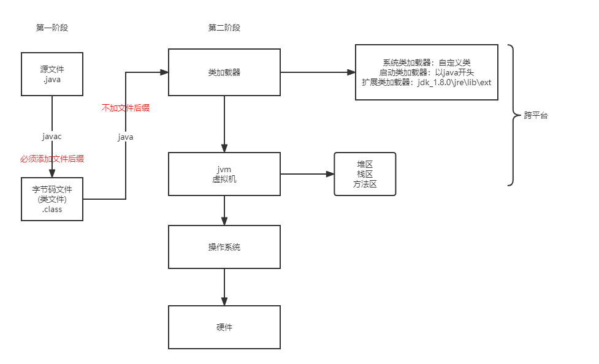
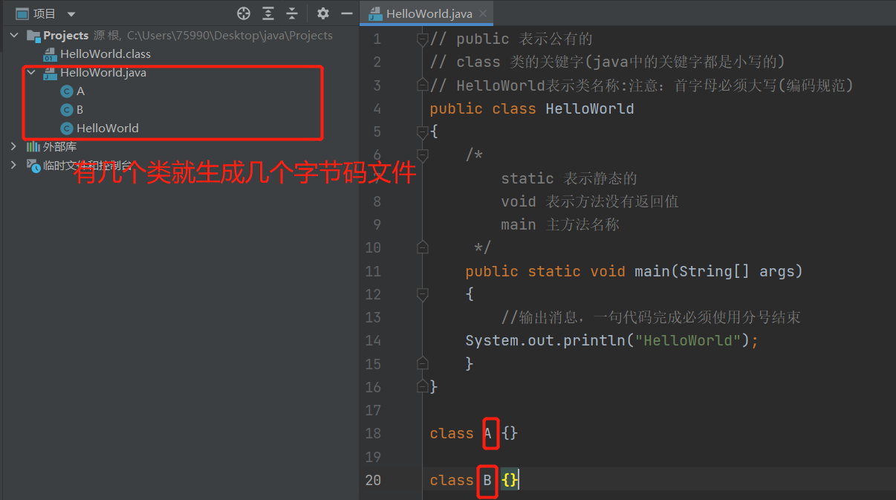

[点击Java大数据开发体系介绍导图](./PDF/Day01_Java开发体系介绍.pdf)

[点击打开大数据介绍导图](./PDF/Day01_大数据介绍.pdf)

# 1.1 计算机发展史

## 1.1.1语言分为3个阶段

机器语言->低级语言->高级语言

# 1.2 java的发展史


## 1.2.1 JavaSE、JavaEE、JavaME三者之间关系


## 1.2.2 java语言的特性

+ 简单性：相对于c++语言
+ 面向对象：纯面向对象语言
+ 可移植性：一次编译，到处执行
+ 健壮性：自动回收垃圾GC
+ 多线程
+ 安全性：开源

## 1.2.3 java的加载执行



# 1.3 第一个java程序

## 1.3.3 第一个程序HelloWorld.java

```java
// public 表示公有的
// class 类的关键字(java中的关键字都是小写的)
// HelloWorld表示类名称:注意：首字母必须大写(编码规范)
public class HelloWorld
{
	/*
		static 表示静态的
		void 表示方法没有返回值
		main 主方法名称
	 */
	public static void main(String[] args)
	{
		//输出消息，一句代码完成必须使用分号结束
	System.out.println("HelloWorld");
	}
}
```

## 1.3.4 java中的注释

1.单行注释 `//`
2.多行注释 `/*注释说明*/`
3.文档注释（doc） `/**注释说明*/`
**注意：单行和多行注释必须进入源代码后在可以看到**

## 1.3.5 面试题

+ 一个源文件可以编写多个类代码吗?
+ 答：可以。需要注意，public关键字只能出现一次



# 2.1纲要

+ 标识符
+ 关键字
+ 数据类型
+ 运算符
+ 控制语句
+ 方法的创建与使用
+ 递归问题

## 2.1.1标识符

+ 标识符：就是给类、方法、参数起名字

+ 1. java标识符的规则

  - 标识符：数字、字母、下划线、美元符号，其它的都不可以
  - 注意：数字不能做开头

  2. 关键字不能作为标识符名称使用

  3. 区分大小写
  4. 理论上没有长度限制

  案例：

  | 合格标识符 | 非法标识符             |
  | ---------- | ---------------------- |
  | _abc       | 3abc 数字不能开头      |
  | HelloWorld | hello-world 使用了-    |
  | public2    | public 关键字          |
  |            | hello world 使用了空格 |

  标识符命名时最好是“见名知意”，如果两个单词组成的单词，那么第二个单词的首字母必须大写，这种命名方式称为“驼峰式命名”

  ## 2.1.2 关键字

  + 注意：都是小写的

    | class           | extends   | implements | interface  | import         |
    | --------------- | --------- | ---------- | ---------- | -------------- |
    | package         | break     | case       | continue   | default        |
    | do              | if        | else       | for        | return         |
    | switch          | while     | false      | true       | null           |
    | boolean         | byte      | char       | short      | int            |
    | long            | float     | double     | try        | catch          |
    | throw           | throws    | finally    | abstact    | final          |
    | native          | private   | protected  | public     | static         |
    | synchronized    | transinet | volative   | instanceof | new            |
    | super           | void      | assert     | enum       | **goto保留字** |
    | **const保留字** |           |            |            |                |

    

    

# 2.2 数据类型

## 2.2.1 分为两类

+ 基本类型(8种)：
  - 数字类型
    + 整形：byte、short、int、long
    + 浮点：float、double
  - 字符类型：char
  - 布尔类型：boolean(true|false)
+ 引用类型(3种)
  - 类
  - 数组
  - 接口

## 2.2.2 八种数据类型的范围


+ 一个字节占8位，可以使用0补位，例如：0000 0001
+ 笔试题: i+1<1是否成立？
+ 答：成立，因为每种类型都有取值范围，**超出范围就会取反**

# 2.3 字符编码

| 字符编码           | 对应的编码方式                    |
| ------------------ | --------------------------------- |
| ISO-8859-1         | 也称为latin-1;主要用于西欧语言    |
| GB2312/GBK/GB18030 | 用户汉字的编码                    |
| Unicode            | 全球统一编码utf-8，utf-16，utf-32 |

utf-8是3个字节处理中文的，效率高，节省空间


乱码是因为中文正常占两个字节

# 2.4创建字符

```java
public class PrintChar
{
    public static void main(String[] args)
    {
        char param = "";
        System.out.print(param);
    }
}
```


