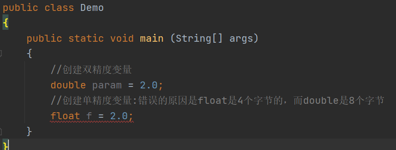
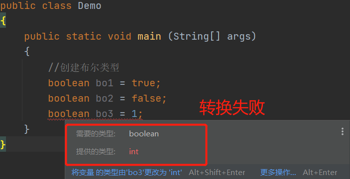
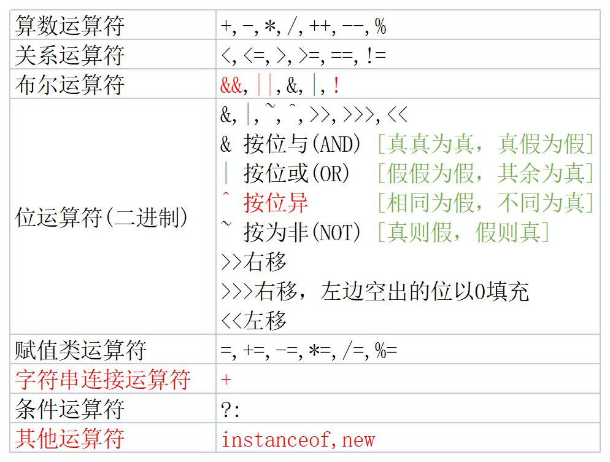
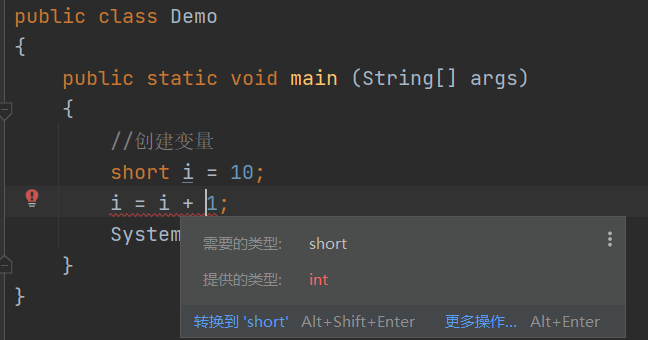
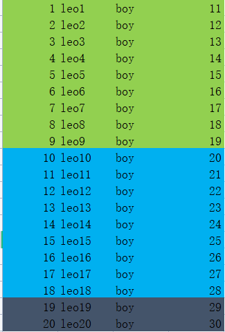

## 2.4.1 IDE 配置：-）

+ 调节字体
+ 创建包
+ **注意：创建包的原则是公司域名的倒写**

# 2.5变量

+ 变量就是Java中一个最基本的单元；包括4个属性；
  - 变量的类型：基本类型或引用类型都可以
  - 变量名称：符合标识符即可
  - 变量的值：如果是基本类型就是具体的值，如果是引用类型就是内存地址
  - 变量的存储单元：根据不同的类型决定在内存中开辟空间的大小(1byte=8位) eg:0000 0000
+ 创建一个变量

```java
public class Demo{
    public static void main (String[] args){
        //创建了一个变量
        int i = 10;
    }
}
```

# 2.6数据类型

## 2.6.1整型

+ 分为：byte、short、int、long
+ 表示的方式：
  - 十进制：1，2，3，...
  - 八进制：以0开头：012
  - 十六进制：以0x开头：0x123
+ 在java中整型的默认类型就是int

+ 如果使用长整形：10L(大小写均可)

## 2.6.2 浮点

+ 浮点类型：单精度float；双精度：double
+ Java中默认精度类型是double
+ 案例



+ 正确创建单精度

```java
public class Demo
{
    public static void main (String[] args)
    {
		//创建单精度，大小写均可
        float f = 2.0f;
        float f1 = 2.0F
    }
}
```

+ **笔试题：float和long谁大？**
  - 答：float大，因为，数字的大小是不按照字节数比较的

## 2.6.3布尔类型

+ boolean类型：true/false只能是这两个值，不能取其他的值
+ 案例：

## 2.6.4 基本类型的转换

+ java中基本类型可以转换，**但是**，**Boolean**类型比较特殊不能与其他类型转换；
+ 类型的转换分为：
  - 默认转换：小类型转大类型
  - 强制转换：大类型转小类型

+ 类型由小到大转换：
  - byte->short(char)->int->long->float->double
  - **注意：byte、short、char之间不会相互转换，首先转为int后再转换**
  - **注意：只要不超出范围，整型可以直接赋值给byte、short、char**

+ **总结：多种类型混合运算过程中，返回最大的类型**

案例1：

```java
public class Demo
{
    public static void main (String[] args)
    {
        //创建参数
        byte b = 100;
        //byte b1 = 1000;错误，超出范围
        //short b = 1000;错误，变量不能同名
        short s = 1000;//正确
        int i = 1000;//正确
        long l = i;//正确,因为int比long小，默认转换了
        //int i1 = l;错误，long比int大，超出范围了。精度丢失
        int i1 = (int)l; //正确，可以强制进行类型转换
        int i2 = 10/3; //正确，多种类型混合运算过程中，返回最大的类型
        long l1 = 10;
        //int f = l1/3;错误，返回的是long类型
        int i3 = (int)l1/3; //可以把long强制转为int类型
        //byte b1 = (byte)l1/3;错误，返回的是int类型
        byte b2 = (byte)(l1/3); //正确
    }
}
```

案例2：

```java
public class Demo
{
    public static void main (String[] args)
    {
        short s1 = 10;
        //short s2 = s1 + 1;错误,因为需要转为int后再运算
    }
}
```

案例3：

```java
public class Demo
{
    public static void main (String[] args)
    {
        char c1 = 'a';
        int i1 = c1 + 100;//正确char转为int以后在运算
        System.out.printlb(i1);
    }
}
```

# 2.7运算符



## 2.7.1 算数运算符

+ 案例1：++就是自身加一

```java
public class Demo
{
    public static void main (String[] args)
    {
        //创建变量
        int i = 10;
        i++ ; //自身加一
        System.out.println(i);
    }
}
```

+ 案例2：

```java
public class Demo
{
    public static void main (String[] args)
    {
        //创建变量
        int i = 10;
        //++在后表示先赋值，自身再加一
        int n = i++ ; 
        System.out.println(i);
        System.out.println(n)
    }
}
```

+ 案例3：

```java
public class Demo
{
    public static void main (String[] args)
    {
        //创建变量
        int i = 10;
        //++在前表示先加一再赋值
        int n = ++i ;
        System.out.println(i);
        System.out.println(n)
    }
}

```

+ 案例4：

```java
public class Demo
{
    public static void main (String[] args)
    {
        //创建变量
        int i = 10;
        //i++相当于i=i+1
        i = i+1;
        System.out.println(i);
    }
}
```

+ 案例5：



```java
public class Demo
{
    public static void main (String[] args)
    {
        //创建变量
        short i = 10;
        //正确，推荐使用 +=、-=、*=、/=，因为自动转为接收的类型
        i += 1;
        System.out.println(i);
    }
}
```

+ 案例6：

```java
public class Demo
{
    public static void main (String[] args)
    {
        //创建变量
        int i = 10;
        //正确，推荐使用 +=、-=、*=、/=，因为自动转为接收的类型
        i /= 3;
        System.out.println(i);
    }
}
```

+ 案例7：

```java
public class Demo
{
    public static void main (String[] args)
    {
        //创建变量
        int i = 10;
        int n = i % 3;//就是取余数
        System.out.println(n);
    }
}
```

使用场景：就是分页的使用



```java
public class Demo
{
    public static void main (String[] args)
    {
        //总记录数
        int total = 20;
        //每页显示9条
        int pageSize = 9;
        //总页码
        int pages = 1;
        if (total%pageSize==0)
        {
            pages = total/pageSize;
        }
        else
        {
            pages = total/pageSize+1;
        }
        System.out.printf("总页码:"+pages);
    }
}
```

