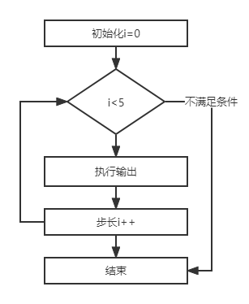

### 2.7.2 关系运算符和布尔运算符

+ 与：两个操作数相与，如果都为true则返回true，否则返回false
+ 或：两个操作数相或，只要有一个为true则返回true
+ 非：取反
+ 异或：相异为true，就是两个操作数不同(一个true一个false)
+ **短路与&&** 和 **逻辑与&** 的区别？
  - **它们返回的结果是相同的，只是运算的过程不相同**
  - 短路与：如果左边为true那么计算右边，否则直接返回false
  - 逻辑与：无论左边是否为true都计算右边后再返回结果
+ **短路或||**和**逻辑或|**的区别？
  - 它们返回的结果是相同的，只是运算过程不同
+ 注意：短路与要求两侧必须是布尔类型，而逻辑与并不要求

+ 笔试题：4&7=？

  + 答：返回4，因为转为二进制后再运算；只有1遇到1返回1，其他都返回0

    4 0100

    7 0111

  ---->4 0100

```java
public class TestDemo {
    public static void main (String[] args) {
        //创建变量
        boolean op1 = 10>5;
        boolean op2 = 10<5;

        //输出
        System.out.println("op1 = " + op1);
        System.out.println("op2 = " + op2);

        //短路与，逻辑与
        System.out.println("op1&&op2 = " + (op1&&op2));
        System.out.println("op1&op2 = " + (op1&op2));

        //短路或，逻辑或
        System.out.println("op1||op2 = " + (op1||op2));
        System.out.println("op1|op2 = " + (op1|op2));

        //取反
        System.out.println("!op1 = " + !op1);

        //异或
        System.out.println("op1^op2 = " + (op1^op2));
        System.out.println("op^|op1 = " + (op1^op1));
    }
}
```

运行结果:

```java
op1 = true
op2 = false
op1&&op2 = false
op1&op2 = false
op1||op2 = true
op1|op2 = true
!op1 = false
op1^op2 = true
op^|op1 = false
```

### 2.7.3 条件运算符

+ 三元运算符

```java
public class TestDemo{
    public static void main(String[] args){
        //创建变量
        int i = 10;
        //三元运算符
        int n = i>30?1:-1;
        System.out.println(n);
        
        //三元运算符
        boolean bo = i%3==0?true:false;
        System.out.println(bo);
    }
}
```

运行结果:

```java
-1
false
```

## 2.8 控制语句

### 2.8.1 判断语句

#### 2.8.1.1 语法

+ if语句

```java 
if (布尔类型) {
	一行或多行语句
}
如果只有一行语句，那么可以省略大括号

if (布尔类型)
    一行语句
```

+ if-else语句

```java
if (布尔类型) {
	一行或多行语句
}else{
    一行或多行语句
}
```

+ if-else if-else执行效率高，因为遇到一个true其他判断就被忽略不执行了

```java	
if (布尔类型) {
	一行或多行语句
}else if{
    一行或多行语句
}else if{
	一行或多行语句
}else{
    一行或多行语句
}
```


#### 2.8.1.2 案例：只是用if，这种判断的效率低

```java
public class TestDemo{
    public static void main(String[] args){
        int age = 3;
        if(age>0&&age<=5){
            System.out.println("儿童");
        }

        if(age>5&&age<=10){
            System.out.println("小学生");
        }

        if(age>10&&age<=18){
            System.out.println("中学生");
        }
    }
}
```

#### 2.8.1.3 案例：使用if-else if -else效率高

```java
public class TestDemo{
    public static void main(String[] args){
        int age = 3;
        if(age>0&&age<=5){
            System.out.println("儿童");
        }else if(age>5&&age<=10){
            System.out.println("小学生");
        }else if(age>10&&age<=18){
            System.out.println("中学生");
        }else {
            System.out.println("大学生");
        }
    }
}
```

#### 2.8.1.4 案例：两个条件判断if-else

```java
public class TestDemo{
    public static void main(String[] args){
        int age = 3;
        if(3%2==0){
            System.out.println("偶数");
        }else{
            System.out.println("奇数");
        }
    }
}
```

### 2.8.2 switch分支语句

#### 2.8.2.1 格式

```java
switch(表达式){
    case 值:
        语句
    	break;
    case 值:
        语句
        break;
    default:
        语句
        break;
}
```

+ 表达式：byte、short、int、char、String
+ break：推荐使用；如果省略，那么从**符合条件的那一行**穿透
+ 如果所有条件都不满足执行default

```java
public class TestDemo{
    public static void main(String[] args){
        int key = 1;
        switch (key){
            case 0:
                System.out.println(0);
                break;
            case 1:
                System.out.println(1);
                break;
            case 2:
                System.out.println(2);
                break;
            case 3:
                System.out.println(3);
                break;
            default:
                System.out.println(-1);
                break;
        }
    }
}
```

运行结果：`1`

#### 2.8.2.2 不添加break那么从符合条件的那一行开始穿透

```java
public class TestDemo{
    public static void main(String[] args){
        int key = 1;
        switch (key){
            case 0:
                System.out.println(0);
            case 1:
                System.out.println(1);
            case 2:
                System.out.println(2);
            case 3:
                System.out.println(3);
            default:
                System.out.println(-1);
        }
    }
}
```

运行结果：

```java
1
2
3
-1
```

+ 笔试题

```java
public class TestDemo{
    public static void main(String[] args){
        int key = 1;
        int i = 10;
        switch (key){
            case 0:
                i++;
            case 1:
                i+=10;
            case 2:
                i--;
            case 3:
                i++;
        }
        System.out.println("i="+i);
    }
}
```

运行结果:`i=20`

+ 笔试题：输出-1，因为，default与位置无关

```java
public class TestDemo{
    public static void main(String[] args){
        int key = 10;
        switch (key){
            default:
                System.out.println(-1);
                break;
            case 0:
                System.out.println(0);
                break;
            case 1:
                System.out.println(1);
                break;
            case 2:
                System.out.println(2);
                break;
            case 3:
                System.out.println(3);
                break;
        }
    }
}
```

输出结果：`-1`

### 2.8.3 for循环

#### 2.8.3.1格式

```java
for (初始化;条件;步长){
    语句
} 
```

#### 2.8.3.2 案例

```java
public class TestDemo{
    public static void main(String[] args){
        for (int i=0;i<5;i++){
            System.out.println(i);                    
        }
    }
}
```

+ 笔试题：是否可以执行？答：可以执行，但是是个死循环

```java
public class TestDemo{
    public static void main(String[] args){
        for (;;){
            System.out.println("abc");
        }
    }
}
```

+ 循环的顺序

```java
public class TestDemo{
    public static void main(String[] args){
        for (int i=0;i<5;i++){
            System.out.println(i);
        }
    }
}
//等价于
public class TestDemo{
    public static void main(String[] args){
        int i=0;
        for (;i<5;){
            System.out.println(i);
            i++;
        }
    }
}
```



+ 笔试题：执行错误，因为，i变量属于for的语句块

```java
public class TestDemo{
    public static void main(String[] args) {
        for (int i = 0;; i < 5; i++) {
            i += 1;
        }
        System.out.println(i);
    }
}
```

+ 笔试题：正确

```java
public class TestDemo {
    public static void main(String[] args) {
        for (int i = 0; i < 5; i++) {
            System.out.println(i);
        }
    }
}
```

### 2.8.4 while循环

#### 2.8.4.1 格式

``` java
while(布尔类型){
    语句;
    防止死循环;
}
```

```java
public class TestDemo {
    public static void main(String[] args) {
        int i = 0;
        while (i<5){
            System.out.println(i);
            i++;
        }
    }
}
```

### 2.8.5 do-while 循环

+ 特点：至少循环一次
+ 格式：

```java
public class TestDemo {
    public static void main(String[] args) {
        int i = 0;
        do {
            System.out.println(i);
            i++;
        }while(i<5); //必须注意结束使用分号
    }
}
```

+ 笔试题：输出`5` `5`

```java
public class TestDemo {
    public static void main(String[] args) {
        int i = 10,n = 0;
        do {
            n++;
            i--;
        }while(n<5);
        System.out.println(i);
        System.out.println(n);
    }
}
```

### 2.8.6 跳出循环体

+ break :跳出当前循环体
+ continue：跳出本次循环
+ return：跳出所有循环体，因为方法弹栈

#### 2.8.6.1 break

```java
public class TestDemo {
    public static void main(String[] args) {
        for (int i = 0; i < 5; i++){
            if (i==2){
                break;
            }
            System.out.println(i);
        }
    }
}
```

运行结果：

```jav
0
1
```

+ 嵌套循环

```java
public class TestDemo {
    public static void main(String[] args) {
        for (int n = 0;n < 5; n++){
            for (int i = 0; i < 5; i++){
                if (i==2){
                    break;
                }
                System.out.println(i);
            }
                System.out.println("------外层------");
        }
    }
}
```

运行结果:

```java
0
1
------外层------
0
1
------外层------
0
1
------外层------
0
1
------外层------
0
1
------外层------
```

+ 跳出所有循环

```java
public class TestDemo {
    public static void main(String[] args) {
        //创建变量
        boolean flag = false;
        for (int n = 0;n < 5; n++){
            if (flag){
                break;
            }
            for (int i = 0; i < 5; i++){
                if (i==2){
                    flag = true;
                    break;
                }
                System.out.println(i);
            }
            System.out.println("------外层------");
        }
    }
}
```

运行结果：

```java
0
1
------外层------
```

#### 2.8.6.2 continue

```java
public class TestDemo {
    public static void main(String[] args) {
        for (int i = 0; i < 5; i++){
            if (i == 2){
                continue;
            }
            System.out.println(i);
        }
    }
}
```

运行结果:

```java
0
1
3
4
```

#### 2.8.6.3 return
```java
public class TestDemo {
    public static void main(String[] args) {
        for (int n = 0; n < 5; n++){
            for (int i = 0; i < 5; i++){
                if (i==2){
                    return;//方法弹栈
                }
                System.out.println(i);
            }
            System.out.println("------外层------");
        }
    }
}
```

运行结果:

```java
0
1
```