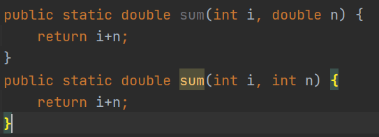
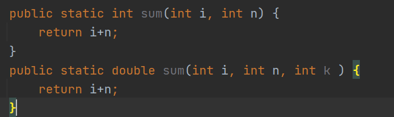

# 第四章 面向对象

## 4.1 方法

+ 方法：就是一种功能的体现。方法上可以复用的
+ 格式：

```java
方法的修饰符 返回类型 方法名称(参数){
	方法体
}
```


+ 方法的修饰符：public、private、protected、abstract、static、final
+ 返回类型：如果方法没有返回值那么使用void修饰，如果有返回类型那么方法的返回值必须是这种类型
+ 方法的名称：符合标识符即可
+ 方法的参数：可以没有或者多个，使用多个逗号分隔符

+ 案例:

```java
package com.holo;

public class Demo {
    public static void main(String[] args) {
        method();
    }
    //自定义的一个方法
    public static void method() {
        System.out.println("这是一个没有返回和参数的方法");
    }
}
```

+ 含一个参数的方法

```java
package com.holo;

public class Demo1 {
    public static void main(String[] args) {
        method(1);
    }
    //自定义的一个方法
    public static void method(int key) {
        switch (key){
            case 1:
                System.out.println("执行了第一个语句");
            break;
            case 2:
                System.out.println("执行了第二个语句");
                break;
            default:
                System.out.println("执行了其他语句");
                break;
        }
    }
}
```

+ 含两个参数的方法

```java
package com.holo;

public class Demo2 {
    public static void main(String[] args) {
        method(1, 2);
    }

    public static void method(int i,int n) {
        System.out.println(i + n);
    }
}
```

+ 含有返回值的方法

```java
package com.holo;

public class Demo3 {
    public static void main(String[] args) {
        int sum = method(1, 2);
        System.out.println(sum);
    }

    public static int method(int i,int n) {
        return i+n;
    }
}
```

​	运行结果: `3`

## 4.2 方法的重载

### 4.2.1 重载的条件：

+ 在**同一个类**中，方法的**名称**是相同的，方法的**参数的类型**、**个数**、顺序**有一个不同**即可，与方法的**返回类型**没有关系

### 4.2.2 案例

```java
public class Demo4 {
    public static void main(String[] args) {
        int methodInt = methodInt(1,2);
    }

    //因为没有重载，所以增加了记忆方法的困难
    public static int methodInt(int i, int n) {
        return i+n;
    }
    public static long methodInt(long i, int n) {
        return i+n;
    }
    public static double methodInt(double i, int n) {
        return i+n;
    }
}
```

### 4.2.3 使用了重载，减少记忆

```java
public class Demo5 {
    public static void main(String[] args) {
    sum(1.0,2);
}

    //因为没有重载，所以增加了记忆方法的困难
    public static int sum(int i, int n) {
        return i+n;
    }
    public static long sum(long i, int n) {
        return i+n;
    }
    public static double sum(double i, int n) {
        return i+n;
    }
}
```

### 4.2.4 重载的条件

+ 参数的**类型**不能相同



+ 参数的**个数**不能相同



+ 参数的**顺序**不能相同


## 4.3 递归

### 4.3.1 案例：求5以内的和

```java
public class Demo6 {
    public static void main(String[] args) {
        int sum = 0;
        for (int i = 0; i < 6; i++){
            sum += 1;
        }
        System.out.println(sum);
    }
}
```

### 4.3.2 案例：使用递归

+ 自身的调用：就是自己调用自己

```java
public class Demo7 {
    public static void main(String[] args) {
        int sum = rec(5);
        System.out.println(sum);
    }
    public static int rec(int i){
        if (i==1)
            return 1;
        return i+rec(i-1);
    }
}
```

运行结果：`15`

+ n的阶乘

```java
public static int rec(int n){
    if (n==1)
        return 1;
    return n+rec(n-1);
}
```

## 4.4 使用方法完成项目

### 4.4.1 第一版 

```java
package com.holo;

import java.util.Scanner;

/**
 * @author Holo
 * @date 2022/1/11 15:10
 */
public class Demo9 {
    public static void main(String[] args) {
        //控制台对象
        Scanner scanner = new Scanner(System.in);
        //跳出循环体的标识
        boolean flag = true;
        //提示信息
        System.out.println("1.添加；2.显示；3.删除;4.更新;5.退出");
        //循环
        do {
            int key = scanner.nextInt();
            switch (key) {
                case 1:
                    System.out.println("请输入一个数字");
                    save(scanner.nextInt());
                    break;
                case 2:
                    findAll();
                    break;
                case 3:
                    System.out.println("请输入一个要删除的数字");
                    delete(scanner.nextInt());
                    break;
                case 4:
                    System.out.println("请输入需要更新的数字");
                    int i = scanner.nextInt();
                    System.out.println("请输入需要更新的新数字");
                    int n = scanner.nextInt();
                    update(i, n);
                    break;
            }
        } while (flag);

    }

    //创建数组
    static int[] array = new int[3];

    //获取数据下标
    public static int findByIndex(int element) {
        //通过判断element的值决定查找空位置还是对应元素的下标
        for (int index = 0; index < array.length; index++) {
            if (element == 0) {//获取空位置
                if (array[index] == 0) {
                    return index;
                }
            } else {//查询对应元素的下标
                if (array[index] == element) {
                    return index;
                }
            }
        }
        return -1;
    }

    //添加数据
    public static void save(int el) {
        //获取一个保存元素的空位置
        int index = findByIndex(0);
        //判断下标
        if (index != -1) {
            array[index] = el;
            System.out.println("操作成功");
        } else {
            System.out.println("满了");
        }
    }

    //显示数据
    public static void findAll() {
        for (int index = 0; index < array.length; index++) {
            int i = array[index];
            if (i != 0) {
                System.out.println(i);
            }
        }
    }

    //删除数据
    public static void delete(int el) {
        //根据元素获取下标
        int index = findByIndex(el);
        //判断
        if (index != -1) {
            array[index] = 0;
            System.out.println("操作成功");
        } else {
            System.out.println("查无此数据，请重新输入");
        }
    }

    //更新数据
    public static void update(int el, int taget) {
        //根据元素获取下标
        int index = findByIndex(el);
        //判断
        if (index != -1) {
            array[index] = taget;
            System.out.println("操作成功");
        } else {
            System.out.println("查无此数据，请重新输入");
        }
    }
}
```

### 4.4.2第二版

```java
package com.holo;

import java.util.Scanner;

public class Demo10 {
    public static void main(String[] args) {
        //控制台对象
        Scanner scanner = new Scanner(System.in);
        //跳出循环体的标识
        boolean flag = true;
        //提示信息
        System.out.println("1.添加；2.显示；3.删除;4.更新;5.退出");
        //循环
        do {
            int key = scanner.nextInt();
            switch (key) {
                case 1:
                    save(scanner);
                    break;
                case 2:
                    findAll();
                    break;
                case 3:
                    delete(scanner);
                    break;
                case 4:
                    update(scanner);
                    break;
            }
        } while (flag);
    }

    //创建数组
    static int[] array = new int[3];

    //获取数据下标:这是一个公共方法
    public static int findByIndex(int element) {
        //通过判断element的值决定查找空位置还是对应元素的下标
        for (int index = 0; index < array.length; index++) {
            if (element == 0) {//获取空位置
                if (array[index] == 0) {
                    return index;
                }
            } else {//查询对应元素的下标
                if (array[index] == element) {
                    return index;
                }
            }
        }
        return -1;
    }

    //添加数据
    public static void save(Scanner scanner) {
        //获取一个保存元素的空位置
        int index = findByIndex(0);
        if (index != -1) {
            System.out.println("请输入一个数字");
            array[index] = scanner.nextInt();
            System.out.println("操作成功");
        } else {
            System.out.println("满了");
        }
    }

    //显示数据
    public static void findAll() {
        for (int index = 0; index < array.length; index++) {
            int i = array[index];
            if (i != 0) {
                System.out.println(i);
            }
        }
    }

    //删除数据
    public static void delete(Scanner scanner) {
        System.out.println("请输入一个需要删除的数字");
        //根据元素获取下标
        int index = findByIndex(scanner.nextInt());
        //判断
        if (index != -1) {
            array[index] = 0;
            System.out.println("操作成功");
        } else {
            System.out.println("查无此数据，请重新输入");
        }
    }

    //更新数据
    public static void update(Scanner scanner) {
        System.out.println("请输入需要更新的数字");
        //根据元素获取下标
        int index = findByIndex(scanner.nextInt());
        //判断
        if (index != -1) {
            System.out.println("请输入需要更新的新数字");
            array[index] = scanner.nextInt();
            System.out.println("操作成功");
        } else {
            System.out.println("查无此数据，请重新输入");
        }
    }
}
```

