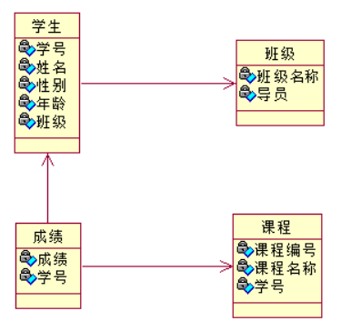
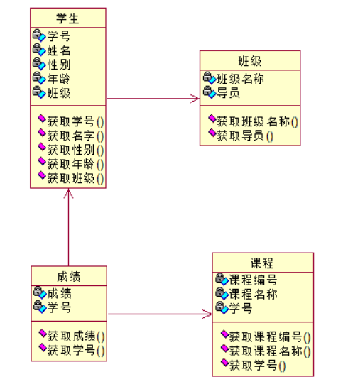
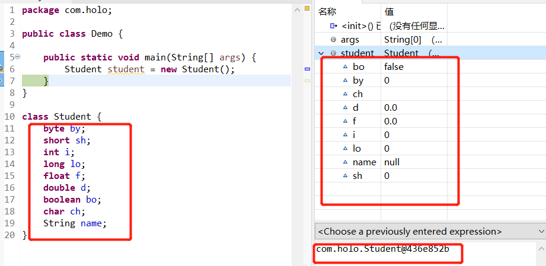

## 4.5 面向过程与面向对象区别

+ c语言就是面向过程语言
+ 面向过程的特点：必须了解整个过程，每个步骤的因果关系。
+ 面向对象：将现实世界分为不同的对象，把各个对象协作起来就可以了。
  + 就是面对一个真实存在的
  + 面向对象的特性：实质就是面向抽象
    + 抽象：具有这一类事物的特征和特性
    + 面向对象符合人的思维

### 4.5.1 面向对象的特性

+ 封装
+ 继承
+ 多态

### 4.5.2 类与对象的概念

+ 类：对具有共性事物的抽象描述
  + 例如：学生类：学号、姓名、性别、年龄、班级
+ 对象（实例）：就是对类的具体化、实例化
  + 例如：学生对象：04982003031、朱少楷、男、20、三班



+ 以上的类图中都是属性，进一步细化



+ **结论：属性源自于一种状态，方法源自于一个功能(动作)**
  + 类=属性+方法
  + 类=成员+功能

### 4.5.3 类的定义

#### 4.5.3.1 类的格式：

```java
类的修饰符 class 类的名称 extends 父类名称 implements 接口名称{
    类体:属性+方法
}
```

+ 案例:

```java
public class Student {
    //学号
    int id;
    //姓名
    String name;
    //性别
    String sex;
    //地址
    String address;
    //年龄
    int age;    
}
```

+ 以上都是属性，也成为成员变量
+ 成员变量会默认初始化
+ **注意**：局部变量不能默认初始化，必须初始化

### 4.5.4 对象的创建和使用

+ 使用new关键字创建对象，才可以使用

```java
public class Demo0 {
    public static void main(String[] args) {
        //创建对象,把堆内存中的这个对象的内存地址赋值给参数student
        Student student = new Student();
        System.out.println("内存地址："+student);
    }
}
```


+ 属性默认值


+ 创建流程图


+ 具体的默认值

| 类型     | 默认值 |
| -------- | ------ |
| byte     | 0      |
| short    | 0      |
| int      | 0      |
| long     | 0      |
| float    | 0.0    |
| double   | 0.0    |
| boolean  | false  |
| char     | ''     |
| 引用类型 | null   |



#### 4.5.4.1 可以对成员变量进行赋值

+ 就是把默认值替换了


+ 一个类可以创建n个对象，并且每个对象的成员只属于当前对象
+ 只有通过对象才可以修改或者访问这个对象的成员(属性)