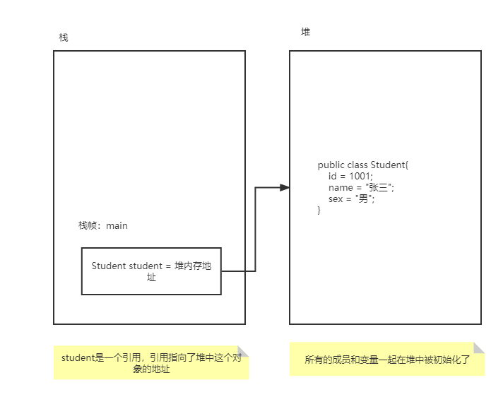
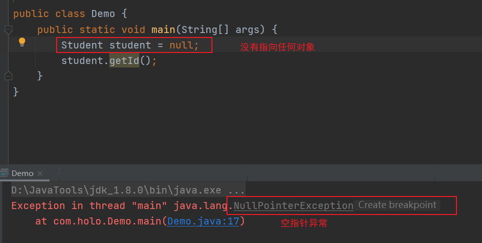
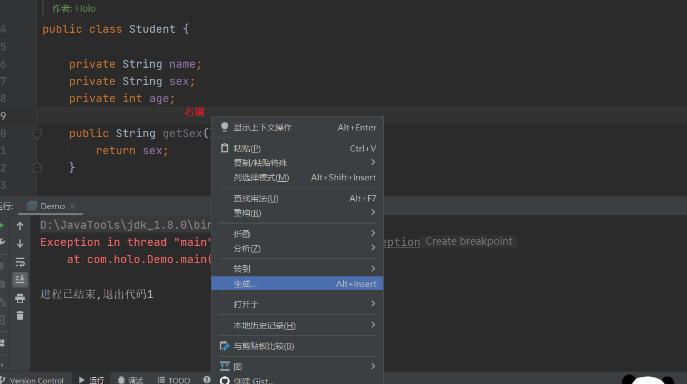
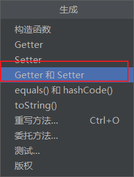
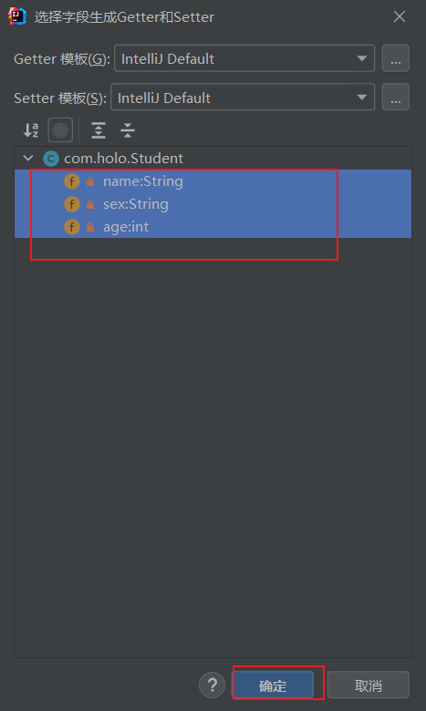

## 4.6 封装性

+ 属性私有化，细节被隐藏掉，安全性提高了
+ private关键字作用就是把属性保护起来了
  + 在本类中可以访问
  + 就只能自己使用
  + 就是为了安全，外界无法访问

### 4.6.1添加一个方法完成对成员(属性)的操作

+ 添加方法(功能)的目的，就是在使用的时候可以添加各种限制(条件，添加判断);
+ 方法就是对成员变量进行操纵的

案例：

```java
public class Demo {
	public static void main(String[] args) {
		Student student = new Student();
		// 通过方法把外面的数据添加到对象的成员上
		student.setAge(20);
		// 通过方法吧成员的数据获取
		int age = student.getAge();
		System.out.println(age);
	}
}

class Student {
	// 学号
	private int id;
	// 姓名
	private String name;
	// 性别
	private String sex;
	// 地址
	private String address;
	// 年龄
	private int age;

	// 添加年龄
	public void setAge(int nl) {
		// 判断
		if (nl > 0 && nl <= 300) {
			age = nl;
		} else {
			System.out.println("请添加范围内的数字");
		}
	}

	// 获取年龄
	public int getAge() {
		return age;
	}
}
```

**通过上面的案例，避免了直接操作对象的属性，这就是封账：让外界对类的内部知道的越少越好**;

**结论：封装属性，暴露方法**

## 4.7 构造方法(构造器、构造函数)

+ 构造方法就是创建对象

### 4.7.1 格式

+ 构造方法的修饰符：private public protected
+ 构造方法和普通方法一样都可以进行重载
+ 构造方法特点：
  + 与类同名
  + 构造方法不能有任何返回类型，既没有返回值，关键字void也不能加；如果添加了void那么就不是构造方法了，而是普通方法
  + 任何类都有构造方法，如果没有显式的编写，在创建对象是，系统会分配一个默认的无参数构造方法；如果显式的定义了构造方法，系统就不会创建默认的无参数构造方法了。

### 4.7.2 案例：无参构造方法

```java
public class Demo1 {

	public static void main(String[] args) {
		Student student = new Student();

	}

}
class Student{
	//系统默认分配了一个无参数的构造方法
}
```

```java
public class Demo1 {
	public static void main(String[] args) {
		Student student = new Student();
	}
}
class Student{
	//无参数构造方法
	public Student() {
		System.out.println("无参数构造方法");
	}
}
```

+ 添加void那么就变为普通方法

```java
class Student{
	//无参数构造方法
	public void Student() {
		System.out.println("无参数构造方法");
	}
}
```

### 4.7.3 显式编写构造方法

+ 创建对象时，系统不会在分配默认的构造方法

```java
public class Demo1 {
	public static void main(String[] args) {
		Student student = new Student();
	}
}

class Student {
	public Student() {
		System.out.println("无参数构造方法");
	}

	public Student(int i) {
		System.out.println("有参数构造方法");
	}
}
```

### 4.7.4 含参数构造方法可以直接对成员初始化

```java
public class Student {
    private int id;
    private String name;
    private String sex;
    public Student(int i,String username,String xb){
        id = i;
        name = username;
        sex = xb;
    }
}
```

+ 初始化

```java
public class Demo {
    public static void main(String[] args) {
        new Student(1001,"张三","男");
    }
}
```

+ 有参构造方法

## 4.8 对象的引用

### 4.8.1 java内存的主要划分


### 4.8.2 内存的表示

+ 主方法main压入栈，就创建一个student对象

```java
public class Demo2 {
	public static void main(String[] args) {
		Student student = new Student(1001, "张三", "男");
	}
}
```


+ 对student这个对象中的成员赋值

```java
public class Demo2 {
	public static void main(String[] args) {
		Student student = new Student(1001, "张三", "男");
	}
}

class Student {
	private int id;
	private String name;
	private String sex;
	public Student(int i, String username, String xb) {
		id = i;
		name = username;
		sex = xb;
	}
}
```




### 4.8.3 当不使用new关键字时，出现问题




## 4.9 this关键字

+ this表示当前对象
+ 如果堆中有n个对象，会有n个this指向对应的对象

### 4.9.1 局部变量

+ 当局部变量与成员变量名称相同时，可以使用this加以区分，因为就近原则

```java
public class Demo2 {
	public static void main(String[] args) {
		//通过构造函数构造对象
		Student student = new Student();
		student.setName("张三");
		System.out.println();
	}
}

class Student {
	// 姓名
	private String name;

	public void setName(String name) {
		// 就把name参数的数值赋值给当前成员的成员变量了
		this.name = name;
	}
}
```

+ 自动生成setter和getter方法





### 4.9.2 可以调用其他的构造方法

+ 注意：调用构造函数是必须在首行

#### 4.9.2.1 这样调用构造方法是错误的，因为，创建了垃圾对象

```java
package com.holo;
public class Demo {
    public static void main(String[] args) {
        Student student = new Student();
    }
}
class Student {
    public Student() {
        System.out.println("无参数");
        //这样调用构造方法是错误的，因为，创建了垃圾对象
        new Student(1);
    }
    public Student(int i) {
        System.out.println("1参数");
    }
    public Student(int i,int n) {
        System.out.println("2参数");
    }
}
```

#### 4.9.2.2 这样调用时正确的

```java
public class Demo {
    public static void main(String[] args) {
        Student student = new Student();
    }
}
class Student {
    public Student() {
        this(10);
        System.out.println("无参数");
    }
    public Student(int i) {
        this(10,20);
        System.out.println("1参数");
    }
    public Student(int i,int n) {
        System.out.println("2参数");
    }
}
```


### 4.9.3 this可以调用其他成员方法

```java
public class Demo {
    public static void main(String[] args) {
        Student student = new Student();
        student.show();
    }
}

class Student {
    public void show() {
        System.out.println("show-method");
        this.save();
    }

    public void save() {
        System.out.println("save-method");
    }
}
```

+ 调用成员方法也可以不适用this关键字(**推荐**)

```java
class Student {
    public void show() {
        System.out.println("show-method");
        save();
    }

    public void save() {
        System.out.println("save-method");
    }
}
```

