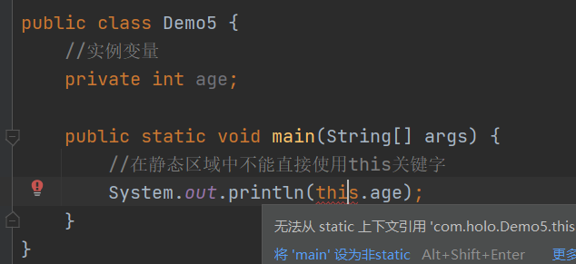

## 5.1 静态关键字 static

### 5.1.1 修饰

+ 可以修饰变量、方法、代码块
+ 特点：
  + 使用static修饰的**类**可以直接加载执行，所以，static修饰的变量也称为**类变量**
  + static修饰的代码块称为静态代码块，JVM加载类的时候，会执行静态代码块中的内容

### 5.1.2 采用静态变量实现累加器

+ 没有采用静态变量，而是成员变量，所以不会实现累加器的效果，**因为**，成员变量属于当前对象，不会被共享

```java
package com.holo;

public class Demo {
    public static void main(String[] args) {
        //创建对象
        Student student1 = new Student();
        Student student2 = new Student();
        //获取成员变量
        System.out.println(student1.getCount());
        System.out.println(student2.getCount());
    }
}

class Student{
    //创建成员变量(属性)
    private int count;

    //创建构造方法
    public Student(){
        count++;
    }

    //获取属性

    public int getCount() {
        return count;
    }
}
```

运行结果:

```java
1
1
```


+ 采用静态变量完成累加器的功能

```java
package com.holo;

public class Demo1 {
    public static void main(String[] args) {
        //创建对象
        Student student1 = new Student();
        Student student2 = new Student();
        //获取成员变量
        System.out.println(student1.getCount());
        System.out.println(student2.getCount());
    }
}

class Student{
    //静态变量
    private static int count;

    //创建构造方法
    public Student(){
        count++;
    }

    //获取属性

    public int getCount() {
        return count;
    }
}
```

运行结果:

```java
2
2
```


+ static 声明的变量通过该类new出的对象，都可以“共享”

+ 类也可以直接访问，所以，我们称为“类变量”

+ 类直接调用

```java
package com.holo;

public class Demo2 {
    public static void main(String[] args) {
        System.out.println(Student.count);
    }
}

class Student{
    //静态变量
   public static int count;
}
```

运行结果: `0`

### 5.1.3 笔试题

#### 5.1.3.1 静态方法中是否可以访问实例变量、实例方法或this关键字？

答: 不能，因为**静态修饰**的在**类加载器**就初始化了，而对象这时候还不存在。


+ 我们可以改善下代码

  + 把方法改为static修饰

    

  + 使用对象调用

    

  + 不能在静态中直接使用this

    

#### 5.1.3.2 静态方法的初始化顺序

+ 就是按照static修改的顺序执行

```java
public class Demo6 {
    static {
        System.out.println(1);
    }

    static {
        System.out.println(2);
    }

    static {
        System.out.println(3);
    }
   public static void main(String[] args) {
        System.out.println(4);
    }
}
```

输出：

```java
1
2
3
4
```

```java
public class Demo6 {
    public static void main(String[] args) {
        System.out.println(4);
    }
    static {
        System.out.println(1);
    }

    static {
        System.out.println(2);
    }

    static {
        System.out.println(3);
    }
}
```

输出:

```java
1
2
3
4
```

#### 5.1.3.3 执行的顺序

+ 1静态块 2语句块 3构造方法

```java
public class Demo7 {
    public static void main(String[] args) {
        //创建对象时：1静态块 2语句块 3构造方法
        Student student = new Student();
    }
}
class Student{
    //构造方法
    public Student(){
        System.out.println("构造方法");
    }
    //静态块
    static {
        System.out.println("静态块");
    }
    //语句块
    {
        System.out.println("语句块");   
    }
}
```

## 5.2 设计模式

+ 设计模式：就是一种可以反复利用的解决方案

+ 设计模式是1995年，由GoF4人组提出
+ 设计模式：23种
+ 从结构上分为：
  + 创建型
  + 结构型
  + 行为型

### 5.2.1 单例模式

+ 单例模式：就是单实例(一个对象)的一种模式，也称为"反模式"

+ 优缺点:
  + 优点：堆中只创建一个对象，使用堆内存少，成本低
  + 缺点：因为对象是被共享的，所以，有安全问题

+ 创建单例模式：
  + 构造方法私有化
  + 创建一个私有的、静态的、本类型对象
  + 创建一个私有的、静态的、返回本类型的方法
  + **自律模式**

```java
package com.holo;

public class Demo8 {
    public static void main(String[] args) {
        Student student1 = Student.getInstance();
        Student student2 = Student.getInstance();
        //比较两个对象的内存地址
        System.out.println(student1 == student2);
    }
}
//单例模式:饿汉式
class Student {
    //创建一个私有的、静态的对象
    private static Student student = new Student();

    //私有化
    private Student() {
    }

    //创建一个公有的、静态的、返回本类型
    public static Student getInstance() {
        return student;
    }

    //成员方法
    public void method() {
        System.out.println("成员方法");
    }
}
```

+ 单例模式：
  + 饿汉式：推荐使用
  + 懒汉式：加锁-->变为自旋锁

```java
//懒汉式
class Student {
    //创建一个私有的、静态的对象
    private static volatile Student student = null;

    //私有化
    private Student() {
    }

    //创建一个公有的、静态的、返回本类型
    public synchronized static Student getInstance() {
        if (student == null){
            student = new Student();
        }
        return student;
    }

    //成员方法
    public void method() {
        System.out.println("成员方法");
    }
}
```


+ 可以调用成员方法

```java
package com.holo;

public class Demo10 {
    public static void main(String[] args) {
        Student student1 = Student.getInstance();
        //可以通过单例对象调用成员方法了
        student1.method();
    }
}
//单例模式
class Student {
    //创建一个私有的、静态的对象
    private static Student student = new Student();

    //私有化
    private Student() {
    }

    //创建一个公有的、静态的、返回本类型
    public synchronized static Student getInstance() {
        return student;
    }

    //成员方法
    public void method() {
        System.out.println("成员方法");
    }
}
```

## 5.3 优化项目

### 5.3.1 分类完成功能

+ 使用数组模拟数据库：可以创建一个单独的类
+ 实现功能CRUD：独立的类完成
+ 前端：独立类完成

### 5.3.2 开发

+ 开发就是这个过程的反过程

#### 5.3.2.1 创建实体类：即javabean

```java
package com.holo;

public class Student {
    private int id;
    private String username;
    private String sex;
    private int age;

    public int getId() {
        return id;
    }

    public void setId(int id) {
        this.id = id;
    }

    public String getUsername() {
        return username;
    }

    public void setUsername(String username) {
        this.username = username;
    }

    public String getSex() {
        return sex;
    }

    public void setSex(String sex) {
        this.sex = sex;
    }

    public int getAge() {
        return age;
    }

    public void setAge(int age) {
        this.age = age;
    }
}
```

#### 5.3.2.2 创建数据库类：就是管理数组的

```java
package com.holo;

public class DataBaseHolo {
    //构造方法私有化
    private DataBaseHolo(){}
    //创建对象
    private static DataBaseHolo dataBaseHolo = new DataBaseHolo();

    //创建方法
    public static DataBaseHolo getInstance(){
        return dataBaseHolo;
    }
    //创建数据库
    private Student[] students = new Student[3];
    //返回数组的方法:成员方法
    public Student[] getStudents(){
        return students;
    }
}
```


#### 5.3.2.3 业务类service

```java
package com.holo;

import java.util.UUID;
import java.util.zip.CRC32;

//业务类
public class StudentService {
    //依赖数据库
    private static Student[] array = DataBaseHolo.getInstance().getStudents();


    /**
     * TODO 获取对应学生下标
     *
     * @param sid 学号
     * @return 学生下标
     */
    public static int findByIndex(int sid) {
        for (int index = 0; index < array.length; index++) {
            //根据下标获取对应的学生对象
            Student student = array[index];
            //判断是否存在
            if (sid == 0) {
                if (student == null) return index;
            } else {
                if (student != null && sid == student.getId()) return index;
            }
        }
        return -1;
    }

    /**
     * TODO 保存学生信息
     *
     * @param student 学生对象(地址)
     */
    public static void save(Student student) {
        //获取一个空位置
        if (student != null) {
            int index = findByIndex(0);
            if (index != -1) {
                array[index] = student;
                System.out.println("保存成功");
            } else {
                System.out.println("满了");
            }

        } else {
            System.out.println("请添加学生信息");
        }

    }

    /**
     * TODO 显示学生信息
     */
    public static void findAll() {
        //遍历数组中学生的信息
        for (int index = 0; index < array.length; index++) {
            //获取学生对象
            Student student = array[index];
            if (student != null) {
                System.out.println(
                        "学号：" + student.getId() + "\t" +
                                "姓名：" + student.getUsername() + "\t" +
                                "性别：" + student.getSex() + "\t" +
                                "年龄：" + student.getAge() + "\t");
            }
        }
    }

    /**
     * TODO 删除学生
     *
     * @param sid 学号
     */
    public static void delete(int sid) {
        //获取学生在数组中的位置
        int index = findByIndex(sid);
        //判断
        if (index != -1) {
            array[index] = null;
            System.out.println("操作成功");
        } else {
            System.out.println("查无此学生，请重新输入");
        }
    }

    public static void update(int sid, String name) {
        //按照学号查找对应的下标
        int index = findByIndex(sid);
        //判断
        if (index != -1) {
            //获取这个学生
            Student student = array[index];
            //修改姓名
            student.setUsername(name);
            System.out.println("操作成功");
        } else {
            System.out.println("查无此学生，请重新输入");
        }
    }

    public static long getValue() {
        //不重复
        String str = UUID.randomUUID().toString();
        CRC32 crc32 = new CRC32();
        crc32.update(str.getBytes());
        //获取
        long value = crc32.getValue();
        return value;
    }
}
```


#### 5.3.2.4 前端控制类

```java
```

