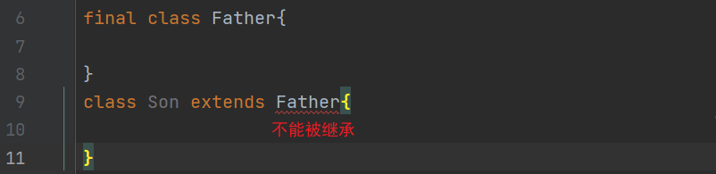
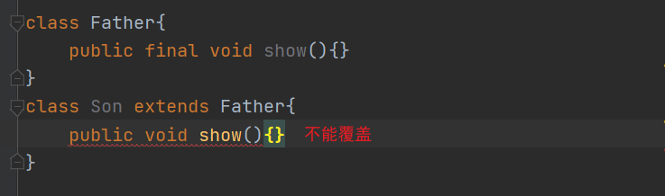
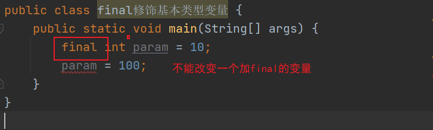
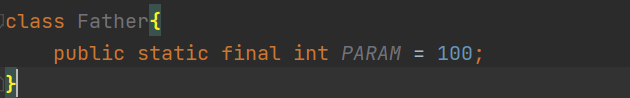
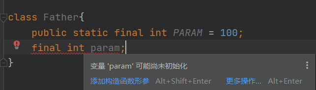
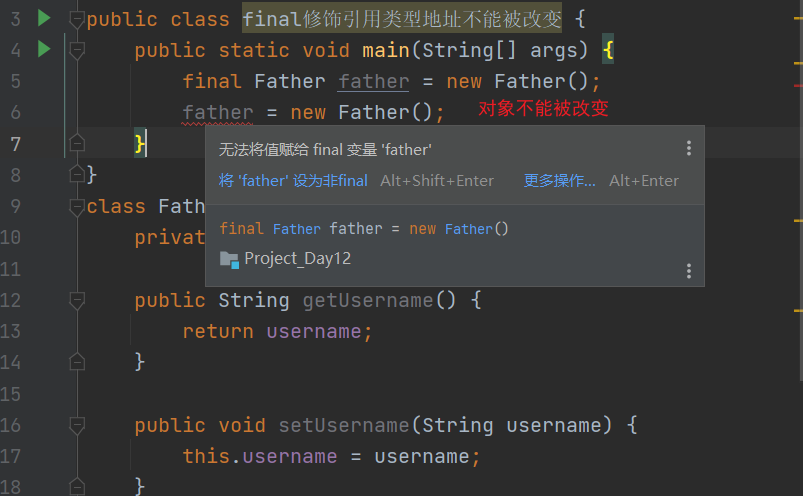
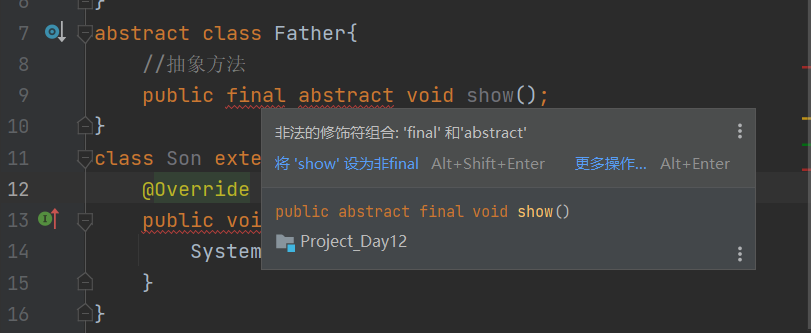

## 5.5 super关键字

### 5.5.1 作用

+ `super`指的是父类对象
+ 调用**父类的构造方法**
+ 调用**父类的成员对象**

**注意**：`super`只能应用于**成员**方法和构造方法中，不能应用在`static`静态方法中，如果在构造方法中使用(和`this`相同)必须放在首行。

### 5.5.2 为什么会有`super`关键字?

+ 因为子类创建对象时必须调用父类的构造方法，先把父类构造完成，因为子类依赖于父类；*无父即无子*;

+ 子类有时也调用父类的成员方法;
+ **特殊注意**：
  + 我们在很多时候创建子类对象时，并不显示的编写构造方法的，那么，默认调用的就是父类的无参构造方法。
  + 构造方法可以被`overload`[重载]，不能被`override`[重写(覆盖)]

### 5.5.3 案例：

#### 5.5.3.1 调用父类的默认构造方法

+ 先创建父类对象后再创建子类对象

```java
package com.holo;

public class 调用父类的无参构造方法 {
    public static void main(String[] args) {
        //创建子类对象
        Son son = new Son();
    }
}

class Father{
    public Father(){
        System.out.println("父类的无参数构造方法");
    }
}

class Son extends Father{
    public Son(){
        //super();
        System.out.println("子类的无参数构造方法");
    }
}
```

运行结果:

```
父类的无参数构造方法
子类的无参数构造方法
```

#### 5.5.3.2 调用指定的构造方法

+ 调用父类的2个参数的构造方法

```java
package com.holo;

public class 调用父类的2个参数的构造方法 {

    public static void main(String[] args) {
        //创建子类对象
        Son son = new Son();
    }
}

class Father {
    public Father() {
        System.out.println("父类的无参数构造方法");
    }
    public Father(int i){
        System.out.println("父类的1参数构造方法");
    }
    public Father(int i,int n){
        System.out.println("父类的2参数构造方法");
    }
}

class Son extends Father {
    public Son() {
        super(1,2);
        System.out.println("子类的无参数构造方法");
    }
}

```

运行结果:

```
父类的2参数构造方法
子类的无参数构造方法
```

#### 5.5.3.3 笔试题

+ 创建子类时调用哪个构造方法

```java
public class 笔试题1 {
    public static void main(String[] args) {
        Son son = new Son();
    }
}

class Father {
    public Father(int i) {
        System.out.println("父类的1参数构造方法");
    }

    public Father(int i, int n) {
        System.out.println("父类的2参数构造方法");
    }
}

class Son extends Father {
    public Son() {
        System.out.println("子类的无参构造方法");
    }
}
```

答:**错误**，因为子类创建对象时，如果没有使用`super`调用父类的构造方法，那么，就是调用**父类的无参数构造方法**，而父类**没有**这个构造方法.

+ 运行结果为多少？

```java
package com.holo;

public class 面试题2 {
    public static void main(String[] args) {
        //创建子类对象
        Son son = new Son(10);
    }
}

class Father {
    public Father() {
        System.out.print(1);
    }

    public Father(int i) {
        System.out.print(2);
    }

    static {
        System.out.print(3);
    }

    {
        System.out.print(4);
    }
}

class Son extends Father {
    public Son() {
        System.out.print(5);
    }

    public Son(int i) {
        System.out.print(6);
    }

    static {
        System.out.print(7);
    }

    {
        System.out.print(8);
    }
}

```

运行结果:`374186`。

​		优先级:`静态块>语句块>构造方法`

## 5.6 final关键字

+ `final`表示最终的，不能改变的

### 5.6.1 作用

+ 采用`final`修饰的类不能被继承了
+ 采用`final`修饰的变量:
  + 基本类型：变量的值不能改变
  + 引用类型：引用的地址不能改变，到那时，被指向的对象中的属性是可以修改的

+ 采用`final`修饰的方法不能被覆盖了
+ 采用`final`修饰的变量必须显示初始化
+ 构造方法不能被`fianl`修饰

### 5.6.2 案例

#### 5.6.2.1 `fianl`修饰的类不能被继承



#### 5.6.2.2 `final`修饰的方法不能被覆盖



#### 5.6.2.3 `final`修饰基本类型变量

 

+ **常量** 用全大写表示，是规范



+ 必须初始化 



#### 5.6.2.4 `final`修饰引用类型地址不能被改变



+ 可以修改对象中的属性

```java
package com.holo;

public class 可以修改对象中属性 {
    public static void main(String[] args) {
        final Father father = new Father();
        //修改属性
        father.setUsername("爸爸");
        father.setUsername("爸比");
    }
}
class Father{
    private String username;

    public String getUsername() {
        return username;
    }

    public void setUsername(String username) {
        this.username = username;
    }
}
```

## 5.7 抽象类

+ **重点：****抽象类不能创建对象**,但是，**有构造方法**，因为子类在创建对象时必须调用父类的构造方法

### 5.7.1 抽象类

+ 使用`abstract`修饰的类即为抽象类
+ 使用`abstract`修饰的方法即为抽象方法
+ 抽象类中可以有抽象方法也可以没有
+ 如果类中有抽象方法，那么这个类一定是抽象类
+ 抽象方法不能使用`final`修饰
+ 子类继承了抽象类，那么必须实现所有的抽象方法
+ 如果子类继承了抽象父类，并且，没有实现抽象方法，那么这个子类也一定是一个抽象类

### 5.7.2 抽象类的作用

+ 在抽象类中可以添加公有的代码(就是相同的代码)
+ 在抽象类中可以约束

### 5.7.3 案例：

#### 5.7.3.1 抽象父类

+ 子类调用对象时也调用了抽象父类的构造方法

```java
package com.holo;

public class 抽象父类 {
    public static void main(String[] args) {
        new Son();
    }
}

abstract class Father {
    private int id;
    private String username;

    public Father() {
        System.out.println("默认父类无参构造方法");
    }

    public Father(int i) {

    }

    public int getId() {
        return id;
    }

    public void setId(int id) {
        this.id = id;
    }

    public String getUsername() {
        return username;
    }

    public void setUsername(String username) {
        this.username = username;
    }
}

class Son extends Father {

}
```

#### 5.7.3.2 在抽象父类中添加约束

+ 添加一个抽象方法，子类必须要实现

```java
package com.holo;

public class 添加一个抽象方法_子类必须要实现 {
    public static void main(String[] args) {

    }
}

abstract class Father {
    //抽象方法
    public abstract void show();

    public abstract void save();

    //实现的方法
    public void update() {
        System.out.println("实现的方法");
    }
}

class Son extends Father {


    @Override
    public void show() {

    }

    @Override
    public void save() {

    }
}
```

#### 5.7.3.3 抽象父类不能使用final修饰

+ 因为这样很矛盾(final与abstract关键字冲突)

