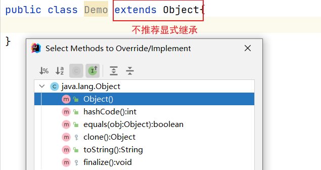
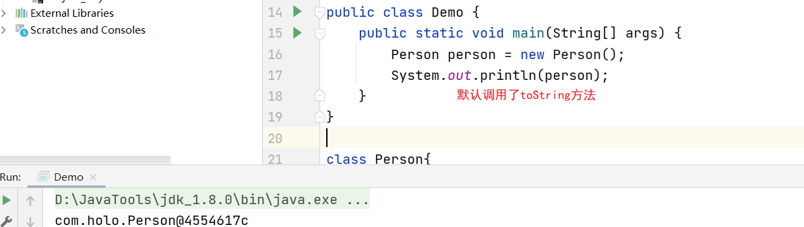
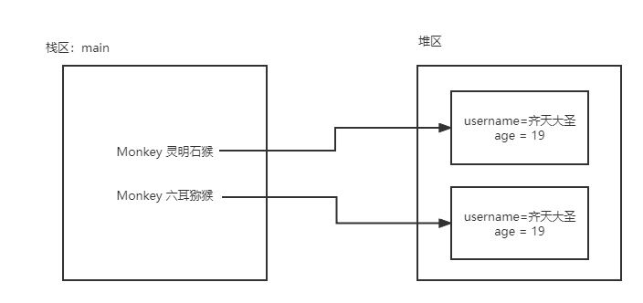
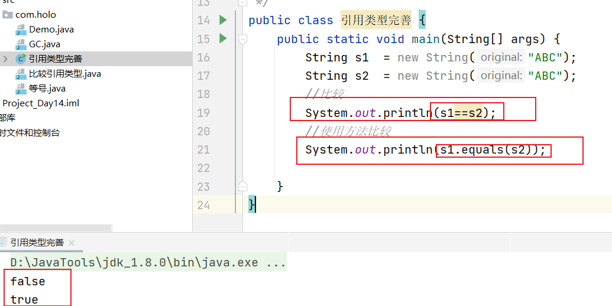

## 6.1 `Object`类

+ `Object`类是所有类的父类(基类、超类)

+ 自定义类不显示的继承`Object`，那么，默认基类就是`Object`

### 6.1.1 案例

```java
public class Demo {
    public static void main(String[] args) {
        Person person = new Person();
        System.out.println(person.toString());
    }
}

class Person{
    @Override
    public String toString() {
        return super.toString();
    }
}

```

运行结果:`com.holo.Person@4554617c`


+ 相当于

### 6.1.2 toString方法



+ 源代码

```java
public String toString() {
    return getClass().getName() + "@" + Integer.toHexString(hashCode());
}
```

+ **注意：在输出对象的参数的时候，调用或不调用toString方法默认都在执行toString方法**`return getClass().getName() + "@" + Integer.toHexString(hashCode());`

#### 6.1.2.1 我们在调用对象的时候，都习惯把toString方法重写(覆盖)

```java
public class Demo {
    public static void main(String[] args) {
        Person person = new Person();
        person.setUsername("朱少楷");
        person.setSex("男");
        person.setAge(19);
        System.out.println(person);
    }
}

class Person{
    private String username ;
    private String sex;
    private int age;

    public String getUsername() {
        return username;
    }

    public void setUsername(String username) {
        this.username = username;
    }

    public String getSex() {
        return sex;
    }

    public void setSex(String sex) {
        this.sex = sex;
    }

    public int getAge() {
        return age;
    }

    public void setAge(int age) {
        this.age = age;
    }

    @Override
    public String toString() {
        return "Person{" +
                "username='" + username + '\'' +
                ", sex='" + sex + '\'' +
                ", age=" + age +
                '}';
    }
}
```

运行结果:`Person{username='朱少楷', sex='男', age=19}`

### 6.1.3 finalize方法

+ 垃圾回收器(Garbage Collection) GC
  + 当对象不再使用了，那么，GC会将其回收
  + 垃圾回收在后台运行，我们没有办法命令立刻回收，但是可以通知
  + 垃圾回收前必须调用的方法就是finalize，不建议使用这个方法

+ 案例

```java
public class GC {
    public static void main(String[] args) {
        //创建对象
        Person person = new Person();
        //不使用了
        person = null;
        //通知垃圾回收器
        System.gc();
    }
}
class Person{
    @Override
    protected void finalize() throws Throwable {
        System.out.println("垃圾回收前被调用了");
    }
}
```

+ 扩展

```java
public class GC {
    public static void main(String[] args) {
        //创建对象
        Person person = new Person();
        //使用对象后
        person = null;
    }
}
```

**问**：在使用玩后是否需要把对象设置为`null`

**答**:不需要设置为null，因为，在方法中的参数都是在压栈时存在，弹栈时不存在。

### 6.1.4 ==与equals方法

#### 6.1.4.1 等号“==”

+ 基本类型：比较的是“值”
+ 引用类型：比较的是“址”(内存地址)

案例一：

```java
public class 等号 {
    public static void main(String[] args) {
        int a = 100;
        int b = 200;
        int c = 100;
        System.out.println(a==b);
        System.out.println(a==c);
    }
}
```

运行结果:

```java
false
true
```

案例二：

```java
public class 比较引用类型 {
    public static void main(String[] args) {
        //创建对象
        Monkey 六耳猕猴 = new Monkey();
        六耳猕猴.setUsername("齐天大圣");
        六耳猕猴.setAge(19);

        //创建对象
        Monkey 灵明石猴 = new Monkey();
        灵明石猴.setUsername("齐天大圣");
        灵明石猴.setAge(19);

        //比较
        System.out.println(六耳猕猴);
        System.out.println(灵明石猴);
        System.out.println(六耳猕猴 == 灵明石猴);
    }
}

class Monkey {
    private String username;
    private int age;

    public String getUsername() {
        return username;
    }

    public void setUsername(String username) {
        this.username = username;
    }

    public int getAge() {
        return age;
    }

    public void setAge(int age) {
        this.age = age;
    }
}
```

运行结果：

```
com.holo.Person@4554617c
com.holo.Person@74a14482
false
```



案例三：引用类型进一步完善

+ equals方法默认使用的是“==”

```java
//JDK的源代码
public boolean equals(Object obj) {
        return (this == obj);
}
```

+ 需要把引用类型中的值比较一下：username和age的“值”相同，那么，就认为是同一个



+ String源代码

```java
public boolean equals(Object anObject) {
    if (this == anObject) {
        return true;
    }
    if (anObject instanceof String) {
        String anotherString = (String)anObject;
        int n = value.length;
        if (n == anotherString.value.length) {
            char v1[] = value;
            char v2[] = anotherString.value;
            int i = 0;
            while (n-- != 0) {
                if (v1[i] != v2[i])
                    return false;
                i++;
            }
            return true;
        }
    }
    return false;
}
```

+ 覆盖Object中的equals方法

```java
public class 引用类型完善 {
    public static void main(String[] args) {
        //创建对象
        Monkey 六耳猕猴 = new Monkey();
        六耳猕猴.setUsername("齐天大圣");
        六耳猕猴.setAge(19);

        //创建对象
        Monkey 灵明石猴 = new Monkey();
        灵明石猴.setUsername("齐天大圣");
        灵明石猴.setAge(19);

        //比较
        System.out.println(六耳猕猴 == 灵明石猴);
        System.out.println(六耳猕猴.equals(灵明石猴));
    }
}

class Monkey {
    private String username;
    private int age;

    public String getUsername() {
        return username;
    }

    public void setUsername(String username) {
        this.username = username;
    }

    public int getAge() {
        return age;
    }

    public void setAge(int age) {
        this.age = age;
    }

    @Override
    public boolean equals(Object anObject) {
        if (this == anObject) {
            return true;
        }
        //判断是否为指定的类型
        if (anObject instanceof Monkey) {
            Monkey another = (Monkey) anObject;
            //判断username和age
            if (age == another.getAge() && username.equals(another.getUsername())) {
                return true;
            }
        }
        return false;
    }
}
```

运行结果:

```java
false
true
```

+ `instanceof`判断类型试用的
+ 注意：强制类型转换
  + 将父类转为子类“向下转型”，是不安全的
  + 将子类转为父类“向上转型”，是安全的

## 6.2 访问权限

| 修饰符    | 类的内部 | 同一个包 | 子类(同包) | 任何位置 |
| --------- | -------- | -------- | ---------- | -------- |
| public    | Y        | Y        | Y          | Y        |
| private   | Y        | N        | N          | N        |
| protected | Y        | Y        | Y          | N        |
| default   | Y        | Y        | N          | N        |

## 6.3 内部类

### 6.3.1 分类

+ 实例内部类：必须持有外部的引用(实例)
+ 静态内部类：不需要持有外部的引用
+ 局部内部类：在方法中使用

### 6.3.2 实例内部类

+ 必须持有外部的引用（实例）：就是内外两个对象都创建
+ 内部不能定义static成员，只能是实例成员

```java
public class 实例内部类 {
    public static void main(String[] args) {
        A a = new A();
        a.methodA();
        A.B b = a.new B();
        b.methodB();
        
    }
}
class A{
    //成员方法
    public void methodA(){
        System.out.println("A-method");
    }
    class B{//内部类
        public void methodB(){
            System.out.println("B-method");
            //可以调用外部的成员方法
            methodA();
        }
    }
}
```

运行结果:

```
A-method
B-method
A-method
```

第二种方式:

```java
public class 实例内部类2 {
    public static void main(String[] args) {
        A.B b = new A().new B();
        b.methodB();
    }
}
class A{
    //成员方法
    public void methodA(){
        System.out.println("A-method");
    }
    class B{//内部类
        public void methodB(){
            System.out.println("B-method");
            //可以调用外部的成员方法
            methodA();
        }
    }
}
```

运行结果:

```
B-method
A-method
```

### 6.3.3 静态内部类

+ 不需要持有外部的引用
+ 静态内部类可以访问外部的静态变量，如果需要访问外部的成员变量必须通过外部的对象方法

+ 案例

```java
public class 静态内部类 {
    public static void main(String[] args) {
        //不需要创建外部对象，直接创建内部对象即可
        A.B b = new A.B();
        b.methodB();
        //可以直接调用静态方法
        System.out.println(A.B.i);
    }
}

class A {
    //静态方法
    public static void methodA() {
        System.out.println("A-method");
    }

    static class B {//内部类
        public static int i = 100;

        public void methodB() {
            System.out.println("B-method");
            //可以调用外部的成员方法
            methodA();
        }
    }
}
```

### 6.3.4 局部内部类

+ 就是在方法中创建的类，和局部变量的使用是相同的

```java
public class 局部内部类 {
    public static void main(String[] args) {
        //创建对象，调用成员方法
        new A().methodA(100);
    }
}

class A {
    public void methodA(int i) {
        //相当于定义了一种只在方法内使用的类
        class B {
            public void methodB() {
                System.out.println("I-->" + i);
            }
        }
        //在方法内使用
        B b = new B();
        b.methodB();
    }
}
```

### 6.3.5 扩展：匿名内部类

+ 接口作为方法的参数使用了

```java
public class 匿名内部类 {
    public static void main(String[] args) {
        B b = new B();
        //调用方法，匿名实现接口中的方法
        b.exec(new A() {
            @Override
            public Object callback() {
                return "匿名实现";
            }
        });

    }
}

interface A {
    Object callback();
}

class B {
    //成员方法
    public Object exec(A a) {
        return a.callback();
    }
}
```

+ 使用lambda函数实现

```java
public class lambda函数实现 {
    public static void main(String[] args) {
        A a = ()->"lambda函数实现";
        //调用
        Object back = a.callBack();
        System.out.println(back);
    }
}
interface A{
    Object callBack();
}
```