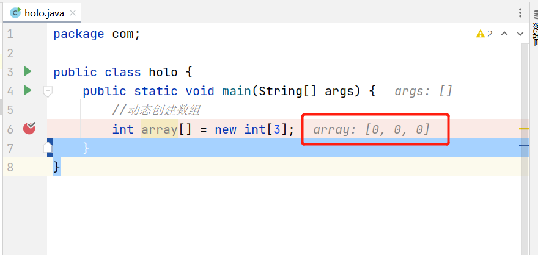
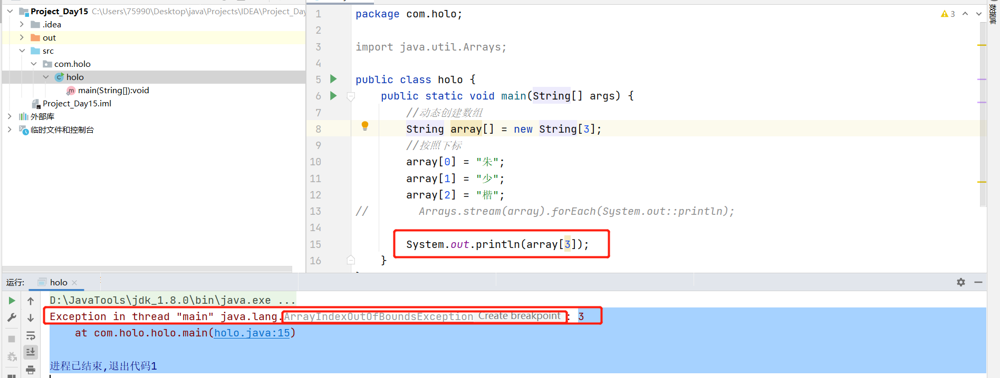

# 第五章 数组

## 5.1 数组概要

+ 数组是一种引用类型


+ 数组是一组数据的集合
+ 数组作为引用类型
+ 数组中的元素可以是"基本类型",也可以是"引用类型",**但是**,必须是同一种类型
+ 数组的长度(元素的个数)是一个属性表示的,`length`表示的就是长度
+ 数组的长度一旦确定后,就无法修改了
+ 数组的元素是有下标的,并且从`0`开始,最大的下标值是`length-1`

## 5.2 一维数组的创建和使用

### 5.2.1 创建一维数组

#### 5.2.1.1 第一种 (推荐) :

```java
int[] array = new int[2]; 
```

#### 5.2.1.2 第二种:

```java
int array[] = new int[2];
```

#### 5.2.1.3 动态创建数组和静态创建数组

##### 5.2.1.3.1 动态创建数组

+ 动态创建数组:默认在堆中开辟了三个位置,并且,默认元素的值就是该类型的默认值




+ 可以在实际开发中按照下标添加对应的数据元素


+ 可以通过循环的方式获取元素

  + 案例1:

    ```java
    public class holo {
        public static void main(String[] args) {
            //动态创建数组
            String array[] = new String[3];
            //按照下标
            array[0] = "朱";
            array[1] = "少";
            array[2] = "楷";
            //循环获取元素值
            for (int index = 0; index < array.length; index++) {
                System.out.println(array[index]);
            }
        }
    }
    ```

  + 案例2:

    ```java
    public class holo {
        public static void main(String[] args) {
            //动态创建数组
            String array[] = new String[3];
            //按照下标
            array[0] = "朱";
            array[1] = "少";
            array[2] = "楷";
            //循环获取元素值
            for (String element : array) {
                System.out.println(element);
            }
        }
    }
    ```

  + 案例3:lambda函数的方式

    ```java
    public class holo {
        public static void main(String[] args) {
            //动态创建数组
            String array[] = new String[3];
            //按照下标
            array[0] = "朱";
            array[1] = "少";
            array[2] = "楷";
            
            Arrays.stream(array).forEach(System.out::println);
        }
    }
    ```

  + 必须注意元素的下标,因为,会出现一个**运行期**的异常

  

##### 5.2.1.3.2 静态创建数组

+ 就是初始化的时候就把数组中的元素由默认值添加为指定的数值了

```java
public class 静态创建数组 {
    public static void main(String[] args) {
        //静态创建数组
        int [] array = {1,2,3,4,5};
        //输出
        for (int index = 0; index < array.length; index++) {
            System.out.println(array[index]);
        }
    }
}
```

运行结果:

```
1
2
3
4
5
```

```java
public class 静态创建数组 {
    public static void main(String[] args) {
        //静态创建数组
        int [] array = {1,2,3,4,5};
        //输出
//        for (int index = 0; index < array.length; index++) {
//            System.out.println(array[index]);
//        }
        Arrays.stream(array).forEach(System.out::println);
    }
}
```

运行结果:

```
1
2
3
4
5
```

## 5.3 二维数组的创建和使用

+ 二维数组就是两个一维数组

### 5.3.1 创建二维数组的三种方式

```java
public class 二维数组的创建 {
    public static void main(String[] args) {
        //在类型的后面添加中括号
        int[][] array0 = new int[2][3];
        //在变量名称的后面添加中括号
        int array1[][] = new int[2][3];
        //扩展
        int[] array2[] = new int[2][3];
    }
}
```

### 5.3.2 动态创建二维数组


```java
public class 动态创建二维数组 {
    public static void main(String[] args) {
        //动态创建二维数组:2行3列
        int[] array[] = new int[2][3];
        //添加元素
        array[0][0]=1;
        array[0][1]=2;
        array[0][2]=3;

        array[1][0]=4;
        array[1][1]=5;
        array[1][2]=6;

        //通过嵌套循环获取元素
        for (int row = 0; row < array.length; row++) {
            for (int column = 0; column < array[row].length; column++) {
                System.out.println("array["+row+"]["+column+"]="+array[row][column]);
            }
        }
    }
}
```

运行结果:

```
array[0][0]=1
array[0][1]=2
array[0][2]=3
array[1][0]=4
array[1][1]=5
array[1][2]=6
```

### 5.3.4 高维创建二维数组

#### 5.3.4.1 静态方式创建

```java
public class 高维创建二维数组 {
    public static void main(String[] args) {
        int[][] array = {{1}, {2, 3}, {4, 5, 6}};
        //遍历
        for (int row = 0; row < array.length; row++) {
            for (int column = 0; column < array[row].length; column++) {
                System.out.println("array[" + row + "][" + column + "]=" + array[row][column]);
            }
        }
    }
}
```

运行结果:

```
array[0][0]=1
array[1][0]=2
array[1][1]=3
array[2][0]=4
array[2][1]=5
array[2][2]=6
```

#### 5.3.4.2 动态方式创建

```java
public class 高维创建二维数组_动态方式 {
    public static void main(String[] args) {
        //高维创建,可以不确定列数
        int[][] array = new int[3][];
        
        //在使用元素时,必须创建出来了
        array[0] = new int[1];
        array[0][0] = 1;

        array[1] = new int[2];
        array[1][0] = 2;
        array[1][1] = 3;

        array[2] = new int[3];
        array[2][0] = 4;
        array[2][1] = 5;
        array[2][2] = 6;

        //遍历
        for (int row = 0; row < array.length; row++) {
            for (int column = 0; column < array[row].length; column++) {
                System.out.println("array[" + row + "][" + column + "]=" + array[row][column]);
            }
        }

    }
}
```

运行结果:

```
array[0][0]=1
array[1][0]=2
array[1][1]=3
array[2][0]=4
array[2][1]=5
array[2][2]=6
```

