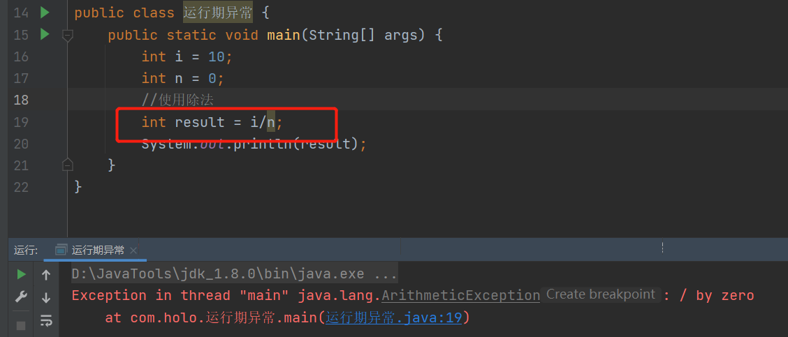

# 第六章 异常

## 6.1 什么是异常

```java
public class 什么是异常 {
    public static void main(String[] args) {
        int i = 10;
        int n = 0;
        //使用除法
        int result = i / n;
        System.out.println(result);
    }
}
```


+ 错误的原因就是因为被0除
+ 这种信息被Java的运行环境爆出来了,这就是Java的异常体系
+ 注意:Java的异常都是**"类"**

## 6.2 异常的分类

### 6.2.1 异常分类图


### 6.2.2 异常分类

+ Error错误,如果程序出现Error,那么将无法恢复,只能重新启动应用.例如:OutOfMemeoryError

+ **受控异常**(一般性异常;**编译期异常**):这种异常出现时,必须显示的处理,因为,不处理程序无法运行


+ **非受控异常**(**运行期异常**)



### 6.2.3 `try`、`catch`、`finally`

+ 异常的捕获和处理采用`try-catch`完成

```java
try {
}catch (OneException e){
    
}catch (TwoException e){
    
}finally {
    
}
```

+ `try`中包含任何可能产生异常的代码

+ `try`后面可以是一个`catch`或者多个`catch`;`catch`就是捕获异常的
  + 如果try代码块中出现了异常,那么,立刻跳转到catch语句块中
  + 在try中出现异常的语句后面的代码不会执行了
+ `finally`表示:无论上面的代码是否有异常出现都必须执行的代码块

+ `try`可以直接使用finally

```java
try {
}finally {
}
```

#### 6.2.3.1 案例

```java
public class try_catch {
    public static void main(String[] args) {
        int i = 10;
        int n = 0;
        try {
            //业务代码
            //因为,这一行代码被0除,所以,下一行代码不会被执行
            int result = i / n;
            System.out.println(result);
        } catch (ArithmeticException e) {
            //e表示ArithmeticException类的局部变量
            System.out.println("不能被0除");
        }
    }
}
```

运行结果:

``` 
不能被0除
```

#### 6.2.3.2 可以使用两种方式输出异常信息系

+ 获取异常的描述信息

```java
public class 获取异常的描述信息 {

    public static void main(String[] args) {
        int i = 10;
        int n = 0;
        try {
            //业务代码
            //因为,这一行代码被0除,所以,下一行代码不会被执行
            int result = i / n;
            System.out.println(result);
        } catch (ArithmeticException e) {
            //e表示ArithmeticException类的局部变量
            String message = e.getMessage();
            System.out.println("异常的描述信息:" + message);
        }

    }
}
```

运行结果:

```
异常的描述信息:/ by zero
```

+ 获取异常堆栈信息(适合程序调试阶段)

```java
public class 获取异常堆栈信息 {
    public static void main(String[] args) {
        int i = 10;
        int n = 0;
        try {
            //业务代码
            //因为,这一行代码被0除,所以,下一行代码不会被执行
            int result = i / n;
            System.out.println(result);
        } catch (ArithmeticException e) {
            //e表示ArithmeticException类的局部变量
            e.printStackTrace();
        }
    }
}
```

运行结果:

#### 6.2.3.3 受控异常

```java
public class 受控异常 {
    public static void main(String[] args) {
        try {
            FileInputStream fileInputStream = new FileInputStream("");
        } catch (FileNotFoundException e) {
            e.printStackTrace();
        }
    }
}
```

#### 6.2.3.4 `finally`关键字

+ 特点:无论执行是否正常,都必须执行的代码段

```java
public class finally关键字 {
    public static void main(String[] args) {
        try {
            FileInputStream fileInputStream = new FileInputStream("");
        } catch (FileNotFoundException e) {
            e.printStackTrace();
        } finally {
            System.out.println("必须执行的代码");
        }
    }
}
```

运行结果:

+ 使用场景:释放资源

  > 例如:1.关闭数据库连接
  >
  > ​		 2.关闭数据流

+ 深入`finally`
  + **原因:在`return`执行`finally`代码块,但是,返回的是10,因为a变量已经在弹栈过程中了**

```java
public class 深入finally {
    public static void main(String[] args) {
        int result = method();
        System.out.println(result);
    }

    public static int method() {
        int a = 10;
        try {
            return a;
        } finally {
            System.out.println("在return之前执行");
            a = 100;
        }
    }
}
```

运行结果: 

```
在return之前执行
10
```

+ 深入`finally`

```java
public class 深入finally_2 {
    public static void main(String[] args) {
        int result = method();
        System.out.println(result);
    }

    public static int method() {
        int a = 10;
        try {
            a = 200;
        } finally {
            a = 100;
        }
        return a;
    }
}
```

运行结果:

```
100
```

#### 6.2.3.5 final、finally、finalize的区别?

+ final:

  1. 修饰类不能继承

  2. 修饰参数:

     > 基本类型:值不能修改
     >
     > 引用类型:地址(对象)不能修改
     >
     > static final修饰变量

+ finally:代码段无论如何都必须执行

+ finalize():垃圾回收前调用的方法

## 6.3 如何声明异常

+ 在方法中可以使用throws声明异常,如何声明的异常为受控异常,那么,在调用方法的时候必须处理

### 6.3.1 声明异常;处理异常

```java
public class 声明异常 {
    public static void main(String[] args) {
        //调用方法的时候处理异常
        try {
            method();
        } catch (FileNotFoundException e) {
            e.printStackTrace();
        }
    }

    public static void method() throws FileNotFoundException {//声明异常
        FileInputStream fileInputStream = new FileInputStream("./Demo.txt");
    }
}
```

### 6.3.2 还是使用声明异常(不推荐)

```java
public class 声明异常 {
    public static void main(String[] args) throws FileNotFoundException {
        method();
    }

    public static void method() throws FileNotFoundException {//声明异常
        FileInputStream fileInputStream = new FileInputStream("./Demo.txt");
    }
}
```

### 6.3.3 声明非受控异常

```java
public class 声明非受控异常 {
    public static void main(String[] args) {
        //可以不缩写try-catch,因为是个非受控异常
        method();
        //建议缩写异常处理
        try {
            method();
        } catch (ArithmeticException e) {
            e.printStackTrace();
        }
    }

    public static void method() throws ArithmeticException {//声明异常
        int i = 10;
        int n = 0;
        int result = i / n;
        System.out.println(result);
    }
}
```

## 6.4 手动抛出异常

+ 使用throw关键字抛出异常
  + 相当于return,下面的代码不被执行
  + 可以抛出受控异常或非受控异常

### 6.4.1 自定义一般性异常

```java
public class 自定义一般性异常 {
    public static void main(String[] args) {
        //测试
        method(1, 1);
    }

    public static void method(int i, int n) {
        try {
            if (n == 0) {
                //手动抛出
                throw new MyException("不能为0");
            }
            if (!(n > 0 && n <= 100)) {
                throw new MyException("必须在1-100之间");
            }
            int result = i / n;
            System.out.println("result=" + result);
        } catch (Exception e) {
            e.printStackTrace();
        }
    }
}

//自定义异常类
class MyException extends Exception {
    public MyException() {
        super();
    }

    public MyException(String message) {
        super(message);
    }

    public MyException(String message, Throwable cause) {
        super(message, cause);
    }

    public MyException(Throwable cause) {
        super(cause);
    }

    protected MyException(String message, Throwable cause, boolean enableSuppression, boolean writableStackTrace) {
        super(message, cause, enableSuppression, writableStackTrace);
    }
}
```

运行结果：

```
result=1
```

### 6.4.2 自定义运行期异常

```java
public class 自定义运行期异常 {
    public static void main(String[] args) {
        //测试
        method(1, 1);
    }

    public static void method(int i, int n) {
        if (n == 0) {
            //手动抛出
            throw new MyException("不能为0");
        }
        if (!(n > 0 && n <= 100)) {
            throw new MyException("必须在1-100之间");
        }
        int result = i / n;
        System.out.println("result=" + result);
    }
}

//自定义异常类
class MyException extends RuntimeException {
    public MyException() {
        super();
    }

    public MyException(String message) {
        super(message);
    }

    public MyException(String message, Throwable cause) {
        super(message, cause);
    }

    public MyException(Throwable cause) {
        super(cause);
    }

    protected MyException(String message, Throwable cause, boolean enableSuppression, boolean writableStackTrace) {
        super(message, cause, enableSuppression, writableStackTrace);
    }
}
```

### 6.4.3 throws和throw的区别

+ throws:声明异常(不处理,谁使用谁处理)
+ throw:抛出异常(抛出自定义异常) 

## 6.5 异常的捕获顺序

+ 捕获的顺序:从小到大
+ 案例:

```java
public class 异常的捕获顺序 {
    public static void main(String[] args) {

        try {
            FileInputStream fileInputStream = new FileInputStream("");
        } catch (FileNotFoundException e) {
            e.printStackTrace();
        } catch (IOException e) {
            e.printStackTrace();
        } catch (Exception e) {
            e.printStackTrace();
        }
    }
}
```

## 6.6 方法覆盖(重写)与异常

+ 子类不能抛出比父类更多的异常,可以抛出父类异常的子异常

### 6.6.1 自定义异常类和接口

- [ ] ```java
  public class 自定义异常类和接口 {
      //自定义异常类
      class UserNotFound extends IOException {
      }
  
      class PasswordException extends UserNotFound {
      }
      
      class RegisterException extends Exception{
      }
  
      //创建接口
      interface UserDao {
          //编写一个方法
          void show() throws UserNotFound;
      }
  
  }
  ```

### 6.6.2 第一种情况(正确),实现类抛出的异常和接口中抛出的异常相同

```java
class UserDaoTmpl implements UserDao {
    @Override
    public void show() throws UserNotFound {
    }
}
```

### 6.6.3 第二种情况(正确),可以抛出父类异常的子异常

```java
class UserDaoTmpl implements UserDao {
    @Override
    public void show() throws UserNotFound, PasswordException{}
}
```

### 6.6.4 第三种情况(错误),不能抛出比父类更多的异常

```java
class UserDaoTmpl implements UserDao {
    @Override
    public void show() throws UserNotFound, RegisterException {
    }
}
```

## 6.7 总结

### 6.7.1 受控异常、非受控异常的区别:

+ 受控异常:必须显示的处理;
+ 非受控异常: 可以不用显示处理,运行时不需要处理、直接由JVM捕获

### 6.7.2 异常的关键字

+ `try`把有可能出现问题的代码编写在此
+ `catch`异常捕获
+ `finally`代码无论如何都必须执行
+ `throws`声明异常,但不处理(一般都是底层代码)
+ `throw`手动抛出异常(自定义异常)

### 6.7.3 方法覆盖与异常

+ **子类不能抛出比父类更多的异常,可以抛出父类异常的子异常**
