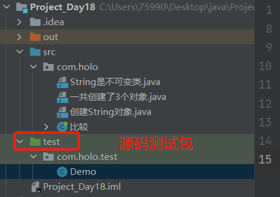

# 第七章 常用类

[Ctrl点击此处打开JDK1.8API文档](..\JDK1.8 API\jdk1.8中文版.CHM) 

## 7.1 `String`

### 7.1.1 `String`类是不可变类

+ `String`对象创建后不可以修改

+ 案例:

```java
public class String是不可变类 {
    public static void main(String[] args) {
        String s1 = "a";
        String s2 = "b";
        s1 = s1 + s2;
        System.out.println(s1);
    }
}
```

运行结果:`ab`


+ 从上图可以看到String对象赋值后不能再修改了。这就是不可变对象,如果对字符串修改,那么将会创建新的对象.

+ 注意:只要使用`" "`赋值的字符串,那么在编译期将会放到方法区的常量池中

+ 常量池中不允许出现重复的对象

### 7.1.2 String s1 = new String (“abc”);

+ 分别在**堆**和**常量池**中创建了2个对象,.返回**堆中的地址**

```java
public class 创建String对象 {
    public static void main(String[] args) {
        /**
         在堆中必须创建一个对象,并且返回的地址就是堆中对象的地址
         但是,常量池中也会创建一个对象,如果常量池中已经存在了abc对象,那么,就不在创建了
         */
        String s2 = new String("abc");
    }
}
```


### 7.1.3 一共创建了几个对象

```java
public class 一共创建了3个对象 {
    public static void main(String[] args) {
        String s1 = "abc";
        String s2 = new String("abc");
        String s3 = new String("abc");
    }
}
```

+ 一共创建了3个对象:堆中创建了2个对象,常量池中创建了1个对象


```java
public class 比较 {
    public static void main(String[] args) {
        String s1 = "abc";
        String s2 = new String("abc");
        String s3 = new String("abc");
		//3个参数分别指向了不同的对象的地址
        
        //比较地址
        System.out.println(s1 == s2);
        System.out.println(s2 == s3);
        //因为,String已经重写了equals方法,进行了基本类型的值得比较
        System.out.println(s1.equals(s2));
    }
}
```

运行结果:

```
false
false
true
```

## 7.2 String的常用方法

### 7.2.1 使用测试方法:单元测试junit

+ 创建源码测试包



+ 编写测试方法

```java
public class Demo {
    //编写一个测试方法
    public int sum(int i, int n) {
        return i + n;
    }
}
```

```java
package com.holo.test;

import com.holo.Demo;
import junit.framework.TestCase;

public class DemoTest extends TestCase {

    //测试方法
    public void test1() {
        Demo demo = new Demo();
        int sum = demo.sum(1, 1);
        System.out.println(sum);
    }
}
```

+ 可以使用`断言`进行逻辑测试

### 7.2.2 字符串常用的方法

 [点击打开](..\Projects\IDEA\Project_Day18\test\com\holo\test\DemoTest.java) 

```java
package com.holo.test;

import com.holo.Demo;
import junit.framework.TestCase;

public class DemoTest extends TestCase {

    //测试方法
    public void test1() {
        Demo demo = new Demo();
        int sum = demo.sum(1, 1);
        //使用断言方法
        assertEquals(sum, 2);
    }

    //toCharArray:把字符串转为字符数组
    public void test2() {
        String s1 = "abc";
        //转为数组
        char[] array = s1.toCharArray();
        //循环
        for (int i = 0; i < array.length; i++) {
            System.out.println(array[i]);
        }
    }

    //charAt方法:根据字符索引返回
    public void test3() {
        String s1 = "abc";
        System.out.println(s1.charAt(0));
    }

    //codePointAt返回对应字符的Unicode码
    public void test4() {
        String s1 = "abc";
        int i = s1.codePointAt(0);
        System.out.println(i);
    }

    //concat拼接字符串
    public void test5() {
        String s1 = "java";
        System.out.println(s1 + "\thello,world");
        //使用concat()方法拼接
        System.out.println(s1.concat("\thello,world"));
    }

    //endWith:判断字符串是否包含指定的后缀
    public void test6(){
        String s1 = "java";
        System.out.println(s1.endsWith("a"));
        System.out.println(s1.endsWith("ava"));
        System.out.println(s1.endsWith("java"));
    }

    //startsWith:判断字符串是否包含指定的前缀
    public void test7(){
        String s1 = "java";
        System.out.println(s1.startsWith("java"));
        System.out.println(s1.startsWith("j"));
    }
}
```

```java
    //equalsIgnoreCase:比较两个字符串,忽略大小写
    public void test8() {
        String s1 = "java";
        String s2 = "JAVA";

        System.out.println(s1.equals(s2));
        System.out.println(s1.equalsIgnoreCase(s2));
        //原理
        System.out.println(s1.toLowerCase().equals(s2.toLowerCase()));
    }

    //getBytes() 转为字节数组
    public void test9() {
        String s1 = "java";
        byte[] bytes = s1.getBytes();
        for (int i = 0; i < bytes.length; i++) {
            System.out.println(bytes[i]);
        }
    }

    //hashCode:获取哈希吗
    public void test10() {
        String s1 = "java";
        System.out.println(s1.hashCode());
    }

    //indexOf:获取指定字符或字符串第一次出现的位置(下标)
    public void test11() {
        String s1 = "java";
        System.out.println(s1.indexOf("av"));
    }

    //lastIndexOf获取指定字符或字符串最后一次出现的位置(下标)
    public void test12() {
        String s1 = "java.java";
        System.out.println(s1.lastIndexOf("."));
    }

    //subString截取字符串
    public void test13() {
        String s1 = "java.txt";
        //修改文件名称
        int index = s1.lastIndexOf(".");
        //截取
        String substring = s1.substring(index);
        //新名称
        String name = UUID.randomUUID() + substring;
        System.out.println(name);
    }

    //subString:截取字符串
    public void test14() {
        String s1 = "hadoop";
        System.out.println(s1.substring(1, 3));//左开右闭
    }

    //isEmpty():是否为空
    public void test15() {
        String s1 = "hadoop";
        System.out.println(s1.isEmpty());
    }

    //join:拼接
    public void test16() {
        String str = String.join(",", "java", "hello", "world");
        System.out.println(str);
    }

    //length()获取字符串长度的方法
    /*注意:1.数组的length是属性;
          2.字符的length()是方法
     */
    public void test17() {
        String s = "java";
        System.out.println(s.length());
    }

    //replace() 替换
    public void test18() {
        String s = "AAAA1111BBBB2222CCCC";
        String replace = s.replace("1", "");
        System.out.println(replace);
    }

    public void test19() {
        String uuid = UUID.randomUUID().toString();
        System.out.println(uuid);
        String replace = uuid.replace("-", "");
        System.out.println(replace);
    }


    //replaceAll()替换:可以使用正则表达式
    public void test20() {
        String s = "AAAA1111BBBB2222CCCC";
        String replaceAll = s.replaceAll("1{4}", "");
        System.out.println(replaceAll);
    }

    public void test21() {//将数字替换为-
        String s = "AAAA1111BBBB2222CCCC";
        String s1 = s.replaceAll("\\d", "-");
        System.out.println(s1);
    }

    public void test22() {//将非数字替换为-
        String s = "AAAA1111BBBB2222CCCC";
        System.out.println(s.replaceAll("\\D", "-"));
    }

    //split()按照指定分隔符返回字符串数组
    public void test23() {
        String s = "hello;java;scala;hive;flink;spark;hadoop";
        String[] array = s.split(";");
        for (int i = 0; i < array.length; i++) {
            System.out.println(array[i]);
        }
    }

    public void test24() {//可以使用正则表达式
        String s = "hello,java.scala/hive?flink;spark:hadoop";
        String[] array = s.split("\\W");
        for (int i = 0; i < array.length; i++) {
            System.out.println(array[i]);
        }
    }

    //转为大小写
    public void test25() {
        String s = "HELLO,JAVA";
        System.out.println(s.toLowerCase());
        String s1 = "hello,java";
        System.out.println(s.toUpperCase());
    }

    //转为字符串
    public void test26() {
        UUID uuid = UUID.randomUUID();
        //转字符串
        System.out.println(uuid.toString());
    }
```