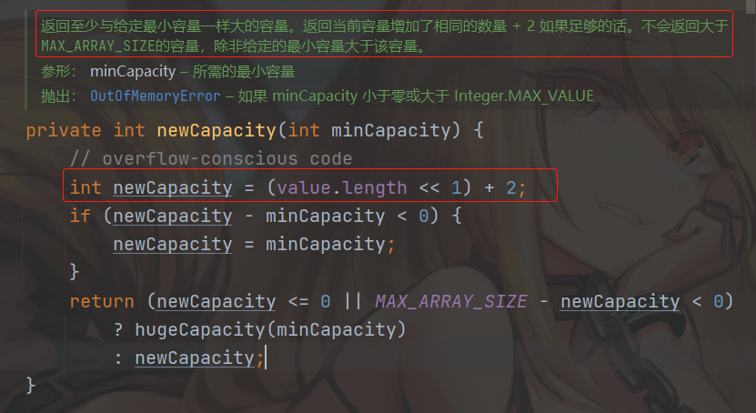
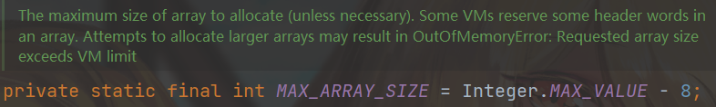
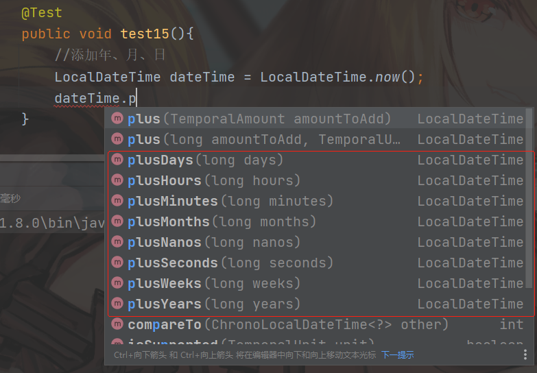
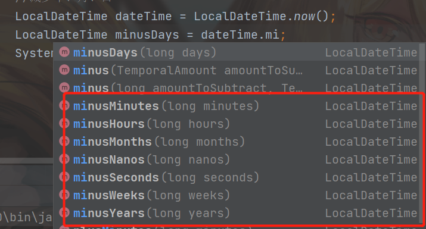

## 7.3 StringBuffer和StringBuilder

### 7.3.1 StringBuffer

+ StringBuffer和StringBuilder称为字符串缓冲区；原理：预先申请一块内存存储字符序列,如果存满了,会重新改变缓冲区的大小,以容纳更多的字符串
+ StringBuffer是可变对象,String是不可变对象,这是它们最大的区别
+ 以后在拼接字符串时就不能使用String而要使用StringBuffer或StringBuilder

### 7.3.2 不能这样拼接字符串

```java
@Test
public void test1() {
    String str = "";
    for (int i = 0; i < 10; i++) {
        //这样拼接字符串的方式会产生大量垃圾对象
        str += i;
    }
    System.out.println(str);
}
```

### 7.3.3 推荐使用StringBuilder拼接字符

```java
@Test
public void test2() {
    StringBuilder stringBuilder = new StringBuilder();
    for (int i = 0; i < 10; i++) {
        //推荐使用
        stringBuilder.append(i);
    }
    System.out.println(stringBuilder);
}
```

### 7.3.4 StringBuffer和StringBuilder区别

#### 7.3.4.1 StringBuffer

+ 是线程安全的,就是多线程的
+ 效率比较低
+ [点击查看StringBuffer帮助文档](https://www.matools.com/file/manual/jdk_api_1.8_google/java/lang/StringBuffer.html)
+ 

#### 7.3.4.2 StringBuilder

+ 单线程
+ 执行效率高
+ [点击查看StringBuilder帮助文档](https://www.matools.com/file/manual/jdk_api_1.8_google/java/lang/StringBuilder.html)
+ 

### 7.3.5 StringBuffer源代码

+ 初始化的长度:16个字符

+ 扩容的容量(原来的基础上2倍+2)



+ 最大的容量



#### 7.3.5.1 笔试题

```java
StringBuilder stringBuilder = new StringBuilder(20);
```

+ 扩容了几次?
+ 答:扩容了0次

### 7.3.6 StringBuilder中的常用方法

+ 使用deleteCharAt()方法

```java
@Test
public void test3() {
    StringBuilder stringBuilder = new StringBuilder();
    //拼接数字
    for (int i = 0; i < 10; i++) {
        stringBuilder.append(i).append(",");
    }
    //去掉最后一个逗号
    stringBuilder.deleteCharAt(stringBuilder.toString().length()-1);
    System.out.println(stringBuilder);
}
```

+ 字符串截取

```java
@Test
public void test4() {
    StringBuilder stringBuilder = new StringBuilder();
    //拼接数字
    for (int i = 0; i < 10; i++) {
        stringBuilder.append(i).append(",");
    }
    //去掉最后一个逗号
    String s = stringBuilder.toString();
    String substring = s.substring(0, s.length() - 1);
    System.out.println(substring);
}
```

+ 在代码中去掉

```java
@Test
public void test5() {
    StringBuilder stringBuilder = new StringBuilder();
    //拼接数字
    for (int i = 0; i < 10; i++) {
        stringBuilder.append(i);
        //判断
        if (i != 9) {
            stringBuilder.append(",");
        }
    }
    System.out.println(stringBuilder);
}
```

+ 笔试题:把字符串逆序输出

```java
@Test
public void test6(){
    String str = "hadoop";
    StringBuilder stringBuilder = new StringBuilder(str);
    //调用方法
    StringBuilder reverse = stringBuilder.reverse();
    System.out.println(reverse);

}
```

## 7.4 基本类型对应的包装类型

### 7.4.1 包装类型提供了更多的实用方法

+ 类型转换
+ 包装类型都是`final`修饰的

| 基本类型 | 包装类型      |
| -------- | ------------- |
| byte     | Byte          |
| short    | Short         |
| int      | **Interger**  |
| long     | Long          |
| float    | Float         |
| double   | Double        |
| char     | **Character** |
| boolean  | Boolean       |

### 7.4.2 类层次结构


#### 7.4.2.1 类型转换的方法

+ 除Boolean和Character以外,其他包装类都有转为包装类和基本类型的方法

```java
@Test
public void test7() {
    String str = "100";
    //转为包装类型
    Integer integer = Integer.valueOf(str);
    //转为基本类型
    int i = Integer.parseInt(str);
}
```

#### 7.4.2.2 自动拆装箱

+ 自动将基本类型转为对象-装箱
+ 自动将对象转为基本类型-拆箱

+ 笔试题

```java
@Test
public void test8() {
    //取值的范围是按照byte的范围获取的
    Integer i = 128;
    Integer n = 128;
    System.out.println(i == n);
}
```

运行结果:

```
false
```

## 7.5 日期类

```java
@Test
public void test9(){
    //传统的日期类不建议使用,因为,效率低
    Date date = new Date();
    System.out.println(date);
    //设置日期格式:HH表示24小时制,hh表示12小时制
    SimpleDateFormat simpleDateFormat = new SimpleDateFormat("yyyy-MM-dd HH:mm:ss");
    System.out.println(simpleDateFormat.format(date));
}
```

运行结果

```
Fri Feb 11 21:09:42 CST 2022
2022-02-11 21:09:42
```

---

```java
@Test
public void test10() {
    //获取日期
    LocalDate date = LocalDate.now();
    System.out.println(date);
    //获取时间
    LocalTime time = LocalTime.now();
    System.out.println(time);
}
```

运行结果:

```
2022-02-11
21:15:14.629
```

---

```java
@Test
public void test11() {
    //获取日期时间
    LocalDateTime dateTime = LocalDateTime.now();
    System.out.println(dateTime);
}
```

运行结果:

```
2022-02-11T21:17:02.469
```

---------------------------------

```java
@Test
public void test12(){
    //获取日期时间
    LocalDateTime dateTime = LocalDateTime.now();
    //使用标准化格式
    DateTimeFormatter formatter = DateTimeFormatter.ISO_LOCAL_DATE_TIME;
    //格式化
    System.out.println(formatter.format(dateTime));
}
```

运行结果:

```
2022-02-11T21:21:31.375
```

----

```java
@Test
public void test13(){
    //获取日期时间
    LocalDateTime dateTime = LocalDateTime.now();
    //自定义格式化
    DateTimeFormatter formatter = DateTimeFormatter.ofPattern("yyyy-MM-dd HH:mm:ss");
    //格式化
    System.out.println(formatter.format(dateTime));
}
```

运行结果:

```
2022-02-11 21:25:59
```

----


### 7.5.3 添加时间



```java
@Test
public void test14(){
    //指定日期时间
    LocalDateTime dateTime = LocalDateTime.of(2002, 8, 17, 12, 00);
    System.out.println(dateTime);
}
```

运行结果:

```
2002-08-17T12:00
```
-------

```java
@Test
public void test15(){
    //添加年、月、日
    LocalDateTime dateTime = LocalDateTime.now();
    LocalDateTime plusDays = dateTime.plusDays(13);
    System.out.println(plusDays);
}
```

运行结果

```
2022-02-24T21:34:29.250
```

---

### 7.5.4 减少时间

```java
@Test
public void test16() {
    //减少年、月、日
    LocalDateTime dateTime = LocalDateTime.now();
    LocalDateTime minusDays = dateTime.minusDays(11);
    //打印自定义格式日期
    System.out.println(DateTimeFormatter.ofPattern("yyyy-MM-dd HH:mm:ss").format(minusDays));
}
```

运行结果:

```java
2022-01-31 21:44:25
```



---

### 7.5.5 其他的日期方法

```java
@Test
    public void test17() {
        //获取日期中的:年/月/日/时....
        LocalDateTime dateTime = LocalDateTime.now();
        System.out.println(DateTimeFormatter.ofPattern("yyyy-MM-dd HH:mm:ss").format(dateTime));
        System.out.println("getYear()-------->" + dateTime.getYear());
        System.out.println("getMonth()------->" + dateTime.getMonth());
        System.out.println("getMonthValue()-->" + dateTime.getMonthValue());
        System.out.println("getHour()-------->" + dateTime.getHour());
        System.out.println("getDayOfYear()--->" + dateTime.getDayOfYear());
        System.out.println("getDayOfMonth()-->" + dateTime.getDayOfMonth());
        System.out.println("getDayOfWeek()--->" + dateTime.getDayOfWeek());
    }
```

运行结果:

```
2022-02-11 21:54:53
getYear()-------->2022
getMonth()------->FEBRUARY
getMonthValue()-->2
getHour()-------->21
getDayOfYear()--->42
getDayOfMonth()-->11
getDayOfWeek()--->FRIDAY
```

---

```java
@Test
public void test18(){
    //时间戳
    System.out.println("长整型时间戳:" + System.currentTimeMillis());
}
```

运行结果:

```
长整型时间戳:1644587819347
```

---

```java
@Test
public void test19() {
    //默认的时区时间
    System.out.println("本地的时区:" + LocalDateTime.now());
    Instant instant = Instant.now();
    //我们的时区和标准默认的时区相差8个小时
    System.out.println("默认的时区:" + instant);
    //必须添加上相差的8个小时
    OffsetDateTime offsetDateTime = instant.atOffset(ZoneOffset.ofHours(8));
    System.out.println("我们的时区:" + offsetDateTime);
    //获取时间戳
    System.out.println("获取实践戳:"+ offsetDateTime.toEpochSecond());
}
```

运行结果:

```
本地的时区:2022-02-11T22:05:57.415
默认的时区:2022-02-11T14:05:57.416Z
我们的时区:2022-02-11T22:05:57.416+08:00
获取实践戳:1644588357
```

---

```java
@Test
public void test20(){
    //计算时间差
    LocalDateTime datetime1 = LocalDateTime.of(2022, 8, 11, 22, 07);
    LocalDateTime datetime2 = LocalDateTime.of(2022, 8, 17, 11, 00);

    //求差
    Duration duration = Duration.between(datetime1, datetime2);
    System.out.println(duration.toDays());
    System.out.println(duration.getSeconds());
}
```

运行结果:

```
5
478380
```

---

```java
@Test
public void test21() {
    //计算日期差
    LocalDate datetime1 = LocalDate.of(2022, 8, 11);
    LocalDate datetime2 = LocalDate.of(2022, 8, 17);

    //求差,日期求差用Period
    Period between = Period.between(datetime1, datetime2);
    System.out.println("天数" + between.getDays());
    System.out.println("月数" + between.toTotalMonths());
}
```

```
天数6
月数0
```

---

```java
@Test
public void test22() {
    //时间校准器
    LocalDateTime dateTime = LocalDateTime.now();
    //获取这个月最后一天
    LocalDateTime with = dateTime.with(TemporalAdjusters.lastDayOfMonth());
    System.out.println(with);
}
```

运行结果:

```
2022-02-28T22:22:35.037
```

---

```java
@Test
public void test23() {
    //查看时区
    Set<String> set = ZoneId.getAvailableZoneIds();
    set.forEach(System.out::println);
}

@Test
public void test24() {
    //指定时区
    LocalDateTime dateTime = LocalDateTime.now();
    ZonedDateTime zonedDateTime = dateTime.atZone(ZoneId.of("Asia/Shanghai"));
    System.out.println(zonedDateTime);
}
```

**test24**运行结果:

```
2022-02-11T22:27:38.731+08:00[Asia/Shanghai]
```

