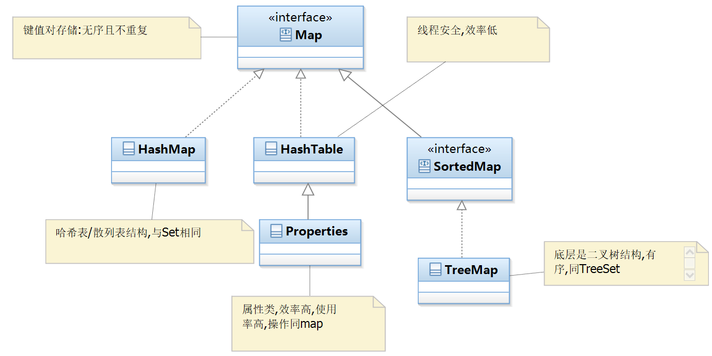
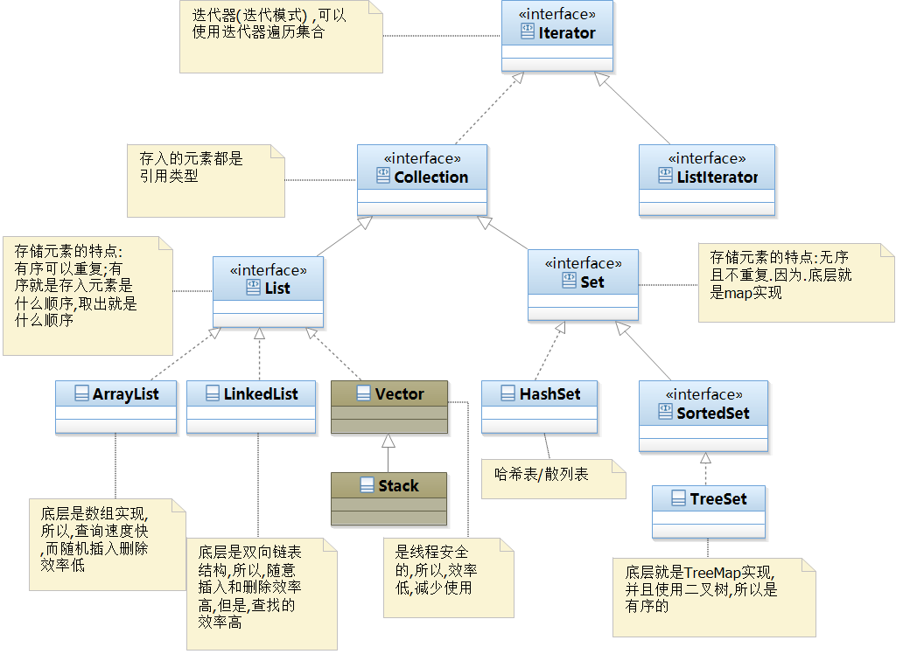
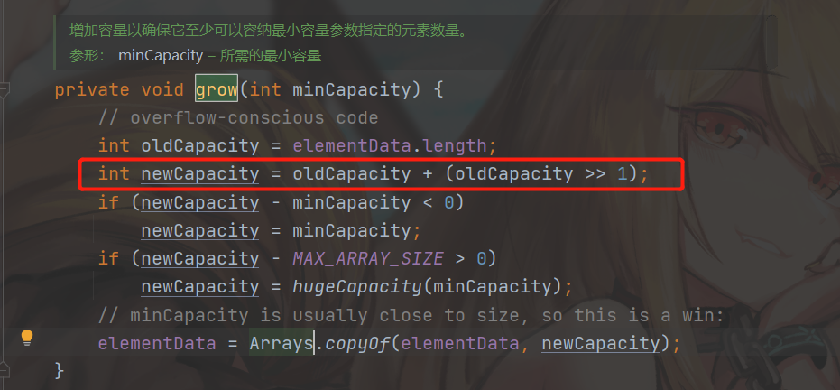

## 7.5 数字类

### 7.5.1 货币类型 DecimalFormat

+ 案例: 千进位符

```java
@Test
public void test1() {
    //货币格式
    DecimalFormat decimalFormat = new DecimalFormat("###,###.##");
    String format = decimalFormat.format(123456.12547);
    System.out.println(format);//123456.13
}
```

+ 案例:规定小数的位数

```java
@Test
public void test2() {
    //货币格式
    DecimalFormat decimalFormat = new DecimalFormat("###,###.000000");
    String format = decimalFormat.format(123456.332);
    System.out.println(format);//123,456.332000
}
```

### 7.5.2 使用财务数据 BigDecimal

+ 可以使用财务数据的专用方法

```java
@Test
public void test3() {
    //财务数据
    BigDecimal v1 = new BigDecimal(20);
    BigDecimal v2 = new BigDecimal(30);
    //相加
    BigDecimal add = v1.add(v2);
    System.out.println(add);//50
```

## 7.6 Random随机数

### 7.6.1 随机数的范围 0-1

```java
@Test
public void test4() {
    for (int i = 0; i < 5; i++) {
        double random = Math.random();
        System.out.println(random);
        //0.8145461676629191
        //0.5063139382435713
        //0.022291936593875183
        //0.9098999456499665
        //0.4524165674492039
    }
}
```

### 7.6.2 工具包下的随机数

```java
@Test
public void test5() {
    Random random = new Random();
    for (int i = 0; i < 5; i++) {
        //可以指定随机数的范围
        int n = random.nextInt(10);
        System.out.print(n);
        // 43959
    }
}
```

+ 笔试题:(待解决)没有出现的10以内的随机数 ?

+ 笔试题:获取50-100之间的随机数?

  - (自解;待讲):

  - ```java
    @Test
    public void test6() {
        Random random = new Random();
        for (int i = 0; i < 5; i++) {
            int n = random.nextInt(50);
            System.out.println(n + 50);
            //86
            //68
            //79
            //66
            //58
        }
    }
    ```

## 7.7 Enum枚举类型

+ 枚举就是为了定义标准,枚举中的参数都是常量

### 7.7.1 案例

```java
public void test7() {
    int i = 10;
    if (i >= 10) {
        System.out.println(Msg.SUCCESS);
    } else {
        System.out.println(Msg.FAILURE);
    }
    //SUCCESS
}

//创建枚举类
enum Msg {
    SUCCESS, FAILURE;
}
```

### 7.7.2 枚举的真实使用场景

```java
//枚举类
public enum Msg {
    DEL("删除", 1), SHOW("显示", 0);
    private String message;
    private Integer flag;

    //含参数的构造方法
    private Msg(String message, int flag) {
        this.message = message;
        this.flag = flag;
    }

    public String getMessage() {
        return message;
    }

    public Integer getFlag() {
        return flag;
    }
}
```

+ 使用

```java
package com.holo;

public class Demo {
    public static void main(String[] args) {
        //获取标识及对应的数字
        String message = Msg.DEL.getMessage();
        Integer flag = Msg.SHOW.getFlag();
        //显示
        System.out.println(message);
        System.out.println(flag);
    }
}
```

### 7.8 实体类:JavaBean

+ 注意:实体类的属性必须是包装类型,因为,我们只需要判断null或者非null即可

```java
public class Person {
    private String username;
    private String sex;
    private Integer age;

    public String getUsername() {
        return username;
    }

    public void setUsername(String username) {
        this.username = username;
    }

    public String getSex() {
        return sex;
    }

    public void setSex(String sex) {
        this.sex = sex;
    }

    public Integer getAge() {
        return age;
    }

    public void setAge(Integer age) {
        this.age = age;
    }
}
```

# 第八章 集合 

+ 因为数组的长度一旦确定就不能修改了,而集合可以看做是一种可变的数组

## 8.1 集合分类

[Java 集合框架 | 菜鸟教程](https://www.runoob.com/java/java-collections.html)

[集合Collection总结_满招损的博客-CSDN博客_collection集合](https://blog.csdn.net/weixin_41704733/article/details/79843877)

[ JAVA collection集合教程_许秀军的博客-CSDN博客_collection集合](https://blog.csdn.net/qq_34379645/article/details/79740578)

### 8.1.1 Map集合



+ 是一种无序且以键值(key/value)方式存储的集合类型;key不能重复,value是可以重复的对象(身份证号-姓名)

### 8.1.2 Collection集合



#### 8.1.2.1 List集合

+ 是一个有序且可以存储重复数据的集合

#### 8.1.2.2 Set集合

+ 是一个无序且不能重复的集合;因为,它底层就是Map结构

## 8.2 List 集合

### 8.2.1 概述

+ List :有序可重复
  1. ArrayList:底层基于数组结构,查询速度快,随机插入和删除比较慢
  2. LinkedList:底层基于双向链表结构,查询慢,随机插入和删除比较快

```java
@Test
public void test8() {
    //不建议使用类进行实例化;因为没有灵活性
    ArrayList list = new ArrayList();
    //推荐使用接口指向实现类:具有灵活性
    Collection list1 = new LinkedList();
    Collection list2 = new HashSet();
    //最推荐的就是使用直接接口
    List list3 = new ArrayList();
    List list4 = new LinkedList();
}
```

### 8.2.2 集合的使用元素都是引用类型


+ 案例

```java
@Test
public void test9() {
    List list = new ArrayList();
    list.add(1);
    //等价于
    list.add(new Integer(1));
}
```

### 8.2.3 遍历集合

```java
@Test
public void test10() {
    List list = new ArrayList();
    //添加元素
    list.add(1);
    list.add(3);
    list.add(5);
    list.add(4);
    list.add(5);
    //遍历:有序输出,就是输入的顺序(※不是排序)
    for (int i = 0; i < list.size(); i++) {
        Object el = list.get(i);
        System.out.print(el);
        //13545
    }
}
```

+ ArrayList集合默认的长度?


+ ArrayList集合如何扩容?



+ 加强for循环

```java
@Test
public void test11() {
    List list = new ArrayList();
    //增加元素
    list.add(1);
    list.add(3);
    list.add(5);
    list.add(4);
    list.add(5);
    //遍历:有序输出,就是输入的顺序(※不是排序)
    for (Object o : list) {
        System.out.println(o);
    }
}
```

+ lambda

```java
@Test
public void test12() {
    List list = new ArrayList();
    //增加元素
    list.add(1);
    list.add(3);
    list.add(5);
    list.add(4);
    list.add(5);
    //遍历:有序输出,就是输入的顺序(※不是排序)
    list.forEach(System.out::println);
}
```

+ 使用迭代器(运行效率高)

```java
@Test
public void test13() {
    List list = new ArrayList();
    //增加元素
    list.add(1);
    list.add(3);
    list.add(5);
    list.add(4);
    list.add(5);
    //遍历:有序输出,就是输入的顺序(※不是排序)
    Iterator iterator = list.iterator();
    while (iterator.hasNext()) {
        Object o = iterator.next();
        System.out.println(o);
    }
}
```