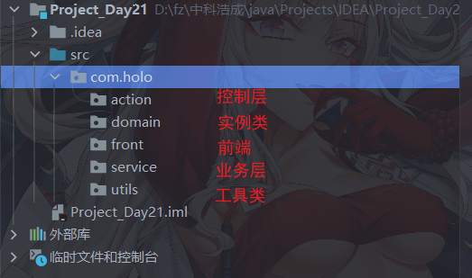

## 8.3 项目:学生管理

### 8.3.1 需求分析

+ 就是针对学生实体(对象)的CRUD进行业务操作

### 8.3.2 技术架构

+ 循环+实体类+集合(模拟数据库)

### 8.3.3 代码编写code

+ 业务层: service+接口
+ 控制层:action
+ 前端:main主方法+scanner完成用户的数据模拟输入

### 8.3.4 功能实现

+ 分包+分类+分方法


+ 包的名称:
  + com.holo.domain 实现类可能与数据库中的表有对应关系或没有
  + com.holo.beans 实体类就是载体,就是封装数据的,与数据库中表没有对应关系
  + com.holo.entity 实体类与数据库中表有对应关系
  + com.holo.pojo 这一类的试题是含有业务处理方法的,不单单是封装数据的



#### 8.3.4.1 编写实体类

```java
package com.holo.domain;

/**
 * @author Holo
 * @date 2022/2/16 16:54
 */

//必须使用引用类型
public class Student {
    private String sid; //学号:唯一不能重复的
    private String username;
    private String sex;
    private Integer age;
    private String dateTime;

    public String getSid() {
        return sid;
    }

    public void setSid(String sid) {
        this.sid = sid;
    }

    public String getUsername() {
        return username;
    }

    public void setUsername(String username) {
        this.username = username;
    }

    public String getSex() {
        return sex;
    }

    public void setSex(String sex) {
        this.sex = sex;
    }

    public Integer getAge() {
        return age;
    }

    public void setAge(Integer age) {
        this.age = age;
    }

    public String getDateTime() {
        return dateTime;
    }

    public void setDateTime(String dateTime) {
        this.dateTime = dateTime;
    }

    @Override
    public String toString() {
        return "Student{" +
                "sid='" + sid + '\'' +
                ", username='" + username + '\'' +
                ", sex='" + sex + '\'' +
                ", age=" + age +
                ", dateTime='" + dateTime + '\'' +
                '}';
    }
}
```

#### 8.3.4.2 编写工具类

```java
package com.holo.utils;

import java.text.Format;
import java.time.LocalDateTime;
import java.time.format.DateTimeFormatter;
import java.util.UUID;
import java.util.zip.CRC32;

/**
 * @author Holo
 * @date 2022/2/16 16:58
 */

//工具类
public class StudentUtils {
    //私有化构造方法,不让外界创建对象
    private StudentUtils() {
    }
    //获取不重复学号
    public static String getKeyString(){
        return UUID.randomUUID().toString().replace("-", "");
    }

    //获取数字类型的学号
    public static long geyKeyLong(){
        CRC32 crc32 = new CRC32();
        crc32.update(UUID.randomUUID().toString().getBytes());
        return crc32.getValue();
    }

    //使用日期模拟学号
    public static String getKeyStringDate() {
        //获取当前的日期(就是服务器的日期)
        LocalDateTime now = LocalDateTime.now();
        //设置日期格式
        DateTimeFormatter formatter = DateTimeFormatter.ofPattern("yyyyMMddHHmmss");
        return formatter.format(now);
    }

    //获取日期
    public static String getDate() {
        //获取当前的日期(就是服务器的日期)
        LocalDateTime now = LocalDateTime.now();
        //设置日期格式
        DateTimeFormatter formatter = DateTimeFormatter.ofPattern("yyyy-MM-dd HH:mm:ss");
        return formatter.format(now);
    }
}
```

#### 8.3.4.3 编写业务处理层

+ 接口

```java

package com.holo.service;

import com.holo.domain.Student;
import java.util.List;

/**
 * @author Holo
 * @date 2022/2/16 17:14
 */
public interface StudentService {
    //添加学生
    void save(Student student);

    //显示学生
    List findAll();

    //按照id查找学生
    Student findById(String id);

    //更新学生
    void update(Student student);

    //删除学生
    void delete(String id);
}
```

+ 实现类

```java
package com.holo.service;

import com.holo.domain.Student;
import com.holo.utils.StudentUtils;

import java.util.ArrayList;
import java.util.Iterator;
import java.util.List;

/**
 * @author Holo
 * @date 2022/2/16 17:15
 */
public class StudentServiceImpl implements StudentService {

    //创建一个存储学生的结合
    private List list = new ArrayList();//接口指向实现类

    @Override
    public void save(Student student) {
        //通过工具类添加学号和日期
        student.setSid(String.valueOf(StudentUtils.geyKeyLong()));
        student.setDateTime(StudentUtils.getDate());
        list.add(student);
    }

    @Override
    public List findAll() {
        return list;
    }

    @Override
    public Student findById(String id) {
        //遍历集合
        if (list.size() > 0) {
            //迭代模式
            Iterator iterator = list.iterator();
            while (iterator.hasNext()) {
                //获取学生
                Student student = (Student) iterator.next();
                //按照学号查找学生
                if (student != null && id.equals(student.getSid())) {
                    return student;
                }
            }
        }
        return null;
    }

    @Override
    public void update(Student student) {
        //按照学号查找对象
        Student stu = findById(student.getSid());
        //判断
        if (stu != null) {//更新对象时,不能修改id的
            if (student.getUsername() != null) {
                stu.setUsername(student.getUsername());
            }
            if (student.getSex() != null) {
                stu.setSex(student.getSex());
            }
            if (student.getAge() != null) {
                stu.setAge(student.getAge());
            }
        }
    }

    @Override
    public void delete(String id) {
        //按照学号查找学生
        Student student = findById(id);
        //删除
        if (student != null) {
            list.remove(student);
        } else {
            System.out.println("没有这个学生");
        }
    }
}
```

#### 8.3.4.4 控制层

```java
package com.holo.action;


import com.holo.domain.Student;
import com.holo.service.StudentService;
import com.holo.service.StudentServiceImpl;

import java.util.List;
import java.util.Scanner;

/**
 * @author Holo
 * @date 2022/2/16 18:02
 */
public class StudentAction {
    //创建业务对象
    private StudentService service = new StudentServiceImpl();
    //创建控制台对象
    private Scanner scanner = new Scanner(System.in);

    //添加
    public void saveStudent(Scanner scanner) {
        //创建学生对象
        Student student = new Student();
        //显示信息
        System.out.println("请输入姓名:");
        student.setUsername(scanner.next());
        System.out.println("请输入性别:");
        student.setSex(scanner.next());
        System.out.println("请输入年龄:(数字)");
        student.setAge(scanner.nextInt());
        //调用业务保存方法
        service.save(student);
    }

    //显示
    public void showStudentMsg() {
        //获取业务方法
        List list = service.findAll();
        if (list.size() > 0) {
            list.forEach(System.out::println);
        } else {
            System.out.println("暂时没有数据");
        }
    }

    //删除
    public void deleteStudent(Scanner scanner) {
        //提示信息
        System.out.println("请输入需要删除的学号");
        service.delete(scanner.next());
    }

    //更新学生信息
    public void updateStudent() {
        //提示信息,封装修改的数据到实体对象中
        Student student = new Student();
        System.out.println("请输入学号:");
        student.setSid(scanner.next());
        System.out.println("请输入姓名:");
        student.setUsername(scanner.next());
        System.out.println("请输入性别:");
        student.setSex(scanner.next());
        System.out.println("请输入年龄");
        student.setAge(scanner.nextInt());
        service.update(student);
    }
}
```

#### 8.3.4.5 前端实现

```java
package com.holo.front;

import com.holo.action.StudentAction;

import java.util.Scanner;

/**
 * @author Holo
 * @date 2022/2/16 18:20
 */
public class StudentFront {
    public static void main(String[] args) {
        //控制台对象
        Scanner scanner = new Scanner(System.in);
        //创建action
        StudentAction action = new StudentAction();
        boolean flag = true;
        System.out.println("1添加 2显示 3删除 4更新 5退出");
        //循环
        do {
            //获取控制台数据
            int key = scanner.nextInt();
            switch (key) {
                case 1://添加
                    action.saveStudent(scanner);
                    break;
                case 2://显示
                    action.showStudentMsg();
                    break;
                case 3://删除
                    action.deleteStudent(scanner);
                    break;
                case 4://更新
                    action.updateStudent();
                    break;
                case 5://退出
                    flag = false;
                    break;
            }
        } while (flag);
    }
}
```

## 8.4 集合中方法

```java
import org.junit.Test;

import java.util.ArrayList;
import java.util.Arrays;
import java.util.List;

/**
 * @author Holo
 * @date 2022/2/16 18:37
 */
public class TestDemo {
    public static void main(String[] args) {
    }

    private List list = new ArrayList();

    @Test
    public void test1() {
        //添加
        list.add(1);
        list.add(2);
        list.add(3);
        //输出
        System.out.println(list);
        //输出:[1, 2, 3]
    }

    @Test
    public void test2() {
        //添加元素
        List list = Arrays.asList(1, 2, 3);
        Object obj = list.get(1);
        System.out.println(obj);
        //输出: 2
    }

    @Test
    public void test3() {
        //添加元素
        List list = Arrays.asList(1,2,3);
        list.remove(1);
        System.out.println(list);
        //报错:java.lang.UnsupportedOperationException
    }

    @Test
    public void test4() {
        //添加元素
        list.add(1);
        list.add(2);
        list.add(3);
        //list.remove(1);
        //输出:[1, 3]
        list.remove(new Integer(1));
        //输出:[2, 3]
        System.out.println(list);
    }

    @Test //是否包含了指定的元素
    public void test5() {
        //添加元素
        list.add(1);
        list.add(2);
        list.add(3);
        //可以判断:在修改集合前必须做判断
        if (list.contains(2)) {
            System.out.println("包含");
        }else {
            System.out.println("不包含");
        }
        //输出:包含
    }
}
```

## 8.5 笔试题

### 8.5.1 输出50-100间的随机数

```java
@Test
public void test6() {
    List list = new ArrayList();
    Random random = new Random();
    //获取50以内的随机数
    for (int i = 0; i < 10; i++) {
        int i1 = random.nextInt(50) + 50;
        list.add(i1);
    }
    System.out.println(list);
    //输出:[77, 80, 96, 66, 58, 51, 81, 54, 84, 76]
}
```

### 8.5.2 输出10以内没有出现的随机数

```java
@Test
public void test7() {
    //无序且不重复
    Set set = new HashSet();
    List list = new ArrayList();
    Random random = new Random();
    for (int i = 0; i < 10; i++) {
        int i1 = random.nextInt(10);
        set.add(i1);
        list.add(i1);
    }
    System.out.println(list);
    System.out.println(set);
    //查询没有出现过的元素
    for (int i = 0; i < 10; i++) {
        //判断
        if (!set.contains(i)) {
            System.out.print(i);
        }
    }
}
//输出:
//[3, 3, 9, 0, 6, 4, 4, 3, 3, 9]
//[0, 3, 4, 6, 9]
//12578
```