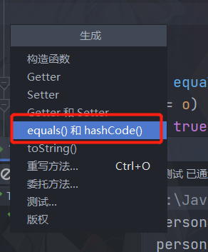
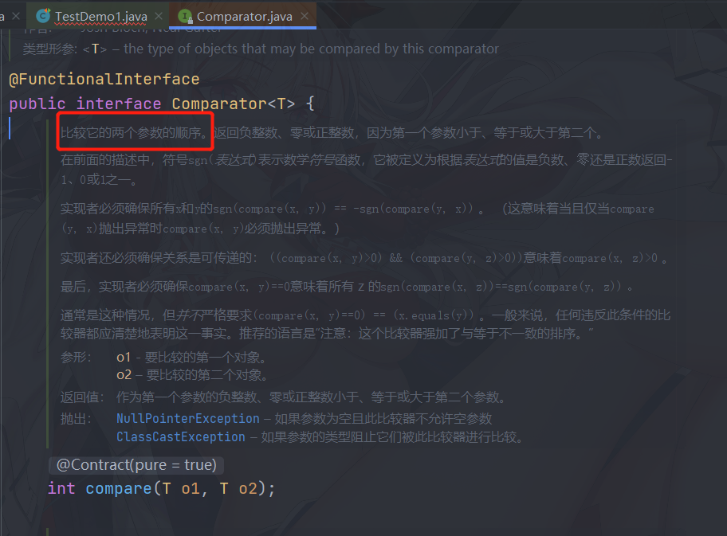
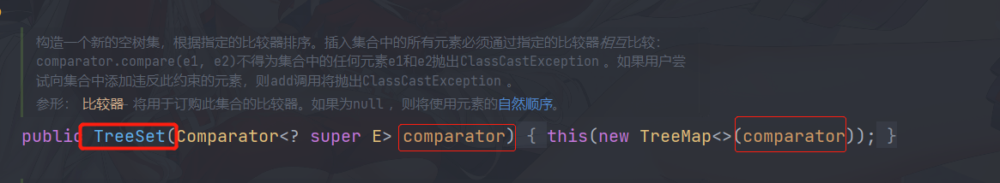

## 8.6 Set接口

+ 特点:无序不重复
  + 无序:每次输出的元素顺序可能都不相同

### 8.6.1 哈希表

+ 哈希表是一种数据结构，哈希表能够提供快速存取操作，哈希表是基于数组的，所以也存在缺点，数组一旦创建就不能扩展
+ 正常的数组，如果需要查询某个值，需要对数组进行遍历，只是一种线性查找，查找的速度较慢，如果数组中的元素值和下标能够存在明确的对应关系，那么通过数组元素的值就可以换算除数据元素的下标，通过下标就可以快速定位数组元素，这样的数组就是哈希表.

+ 创建哈希表(模拟)

| 元素 | 10   | 11   | 12   | 13   | 14   | 15   | 16   | 17   |
| ---- | ---- | ---- | ---- | ---- | ---- | ---- | ---- | ---- |
| 下标 | 0    | 1    | 2    | 3    | 4    | 5    | 6    | 7    |

我们可以找到一个规律:

元素的下标=元素值-10;我们可以把它看做hashcode码

```java
public int hashCode(int element) {
    return element - 10;
}
```

那么，有了hashCode我们就可以快速的定位到元素值了

### 8.6.2 HashSet类

+ HashSet中的元素数据是无序不重复的,HashSet就是按照哈希算法存取数据的

+ 工作原理：当想HashSet中插入数据的时候，它会调用对象的**hashCode**方法得到对象的哈希码，然后再根据哈希码计算出元素的位置

```java
@Test
public void test1() {
    Set set = new HashSet();
    //添加元素
    set.add("a");
    set.add("b");
    set.add("c");

    System.out.println(set);
    //输出:[a, b, c]
    //在添加一个a出现重复值，会去掉
    set.add("a");
    System.out.println(set);
    //输出:[a, b, c]
}
```

#### 8.6.2.1 相同的对象有相同的哈希码，但是，相同的哈希码不一定是同一个对象

```java
@Test
public void test2() {
    Set set = new HashSet();
    //添加元素
    String s1 = "abc";
    String s2 = "abc";
    //输出哈希码
    System.out.println(s1.hashCode());//输出:96354
    System.out.println(s2.hashCode());//输出:96354
    //※注意：相同的对象有相同的哈希码，但是，相同的哈希码不一定是同一个对象
    String s3 = new String("abc");
    System.out.println(s3.hashCode());//输出:96354
    //==比较的是地址
    System.out.println(s3 == s1);     //输出:false
}
```

#### 8.6.2.2 判断一个元素是否重复了，必须要同时判断它的equals方法和hashCode方法

+ 编写一个类：

  + 实体类：

  ```java
  package com.holo;
  
  /**
   * @author Holo
   * @date 2022/2/17 15:04
   */
  public class Person {
      private Integer id;
      private String username;
  
      public Person() {
      }
  
      public Person(Integer id, String username) {
          this.id = id;
          this.username = username;
      }
  
      public Integer getId() {
          return id;
      }
  
      public void setId(Integer id) {
          this.id = id;
      }
  
      public String getUsername() {
          return username;
      }
  
      public void setUsername(String username) {
          this.username = username;
      }
  
      @Override
      public String toString() {
          return "Person{" +
                  "id=" + id +
                  ", username='" + username + '\'' +
                  '}';
      }
  }
  ```

  + 测试类：

  ```java
  @Test
  public void test3() {
      Person person1 = new Person(10010, "张三");
      Person person2 = new Person(10010, "张三");
      Set set = new HashSet();
      set.add(person1);
      set.add(person2);
  
      //查看哈希码
      System.out.println("person1的哈希码:" + person1.hashCode());
      //输出:person1的哈希码:1334729950
      System.out.println("person2的哈希码:" + person2.hashCode());
      //输出:person1的哈希码:1347137144
  
      //输出集合
      System.out.println(set);
      //输出了两个对象:[Person{id=10010, username='张三'}, Person{id=10010, username='张三'}]
      
      //判断是否为同一对象
      System.out.println(person1.equals(person2));
      //输出:false
  }
  ```

虽然添加了重复的数据，因为**哈希码不同**，所以，换算出来**不同**的位置存储元素数据

| 对象    | 元素数据                          | 哈希码     |
| ------- | --------------------------------- | ---------- |
| person1 | Person{id=10010, username='张三'} | 1334729950 |
| person2 | Person{id=10010, username='张三'} | 1347137144 |

#### 8.6.2.3 完善，覆盖equals方法：如果id相同就认为是同一个对象

+ 实体类中override equals方法

```java
@Override
public boolean equals(Object o) {
    if (this == o) {
        return true;
    }
    if (o instanceof Person) {
        Person person = (Person) o;
        if (person.getId().equals(id)) {
            return true;
        }
    }
    return false;
}
```

+ 测试类：

```java
@Test
    public void test4() {
        Person person1 = new Person(10010, "张三");
        Person person2 = new Person(10010, "张三");
        Set set = new HashSet();
        set.add(person1);
        set.add(person2);

        //查看哈希码
        System.out.println("person1的哈希码:" + person1.hashCode());
        //输出:person1的哈希码:1334729950
        System.out.println("person2的哈希码:" + person2.hashCode());
        //输出:person1的哈希码:1347137144

        //输出集合
        System.out.println(set);
        //输出:[Person{id=10010, username='张三'}, Person{id=10010, username='李四'}]

        //如果id相同就认为是同一个对象
        System.out.println(person1.equals(person2));
        //输出:true
    }
```

虽然完善了equals方法，也返回true，但是他们的哈希码仍然不同，所以还是换算了不同位置

| 对象    | 元素数据                          | 哈希码     |
| ------- | --------------------------------- | ---------- |
| person1 | Person{id=10010, username='张三'} | 1334729950 |
| person2 | Person{id=10010, username='张三'} | 1347137144 |

#### 8.6.2.4 继续完善，只覆盖hashCode方法；如果id相同就认为是同一个对象

+ 实体类：

```java
package com.holo;

/**
 * @author Holo
 * @date 2022/2/17 15:04
 */
public class Person {
    private Integer id;
    private String username;

    public Person() {
    }

    public Person(Integer id, String username) {
        this.id = id;
        this.username = username;
    }

    public Integer getId() {
        return id;
    }

    public void setId(Integer id) {
        this.id = id;
    }

    public String getUsername() {
        return username;
    }

    public void setUsername(String username) {
        this.username = username;
    }

    @Override
    public String toString() {
        return "Person{" +
                "id=" + id +
                ", username='" + username + '\'' +
                '}';
    }

    @Override
    public int hashCode() {
        return id.hashCode();
    }
}
```

+ 测试类：

```java
@Test
public void test5() {
    Person person1 = new Person(10010, "张三");
    Person person2 = new Person(10010, "李四");
    Set set = new HashSet();
    set.add(person1);
    set.add(person2);

    //查看哈希码
    System.out.println("person1的哈希码:" + person1.hashCode());
    //输出:person1的哈希码:10010
    System.out.println("person2的哈希码:" + person2.hashCode());
    //输出:person1的哈希码:10010

    //输出集合
    System.out.println(set);
    //输出:[Person{id=10010, username='张三'}, Person{id=10010, username='李四'}]

    ////判断是否为同一对象
    System.out.println(person1.equals(person2));
    //输出:false
}
```

哈希码都相同，但是，equals不相同，所以认为不一样，还是换算了两个位置

| 对象    | 元素数据                          | 哈希码 |
| ------- | --------------------------------- | ------ |
| person1 | Person{id=10010, username='张三'} | 10010  |
| person2 | Person{id=10010, username='张三'} | 10010  |

#### 8.6.2.5 需要同时覆盖hashCode和equals两个方法

+ 实体类：

```java
package com.holo;

/**
 * @author Holo
 * @date 2022/2/17 15:04
 */
public class Person {
    private Integer id;
    private String username;

    public Person() {
    }

    public Person(Integer id, String username) {
        this.id = id;
        this.username = username;
    }

    public Integer getId() {
        return id;
    }

    public void setId(Integer id) {
        this.id = id;
    }

    public String getUsername() {
        return username;
    }

    public void setUsername(String username) {
        this.username = username;
    }

    @Override
    public String toString() {
        return "Person{" +
                "id=" + id +
                ", username='" + username + '\'' +
                '}';
    }


    @Override
    public boolean equals(Object o) {
        if (this == o) {
            return true;
        }
        if (o instanceof Person) {
            Person person = (Person) o;
            if (person.getId().equals(id)) {
                return true;
            }
        }
        return false;
    }


    @Override
    public int hashCode() {
        return id.hashCode();
    }
}
```

+ 测试类：

```java
@Test
public void test7() {
    Person person1 = new Person(10010, "张三");
    Person person2 = new Person(10010, "张三");
    Set set = new HashSet();
    set.add(person1);
    set.add(person2);

    //查看哈希码
    System.out.println("person1的哈希码:" + person1.hashCode());
    //输出:person1的哈希码:10010
    System.out.println("person2的哈希码:" + person2.hashCode());
    //输出:person1的哈希码:10010

    //输出集合
    System.out.println(set);
    //输出:[Person{id=10010, username='张三'}]

    ////判断是否为同一对象
    System.out.println(person1.equals(person2));
    //输出:true
}
```

这一次去掉了重复的数据，因为同时覆盖了两个方法，hashCode，equals

| 对象    | 元素数据                          | 哈希码 | 判断 |
| ------- | --------------------------------- | ------ | ---- |
| person1 | Person{id=10010, username='张三'} | 10010  | true |
| person2 | Person{id=10010, username='张三'} | 10010  |      |

+ 强调的是：
  + 两个对象equals相等，那么，他们的hashCode一定相等
  + 两个对象equals不相等，那么，他们的hashCode不要求一定相等，所以，不建议只覆盖一个方法

+ 一键生成：

#### 8.6.2.6 如果id和username都相同才认为是重复数据

+ 实体类：

```java
@Override
public boolean equals(Object o) {
    if (this == o) {
        return true;
    }
    if (o instanceof Person) {
        Person person = (Person) o;
        if (person.getId().equals(id) && person.getUsername().equals(username)) {
            return true;
        }
    }
    return false;
}


@Override
public int hashCode() {
    return id.hashCode() - username.hashCode();
```

+ 测试类：

```java
@Test
public void test8() {
    Person person1 = new Person(10010, "张三");
    Person person2 = new Person(10010, "张三");
    Person person3 = new Person(10010, "王五");
    Set set = new HashSet();
    set.add(person1);
    set.add(person2);
    set.add(person3);
    //查看哈希码
    System.out.println("person1的哈希码:" + person1.hashCode());
    //输出:person1的哈希码:-764879
    System.out.println("person2的哈希码:" + person2.hashCode());
    //输出:person2的哈希码:-764879
    System.out.println("person3的哈希码:" + person3.hashCode());
    //输出:person3的哈希码:-927055

    //输出集合
    System.out.println(set);
    //输出:[Person{id=10010, username='王五'}, Person{id=10010, username='张三'}]

    ////判断是否为同一对象
    System.out.println(person1.equals(person2));
    //输出:true
    System.out.println(person1.equals(person3));
    //输出:false
}
```

### 8.6.3 TreeSet类

+ 底层是TreeMap实现，使用二叉树算法
+ 升序

```java
@Test
public void test9(){
    Set set = new TreeSet();
    set.add(2);
    set.add(5);
    set.add(3);
    set.add(3);
    set.add(1);
    System.out.println(set);
    //输出:[1, 2, 3, 5]
}
```

+ 自定义类：按照年龄排序
  + 实体类：

```java
package com.holo;

/**
 * @author Holo
 * @date 2022/2/17 15:04
 */
public class Person {

    private String username;
    private Integer age;

    public Person() {
    }

    public Person(String username, Integer age) {
        this.username = username;
        this.age = age;
    }

    public String getUsername() {
        return username;
    }

    public void setUsername(String username) {
        this.username = username;
    }

    public Integer getAge() {
        return age;
    }

    public void setAge(Integer age) {
        this.age = age;
    }

    @Override
    public String toString() {
        return "Person{" +
                "username='" + username + '\'' +
                ", age=" + age +
                '}';
    }
}
```

+ 测试类：

```java
@Test
public void test1() {
    //创建对象
    Person person1 = new Person("小朱", 20);
    Person person2 = new Person("小任", 21);
    Person person3 = new Person("小李", 22);

    //创建集合
    Set set = new TreeSet();
    set.add(person1);
    set.add(person2);
    set.add(person3);
    System.out.println(set);

}
```


#### 8.6.3.2 完善：覆盖方法compareTo

+ 实体类：

```java
package com.holo;

/**
 * @author Holo
 * @date 2022/2/17 15:04
 */
public class Person implements Comparable {

    private String username;
    private Integer age;

    public Person() {
    }

    public Person(String username, Integer age) {
        this.username = username;
        this.age = age;
    }

    public String getUsername() {
        return username;
    }

    public void setUsername(String username) {
        this.username = username;
    }

    public Integer getAge() {
        return age;
    }

    public void setAge(Integer age) {
        this.age = age;
    }

    @Override
    public String toString() {
        return "Person{" +
                "username='" + username + '\'' +
                ", age=" + age +
                '}';
    }

    @Override
    public int compareTo(Object o) {//根据结果产生：升序，降序
        int result = this.age - ((Person) o).getAge();//升序
        //int result = ((Person) o).getAge() - this.age;//降序
        return result;
    }
}
```

+ 测试类：

```java
@Test
public void test1() {
    //创建对象
    Person person1 = new Person("小朱", 20);
    Person person2 = new Person("小任", 21);
    Person person3 = new Person("小李", 22);

    //创建集合
    Set set = new TreeSet();
    set.add(person1);
    set.add(person2);
    set.add(person3);
    System.out.println(set);
    //[Person{username='小朱', age=20}, Person{username='小任', age=21}, Person{username='小李', age=22}]
}
```

+ 注意：自定义类**可以**实现一个接口Comparable，才可以添加到**TreeSet**集合中排序

#### 8.6.3.3 Comparator接口完成排序



+ 因为Comparable接口必须在类中实现，无论将来是否排序
+ Comparator接口就很灵活，需要排序的时候再实现就可以，不需要必须在类开始的时候就实现

+ 实体类：

```java
public class Person {
    private String username;
    private Integer age;

    public Person() {
    }

    public Person(String username, Integer age) {
        this.username = username;
        this.age = age;
    }

    public String getUsername() {
        return username;
    }

    public void setUsername(String username) {
        this.username = username;
    }

    public Integer getAge() {
        return age;
    }

    public void setAge(Integer age) {
        this.age = age;
    }

    @Override
    public String toString() {
        return "Person{" + "username='" + username + '\'' + ", age=" + age + '}';
    }
}
```



+ 测试类：
  + 匿名实现
```java
@Test
public void test2() {
    //创建对象
    Person person1 = new Person("小朱", 20);
    Person person2 = new Person("小任", 21);
    Person person3 = new Person("小李", 22);

    //创建集合
    Set set = new TreeSet(new Comparator() {//需要对元素进行排序的时候在匿名实现
        @Override
        public int compare(Object o1, Object o2) {
            return ((Person) o1).getAge() - ((Person) o2).getAge();
        }
    });
    set.add(person1);
    set.add(person2);
    set.add(person3);
    System.out.println(set);
    //[Person{username='小朱', age=20}, Person{username='小任', age=21}, Person{username='小李', age=22}]
}  
```

+ lambda函数实现

```java
@Test
public void test4() {//lambda函数实现
    //创建对象
    Person person1 = new Person("小朱", 20);
    Person person2 = new Person("小任", 21);
    Person person3 = new Person("小李", 22);
    //使用lambda函数的方式
    Comparator comparator = (o1, o2) -> ((Person) o2).getAge() - ((Person) o1).getAge();
    Set set = new TreeSet(comparator);
    set.add(person1);
    set.add(person2);
    set.add(person3);
    System.out.println(set);
    //[Person{username='小李', age=22}, Person{username='小任', age=21}, Person{username='小朱', age=20}]
}
```

#### 8.6.3.4 Comparable和Comparator区别（笔试必考题）

+ 一个类实现了Comparable接口表明这个类的对象之间是可以相互比较的，这个类对象组成的集合就可以直接使用sort方法排序，如何集合中使用比较功能，必须保证集合中的数据类型是一致的。
+ Comparator可以看成一种算法的实现，讲算法和数据分离，Comparator也可以在下面两种环境下使用：
  1. 类间没有考虑到比较问题而没有实现Comparable，可以通过Comparator来实现排序而不必改变对象本身。
  2. 可以使用多种排序标准，比如升序，降序等。