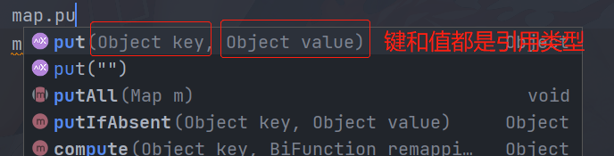
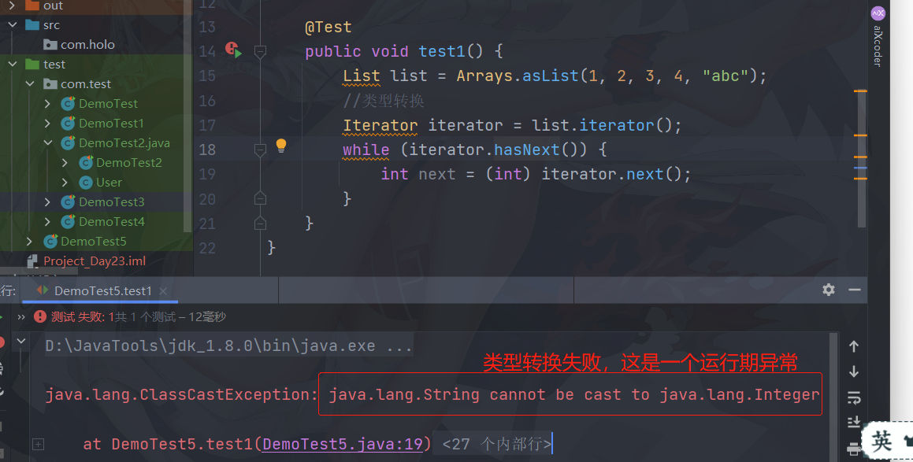
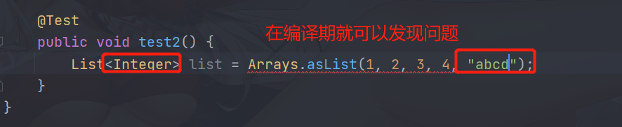
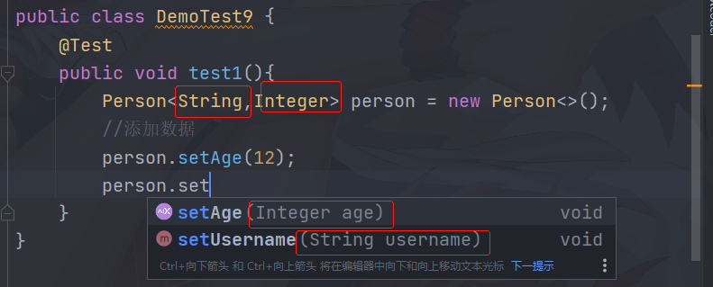

## 8.7 Map接口

### 8.7.1 HashMap

+ Map中可以存储键值对（key/value）,Map实现常用的类就是HashMap，HashMap存储和HashSet一样，仍然使用哈希算法，所以，在使用自定义类作为key使用时，必须同时覆盖equals和hashCode方法



```java
@Test
public void test1() {
    Map map = new HashMap();
    map.put("1001","小明");
    map.put("1002","小亮");
    map.put("1001","小李");
    System.out.println(map);
    //输出:{1002=小亮, 1001=小李}
}
```

+ HashMap特点：

  + 无序不重复
  + 结构：
    + jdk8之前使用了**数组+链表**结构；数组是HashMap的主体，链表则是解决**哈希冲突**而存在的；
    + jdk8之后发生变化了，当链表长度大于**8**（默认阈值），将链表转为[红黑树](https://www.cnblogs.com/skywang12345/p/3245399.html)（检索速度快），减少搜索时间。

  + 为什么推荐使用String作为key使用？
    + HashMap实现是通过key的hashCode来确定value的存储位置的，因为String是不可变对象，所以当创建了字符串时，它被缓存下来了，不需要再次计算了，所以，比其他对象快。

### 8.7.2 遍历HashMap中的元素

```java
package com.test;

import org.junit.Test;
import java.util.*;

/**
 * @author Holo
 * @date 2022/2/18 20:53
 */
public class DemoTest {

    @Test
    public void test1() {
        Map map = new HashMap();
        map.put("1001", "小明");
        map.put("1002", "小亮");
        map.put("1001", "小李");
        System.out.println(map);
        //输出:{1002=小亮, 1001=小李}
    }

    @Test
    public void test2() {
        Map map = new HashMap();
        map.put("1001", "小明");
        map.put("1002", "小亮");
        map.put("1001", "小李");
        //遍历
        Set set = map.entrySet();
        Iterator iterator = set.iterator();
        while (iterator.hasNext()) {
            //获取entry
            Map.Entry entry = (Map.Entry) iterator.next();
            //获取key和value
            System.out.println(entry.getKey() + "\t" + entry.getValue());
            //输出：
            //      1002   小亮
            //      1001   小李
        }
    }

    @Test
    public void test3() {
        Map map = new HashMap();
        map.put("1001", "小明");
        map.put("1002", "小亮");
        map.put("1001", "小李");

        //遍历
        Set set = map.keySet();
        Collection values = map.values();

        //底层就是迭代
        set.forEach(System.out::println);
        //1002
        //1001
        for (Object value : values) {
            System.out.println(value);
            //小亮
            //小李
        }
    }
}
```

### 8.7.3 自定义的类作为key

+ 必须重写两个方法

```java
package com.test;

import org.junit.Test;

import java.util.HashMap;
import java.util.Map;

/**
 * @author Holo
 * @date 2022/2/18 21:38
 */
public class DemoTest1 {

    @Test
    public void test1() {
        Map map = new HashMap();
        map.put(new User(10010), "小明");
        map.put(new User(10011), "小李");
        map.put(new User(10010), "小赵");
        System.out.println(map);
        //{User{id=10010}=小赵, User{id=10011}=小李}
    }
}

class User {
    private Integer id;

    public User(Integer id) {
        this.id = id;
    }

    public Integer getId() {
        return id;
    }

    public void setId(Integer id) {
        this.id = id;
    }

    @Override
    public boolean equals(Object o) {
        User user = (User) o;
        return id.equals(user.getId());
    }

    @Override
    public int hashCode() {
        return id.hashCode();
    }

    @Override
    public String toString() {
        return "User{" +
                "id=" + id +
                '}';
    }
}
```


### 8.7.4 TreeMap

+ TreeMap的数据结构：红黑树（平衡树）

```java
@Test
    public void test1() {
        Map map = new TreeMap((x, y) -> ((User) x).getId() - ((User) y).getId());
        map.put(new User(10010), "小明");
        map.put(new User(10011), "小李");
        map.put(new User(10010), "小赵");
        map.put(new User(10013), "小狗");
        //排序完，并去重
        //{User{id=10010}=小赵, User{id=10011}=小李, User{id=10013}=小狗}
        System.out.println(map);
    }

}

class User {
    private Integer id;

    public User(Integer id) {
        this.id = id;
    }

    public Integer getId() {
        return id;
    }

    public void setId(Integer id) {
        this.id = id;
    }

    @Override
    public String toString() {
        return "User{" +
                "id=" + id +
                '}';
    }
```

```java
kage com.test;

import org.junit.Test;
import java.util.Map;
import java.util.TreeMap;

/**
 * @author Holo
 * @date 2022/2/18 21:49
 */
public class DemoTest2 {

    @Test
    public void test1() {
        Map map = new TreeMap((x, y) -> ((User) x).getId() - ((User) y).getId());
        map.put(new User(10010), "小明");
        map.put(new User(10011), "小李");
        map.put(new User(10010), "小赵");
        map.put(new User(10013), "小狗");
        //排序完，并去重
        //输出:{User{id=10010}=小赵, User{id=10011}=小李, User{id=10013}=小狗}
        System.out.println(map);
    }

}

class User {
    private Integer id;

    public User(Integer id) {
        this.id = id;
    }

    public Integer getId() {
        return id;
    }

    public void setId(Integer id) {
        this.id = id;
    }

    @Override
    public String toString() {
        return "User{" +
                "id=" + id +
                '}';
    }
```

## 8.8 Collections工具类

```java
package com.test;

import org.junit.Test;

import java.util.*;

/**
 * @author Holo
 * @date 2022/2/18 22:06
 */
public class DemoTest3 {
    @Test
    public void Test1() {
        List list = new ArrayList();
        list.add(3);
        list.add(2);
        list.add(1);
        System.out.println(list);
        //输出:[3, 2, 1]
        //可以使用工具类排序
        Collections.sort(list);
        System.out.println(list);
        //输出:[1, 2, 3]
    }

    @Test
    public void test2() {
        Set set = new HashSet();
        set.add(3);
        set.add(2);
        set.add(1);
        set.add(3);
        set.add(3223);
        set.add(1133);
        set.add(1231);
        System.out.println(set);
        //无序，不重复
        //[1, 2, 3, 3223, 1133, 1231]

        //可以使用工具类排序
        //可以把set添加list中
        List list = new ArrayList(set);
        Collections.sort(list);
        System.out.println(list);
        //[1, 2, 3, 1133, 1231, 3223]
    }

    @Test
    public void test3() {
        List list = new ArrayList();
        list.add("java");
        list.add("scala");
        list.add("python");
        System.out.println(list);
        //输出：[java, scala, python]

        //未排序，便使用二分查找
        int index = Collections.binarySearch(list, "python");
        System.out.println(index);
        //输出：-2
        //排序
        Collections.sort(list);
        System.out.println(list);
        //[java, python, scala]

        //获取元素对应的下标
        int index1 = Collections.binarySearch(list, "python");
        System.out.println(index1);
        //输出:1
    }

    @Test
    public void test4() {
        List list = new ArrayList();
        list.add(3);
        list.add(1);
        list.add(2);
        System.out.println(list);
        //[3, 1, 2]
        //可以使用工具类逆序
        Collections.reverse(list);
        System.out.println(list);
        //[2, 1, 3]
    }
}
```

## 8.9 Arrays工具类

```java
package com.test;

import org.junit.Test;

import java.util.Arrays;
import java.util.List;

/**
 * @author Holo
 * @date 2022/2/18 22:56
 */
public class DemoTest4 {

    @Test
    public void test1() {
        List<Integer> list = Arrays.asList(1, 2, 3, 4, 5);
        //输出
        list.forEach(System.out::print);
    }

    @Test
    public void test2() {
        //不允许修改元素
        List<Integer> list = Arrays.asList(1, 2, 3, 4, 5);
        list.add(100);
        //输出
        list.forEach(System.out::print);
        //异常：java.lang.UnsupportedOperationException
    }

    @Test
    public void test3() {
        //不允许修改元素
        List<Integer> list = Arrays.asList(1, 2, 3, 4, 5);
        list.remove(100);
        //输出
        list.forEach(System.out::print);
        //异常：java.lang.UnsupportedOperationException
    }

    @Test
    public void test4() {
        //不允许修改元素
        List<Integer> list = Arrays.asList(1, 2, 3, 4, 5);
        //结合转为数组
        Object[] array = list.toArray();
        for (int i = 0; i < array.length; i++) {
            System.out.println(array[i]);
            //1
            //2
            //3
            //4
            //5
        }
    }
}
```

## 9.0 泛型

### 9.0.1 使用泛型就是为了及早发现问题



### 9.0.2 使用泛型就可以在编译期发现和处理问题



### 9.0.3 使用泛型改善比较器：Comparable

+ 实体类

```java
package com.holo;

/**
 * @author Holo
 * @date 2022/2/18 23:21
 */
public class Person implements Comparable<Person> {
    private String username;
    private Integer age;

    public Person() {
    }

    public Person(String username, Integer age) {
        this.username = username;
        this.age = age;
    }

    public String getUsername() {
        return username;
    }

    public void setUsername(String username) {
        this.username = username;
    }

    public Integer getAge() {
        return age;
    }

    public void setAge(Integer age) {
        this.age = age;
    }

    @Override
    public String toString() {
        return "Person{" +
                "username='" + username + '\'' +
                ", age=" + age +
                '}';
    }

    @Override
    public int compareTo(Person o) {
        return o.getAge() - age;
    }

}
```

测试类：

```java
package com.holo;

import java.util.Set;
import java.util.TreeSet;

/**
 * @author Holo
 * @date 2022/2/18 23:29
 */
public class Demo {
    public static void main(String[] args) {
        Set<Person> set = new TreeSet<>();
        //添加元素
        set.add(new Person("小朱", 20));
        set.add(new Person("小任", 19));
        set.add(new Person("小孙", 21));
        System.out.println(set);
        //降序输出
        //[Person{username='小孙', age=21}, Person{username='小朱', age=20}, Person{username='小任', age=19}]

    }
}
```

### 9.0.4 使用泛型改善比较器：Comparator

实体类：

```java
package com.holo1;

/**
 * @author Holo
 * @date 2022/2/18 23:43
 */
public class Person {
    private String username;
    private Integer age;

    public Person() {
    }

    public Person(String username, Integer age) {
        this.username = username;
        this.age = age;
    }

    public String getUsername() {
        return username;
    }

    public void setUsername(String username) {
        this.username = username;
    }

    public Integer getAge() {
        return age;
    }

    public void setAge(Integer age) {
        this.age = age;
    }

    @Override
    public String toString() {
        return "Person{" +
                "username='" + username + '\'' +
                ", age=" + age +
                '}';
    }
}
```

测试类：

```java
package com.test;

import com.holo1.Person;
import org.junit.Test;

import java.util.Set;
import java.util.TreeSet;

/**
 * @author Holo
 * @date 2022/2/18 23:44
 */
public class DemoTest6 {
    @Test
    public void test1() {
        Set<Person> set = new TreeSet<>((x, y) -> x.getAge() - y.getAge());
        //添加元素
        set.add(new Person("小朱", 20));
        set.add(new Person("小任", 19));
        set.add(new Person("小孙", 21));
        System.out.println(set);
        //升序输出
        //[Person{username='小任', age=19}, Person{username='小朱', age=20}, Person{username='小孙', age=21}]
    }
}
```

### 9.0.5 改造Map

+ 可以去约束key/value的类型

```java
public class DemoTest7 {
    @Test
    public void test1() {
        Map<Integer, String> map = new HashMap<>();
        map.put(1001, "老朱");
        map.put(1002, "老任");
        map.put(1003, "老李");
        map.put(1001,1002);//编译期错误
    }

    @Test
    public void test2() {
        //创建集合
        List<Map<Integer, String>> list = new ArrayList<>();
        Map<Integer, String> map = new HashMap<>();
        map.put(10010, "老朱");
        Map<Integer, String> map1 = new HashMap<>();
        map1.put(10086, "老任");
        //向集合中添加元素
        list.add(map);
        list.add(map1);
        System.out.println(list);
        //输出：[{10010=老朱}, {10086=老任}]
    }
}
```

### 9.0.6 自定义泛型

```java
package com.holo2;

/**
 * @author Holo
 * @date 2022/2/19 0:00
 */
public class Person<T> {
    private String username;
    private T age;

    public String getUsername() {
        return username;
    }

    public void setUsername(String username) {
        this.username = username;
    }

    public T getAge() {
        return age;
    }

    public void setAge(T age) {
        this.age = age;
    }
}
```

+ 测试类：

```java
package com.test;

import com.holo2.Person;
import org.junit.Test;

/**
 * @author Holo
 * @date 2022/2/19 0:02
 */
public class DemoTest8 {
    @Test
    public void test1(){
        Person<String> person = new Person<>();
        //添加数据
        person.setAge("12");
    }
}
```

### 9.0.7 自定义泛型

实体类：

```java
package com.holo3;

/**
 * @author Holo
 * @date 2022/2/19 0:05
 */
public class Person<T1,T2> {
    private T1 username;
    private T2 age;

    public T1 getUsername() {
        return username;
    }

    public void setUsername(T1 username) {
        this.username = username;
    }

    public T2 getAge() {
        return age;
    }

    public void setAge(T2 age) {
        this.age = age;
    }
}
```



### 9.0.8 泛型的标识

+ 泛型的标识，只要符合标识符规则即可

### 9.0.9 笔试题

+ HashMap与HashTable区别？

  + HashTable多线程，效率低，HashMap单线程，效率高

  + **null**可以作为HashMap的key使用，不能作为HashTable的key


### 9.0.10 Properties属性类

```java
package com.test;

import org.junit.Test;

import java.util.Properties;

/**
 * @author Holo
 * @date 2022/2/19 0:18
 */
public class DemoTest11 {
    @Test
    public void test1() {
        Properties properties = new Properties();
        //添加元素
        properties.put(10086, "老朱");//key和value都是引用类型（Object）
        properties.setProperty("10010", "老杨");//key和value必须是字符串类型
        //遍历
        Object obj = properties.get(10086);//key和返回的类型都是引用类型
        String property = properties.getProperty("10010");//key和返回的类型都是String
        System.out.println(obj);//输出：老朱
        System.out.println(property);//输出：老杨
    }
}
```

### 9.0.11 可以加载文件

+ 文件的格式：

> name = leo 
>
> sex		boy
>
> id    10086

(每行只能写一对数据)

```java
@Test
public void test2() throws Exception {
    Properties properties = new Properties();
    //加载元素
    properties.load(new FileReader("D:\\fz\\中科浩成\\java\\Projects\\IDEA\\Project_Day23\\test\\com\\test\\data.properties"));
    //读取文件内容，就是按照key/value的方式读取
    String name = properties.getProperty("name");
    String sex = properties.getProperty("sex");
    String age = properties.getProperty("age");
    System.out.println(name + "\t" + sex + "\t" + age);
}
```

