# JVM的问题

+ `java -XX:+PrintGCDetails -version `用于打印输出详细的GC收集日志的信息

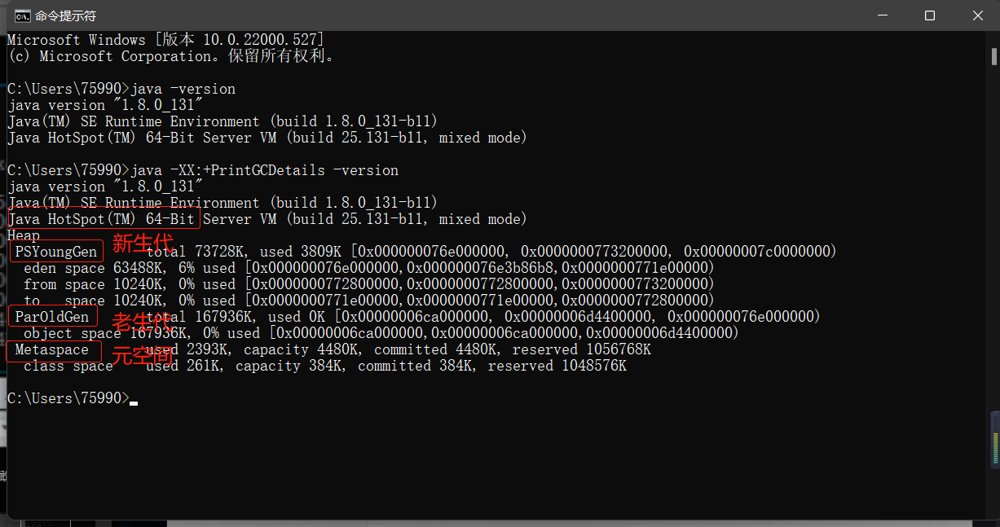

**[点击查看JVM发展史.P31](../参考教材/深入理解Java虚拟机：JVM高级特性与最佳实践（第3版）.pdf?#page=31)** 


JVM的主要组成部分：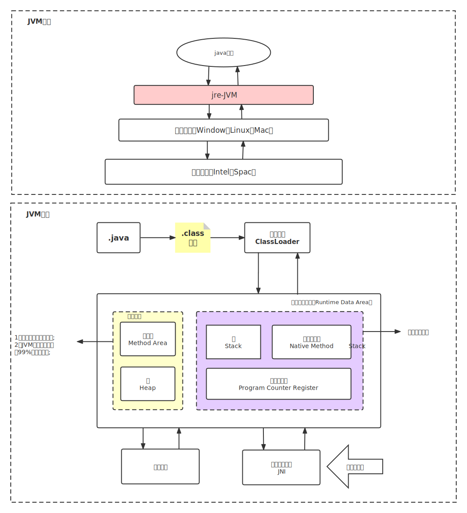

# JVM包含的两个系统和两个组件

### 两个系统：

+ ClassLoader类加载器
+ Execution Engine执行引擎

### 两个组件

+ 运行时数据区
+ 本地接口

### java程序运行机制

+ 使用javac编译命令把源文件编译为字节码文件，使用java执行命令把字节码中的命令解释完成。
+ JVM所管理的内存分为几个区：


**5个部分：**

+ [程序计数器（Program Counter Register）.P72](../参考教材/深入理解Java虚拟机：JVM高级特性与最佳实践（第3版）.pdf?#page=72):是一块较小的内存空间，它可以看作是**当前线程所执行的字节码**的**行号指示器**。在Java虚拟机的概念模型里，字节码解释器工作时就是通过改变这个计数器的值来选取下一条需要执行的**字节码指令**，它是程序控制流的指示器，分支、循环、跳转、异常处理、线程恢复等基础功能都需要依赖这个计数器来完成。 

+ [Java虚拟机栈(Java Virtual Machine Stack).P73](../参考教材/深入理解Java虚拟机：JVM高级特性与最佳实践（第3版）.pdf?#page=73):描述的是Java方法执行的线程内存模型：每个方法被执行的时候，Java虚拟机都会同步创建一个栈帧（Stack Frame）用于存储局部变量表、操作数栈、动态连接、方法出口等信息.

+ [本地方法栈（Native Method Stacks）.P74](../参考教材/深入理解Java虚拟机：JVM高级特性与最佳实践（第3版）.pdf?#page=74):与虚拟机栈所发挥的作用是非常相似的，其区别只是虚拟机栈为虚拟机执行**Java方法（也就是字节码）**服务，而**本地方法栈**则是为虚拟机使用到的**本地（Native） 方法**服务。 

+ [Java堆（Java Heap）.P75](../参考教材/深入理解Java虚拟机：JVM高级特性与最佳实践（第3版）.pdf?#page=75):是虚拟机所管理的内存中最大的一块。Java堆是被所有线程共享的一块内存区域，在虚拟机启动时创建。此内存区域的唯一目的就是存放**对象实例**.

+ [方法区(Method Area).P77](../参考教材/深入理解Java虚拟机：JVM高级特性与最佳实践（第3版）.pdf?#page=77):是各个线程共享的内存区域，它用于存储**已被虚拟机加载**的**类型信息、常量、静态变量**、即时编译器编译后的代码缓存等数据.

## Java HotSpot(TM) 虚拟机

### HotSpot特点:

+ 热点代码探测技术:HotSpot虚拟机的热点代码探测能力可以通过**执行计数器**找出最具有编译价值的代码，然后通知**即时编译器**以**方法**为单位进行编译。如果一个方法被频繁调用，或方法中有效循环次数很多，将会分别触发标准**即时编译**和**栈上替换编译**（On-Stack Replacement，OSR）行为。通过编译器与解释器恰当地协同工作，可以在最优化的程序响应时间与最佳执行性能中取得平衡.

### 对象的创建方法

+ 使用new关键字:调用了构造方法
+ 使用Constructor类的newInstance方法:调用了构造方法

+ 使用clone方法:没有调用构造方法
+ 使用反序列化:没有调用构造方法

说明:java堆内存中是绝对规整的,使用"指针碰撞"方式分配内存;如果不是规整的,就从空闲的的列表中分配,使用CAS[1]完成

**CAS**:比较并交换（Compare And Swap）操作

## Java中有哪些引用类型(GC相关)

### 强引用:

+ 就是发生GC的时候不会被回收

+ 案例:

  + ```java
    Object obj = new Object();
    ```

当内存空间不足是,java虚拟机宁可抛出异常信息OutOfMemoryError,使程序终止,也不会随意回收强引用的对象;如果强引用不实用了,需要弱化从而GC掉.

### 软引用:

+ 存在但是不是必须的对象,在发生内存溢出之前被回收
+ 在使用时,内存充足时不回收,如果内存不足了,就会回收

```java
package com.holo;

import java.lang.ref.SoftReference;

/**
 * @author Holo
 * @date 2022/2/21 20:16
 */
public class Demo1 {
    public static void main(String[] args) throws Exception {
        //强引用
        String str = new String("abc");
        //软引用
        String str1 = new String("ABC");
        SoftReference<String> softReference = new SoftReference<>(str1);
    }
}
```

### 弱引用:

+ 有但不是必须的对象,在下一次GC时被回收
+ 弱引用与软引用的区别:具有弱引用的对象有更短的生命周期,一旦发现有弱引用的对象无论内存是否不足都会回收

```java
package com.holo;

import java.lang.ref.WeakReference;

/**
 * @author Holo
 * @date 2022/2/21 20:24
 */
public class Demo2 {
    public static void main(String[] args) {
        //弱引用
        String str1 = new String("abc");
        WeakReference<String> weakReference = new WeakReference<>(str1);
        str1 = null;
    }
}
```

如果这个时候需要把弱引用转为强引用,需要调用get()方法

```diff
public class Demo2 {
    public static void main(String[] args) {
        //弱引用
        String str1 = new String("abc");
        WeakReference<String> weakReference = new WeakReference<>(str1);
        //转为强引用
+        String s = weakReference.get();
    }
}

```

### 虚引用:

+ 无法通过虚引用获取对象,就是**形同虚设**,不能决定对象的生命周期
+ 如果第一个对象只持有**虚引用**,那么,他可能随时被GC

```java
package com.holo;

import java.lang.ref.PhantomReference;
import java.lang.ref.ReferenceQueue;

/**
 * @author Holo
 * @date 2022/2/21 20:33
 */
public class Demo3 {
    public static void main(String[] args) {
        String str = new String("abc");
        ReferenceQueue<Object> queue = new ReferenceQueue<>();
        //创建一个虚引用
        PhantomReference phan = new PhantomReference(str, queue);
    }
}
```

## JVM调优

### 调优工具jdk

+ jconsole用于对jvm内存、线程和类进行监控

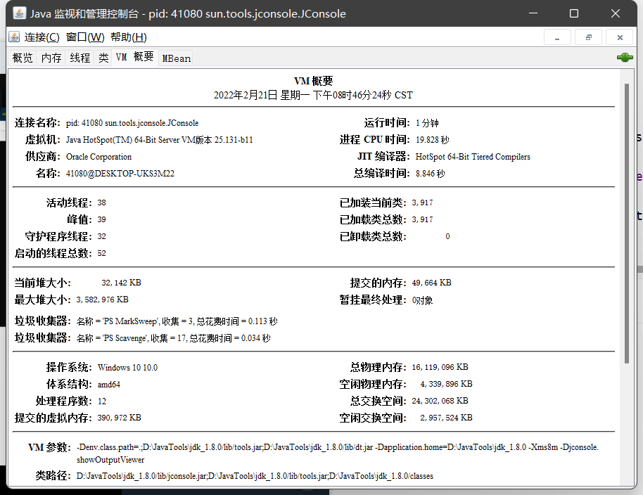

+ jvisualvm:全能的分析工具

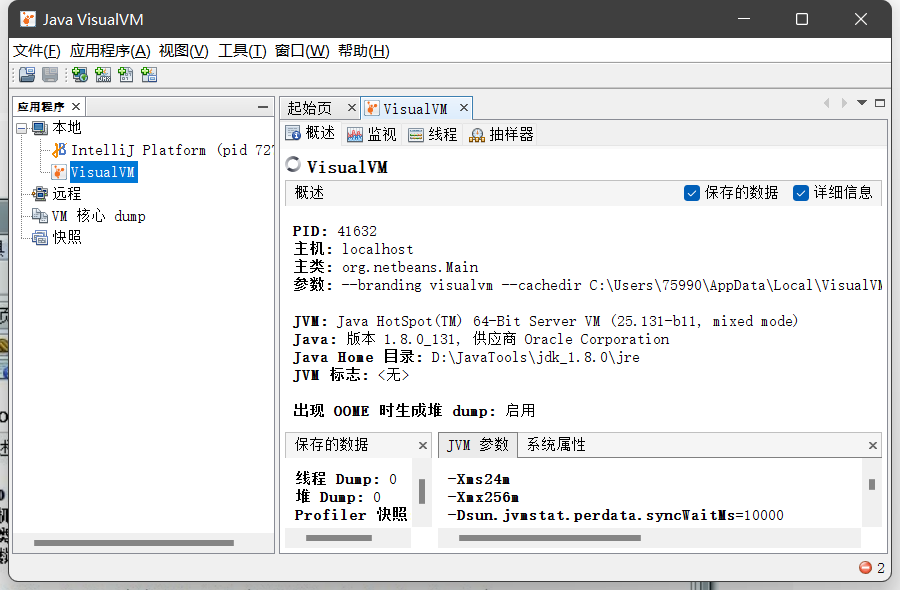

# 第九章 流和文件

## 9.1 java流 概述

### 9.1.1 java中IO流分为几种

+ 按照流的方向:输入流、输出流
+ 按照操作单元:字节流、字符流
+ 按照角色:节点流、处理流

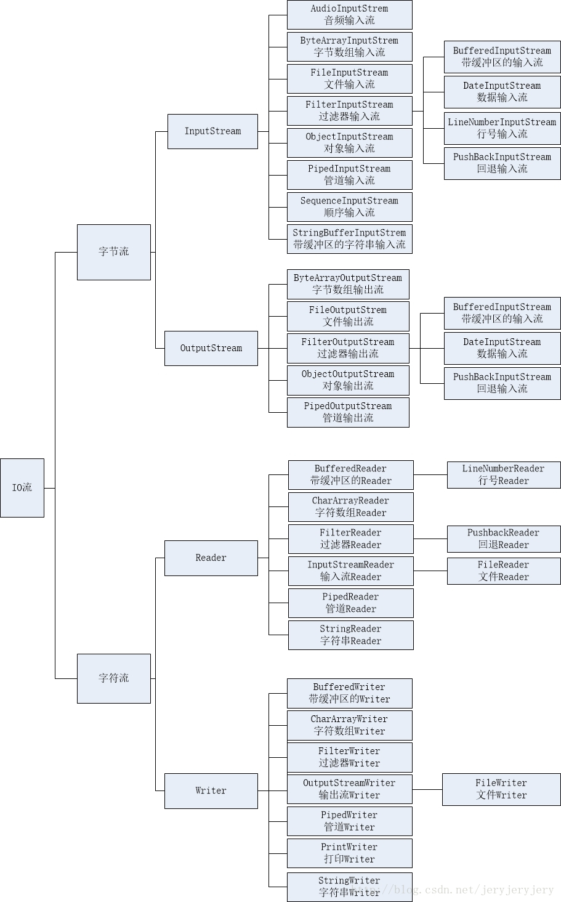

### 9.1.2 按照操作对象分类

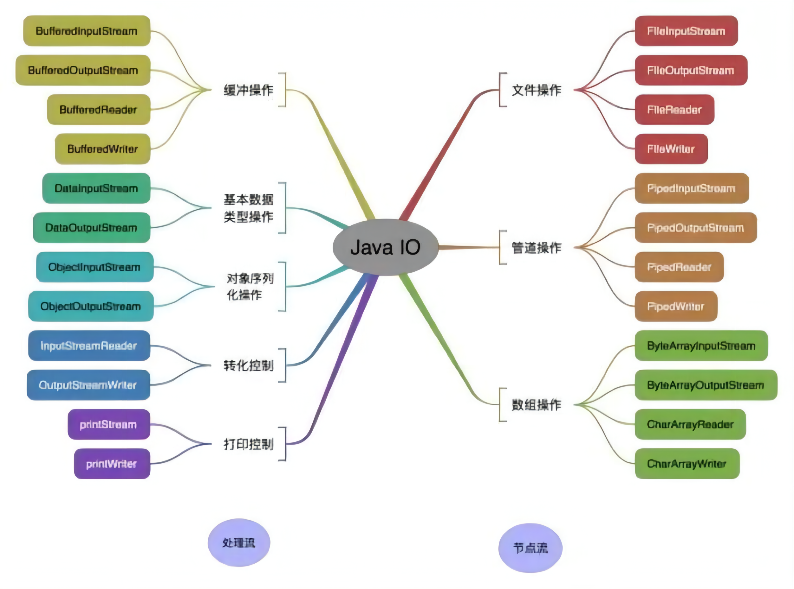

### 9.1.3 BIO、NIO、AIO区别?

+ BIO:Block IO 同步阻塞式IO,就是我们平常使用的传统IO,它的特点是模式简单使用方便,并发处理能力低.
+ NIO:Non IO 同步非阻塞IO,是传统IO的升级,客户端和服务端通过Channel(通道)通讯,实现了多路复用.
+ AIO:Asynchronous IO 是 NIO的升级,也叫NIO2,实现了异步非阻塞IO,异步IO的操作基于事件和回调机制.

### 9.1.4 概述

+ 文件通常有一串字节或字符构成,组成文件的字节的称为字节流,字符的称为字符流.

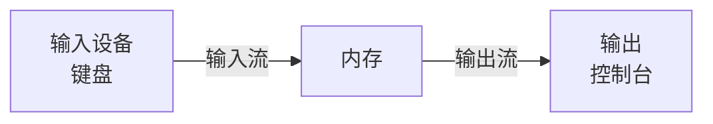

+ 根据文件组成的类型不同,分为字节流和字符流,**以Stream**结尾的都是字节流(万能流)

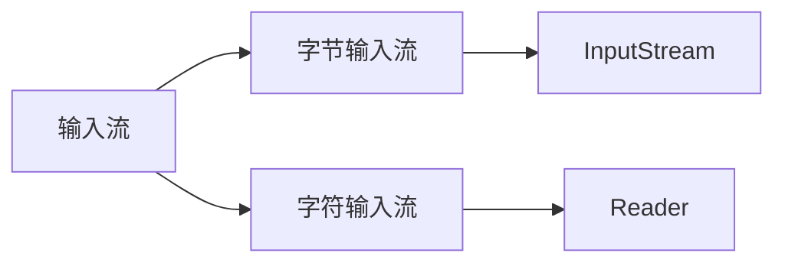

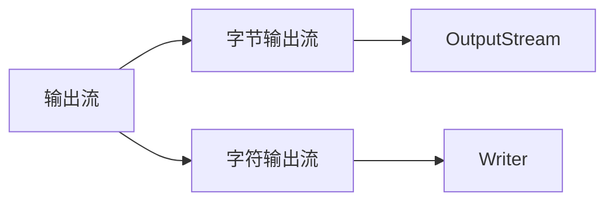

#### 9.1.4.1 InputStream字节输入流

+ InputStream是字节输入流的抽象类

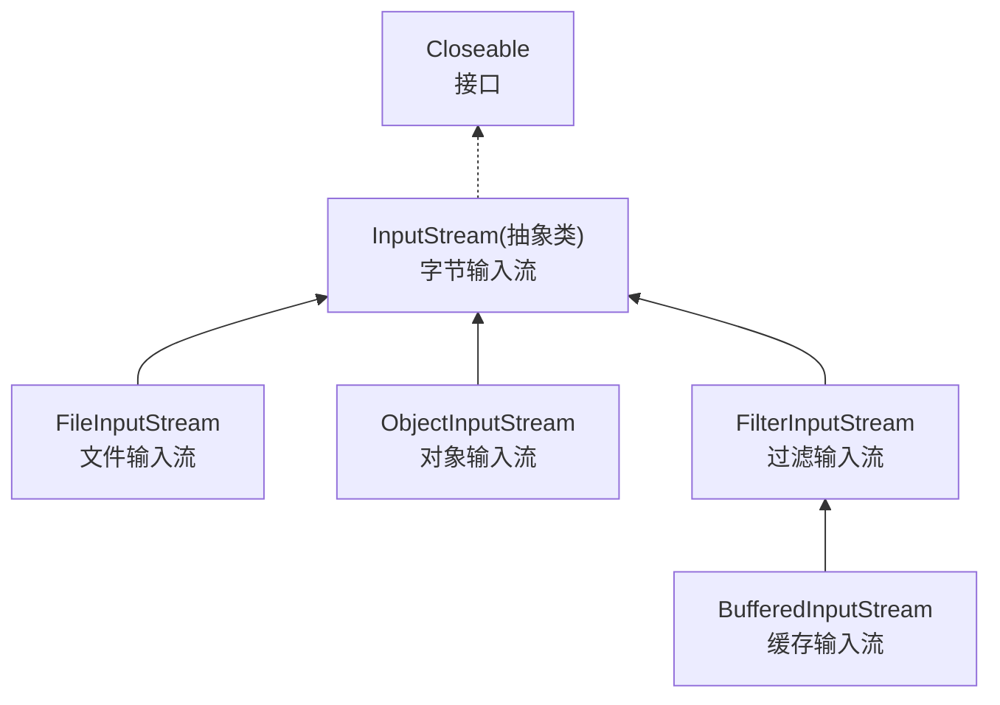

主要的方法:

| 返回         | 方法                                                         |
| ------------ | ------------------------------------------------------------ |
| void         | close()关闭输入流                                            |
| abstract int | read()从输入流读取下一个字节                                 |
| int          | read(byte b[])从输入流汇总读取一定数量的字节并存储在缓冲区中 |
| int          | read(byte[] b, int off, int len)讲输入流中最多`len`个数据字节读入字节数组 |

#### 9.1.4.2 OutputStream字节输出流

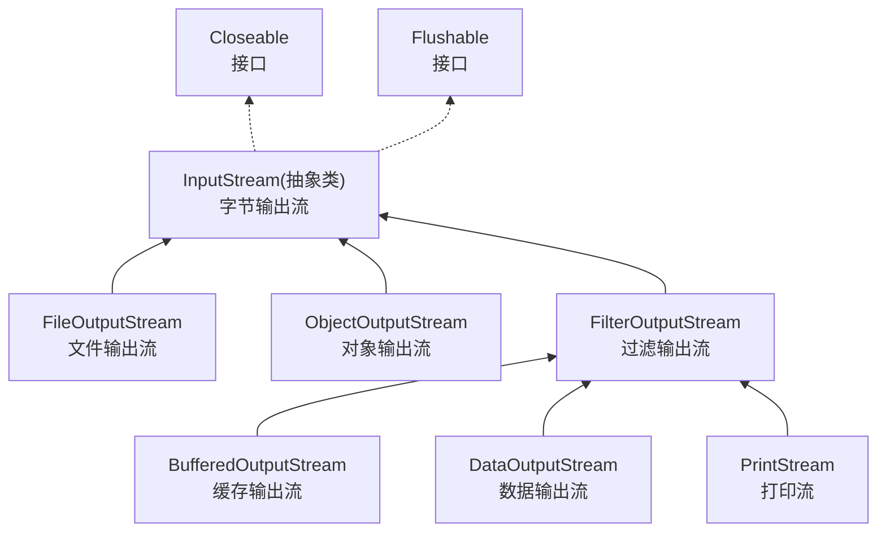

主要的方法:

| 返回          | 方法                                                         |
| ------------- | ------------------------------------------------------------ |
| void          | close()关闭输入流                                            |
| void          | flush()刷新输出流并强制写出所有缓冲区的输出字节              |
| void          | write(byte b[])把`b.length`个字节从指定的字节数组写入输出流  |
| abstract void | write(int b)把指定的字节写入输出流                           |
| void          | write(byte b[], int off, int len)把指定字节数组中的字节从off开始到`len`长度写入输出流 |

#### 9.1.4.3 案例

```java
@Test
public void test1() throws Exception {
    //创建输入字节流
    FileInputStream inputStream = new FileInputStream("D:\\$Study\\中科浩成\\java\\Projects\\IDEA\\Project_Day24\\test\\com\\test\\data.txt");
    //读取
    int temp = 0;
    while ((temp = inputStream.read()) > 0) {
        System.out.print((char) temp);
    }
}
```

+ 输出字节流

+ 

+ ```java
  @Test
  public void test2() throws Exception {
      OutputStream outputStream = null;
      try {
          //创建输出字节流
          outputStream = new FileOutputStream("D:\\$Study\\中科浩成\\java\\Projects\\IDEA\\Project_Day24\\test\\com\\test\\data.txt");
          outputStream.write(1);
          outputStream.flush();
      } catch (FileNotFoundException e) {
          e.printStackTrace();
      } catch (IOException e) {
          e.printStackTrace();
      } finally {
          outputStream.close();
          try {
              outputStream.close();
          } catch (IOException e) {
              e.printStackTrace();
          }
      }
  }
  ```