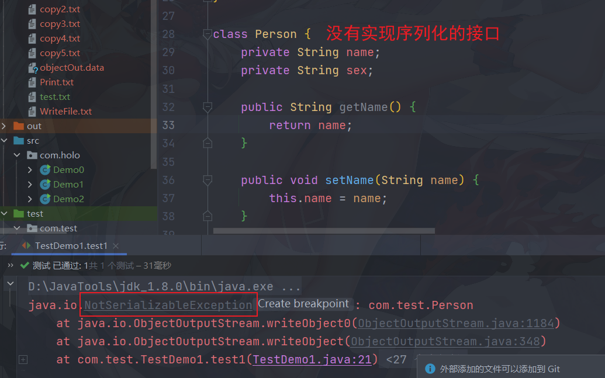
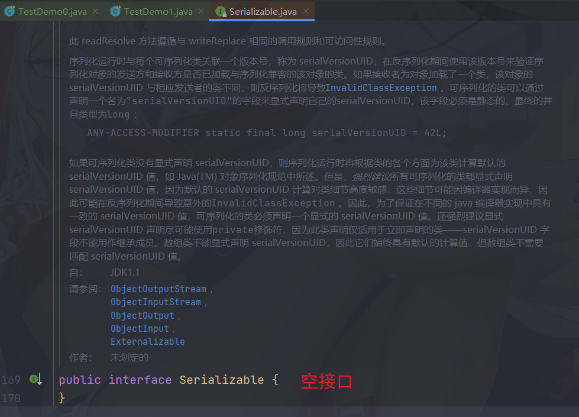
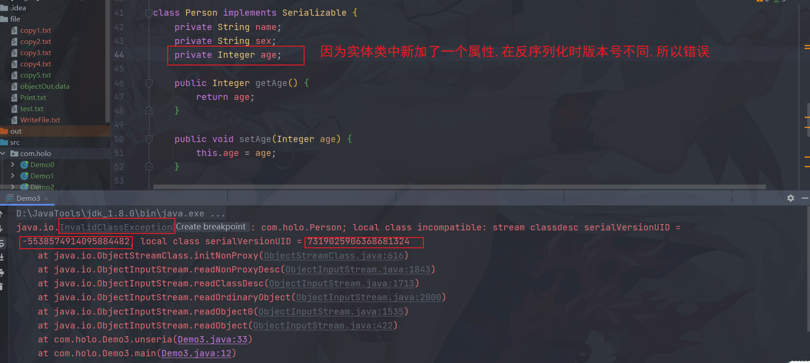

## 9.2 流的使用

### 9.2.1 自动关闭流

```java
package com.holo;

import java.io.*;

/**
 * @author Holo
 * @date 2022/2/22 16:50
 */
public class Demo0 {
    public static void main(String[] args) {
        try (InputStream inputStream = new FileInputStream("file/test.txt");
             OutputStream outputStream = new FileOutputStream("file/copy1.txt");) {
            //文件的复制
            int temp = 0;
            while ((temp = inputStream.read()) > 0) {
                //System.out.print((char)temp);
                //HelloWorld
                //中文  <--乱码               
                outputStream.write(temp);
            }
            //推荐显式的编写此方法
            outputStream.flush();
        } catch (IOException e) {
            e.printStackTrace();
        }
    }
}
```

+ flush()如果没有显式的调用,那么,在close关闭流的时候会自动的被调用

## 9.3 字符流

+ 字符流就是以字符为单位读取文件,这样中文就不会出现乱码

```java
package com.holo;

import java.io.FileReader;
import java.io.IOException;
import java.io.Reader;

/**
 * @author Holo
 * @date 2022/2/22 17:09
 */
public class Demo1 {
    public static void main(String[] args) {
        try (Reader reader = new FileReader("file/test.txt")) {
            //文件的复制
            int temp = 0;
            while ((temp = reader.read()) > 0) {
                System.out.print((char) temp);
                //输出:HelloWorld
                //    中文
            }
        } catch (IOException e) {
            e.printStackTrace();
        }
    }
}
```

### 9.3.2 字符输出流

#### 9.3.2.1 以覆盖方式输出数据

```java
public class Demo2 {
    public static void main(String[] args) {
        //以覆盖的方式
        try (Writer writer = new FileWriter("file/WriteFile.txt");) {
            writer.write("祝你虎年大吉嗷!");
            writer.write("\n");
            writer.write("有你好果汁吃的");
        } catch (Exception e) {
            e.printStackTrace();
        }
    }
}
```

#### 9.3.2.2 以追加方式输出数据

```diff
- try (Writer writer = new FileWriter("file/WriteFile.txt");) {...}
+ try (Writer writer = new FileWriter("file/WriteFile.txt",ture);) {...}
```

#### 9.3.2.3 以复制方式输出数据

```java
@Test
public void test2() {
    try (Reader reader = new FileReader("file/test.txt");
         Writer writer = new FileWriter("file/copy2.txt")) {
        //临时变量
        int temp = 0;
        while ((temp = reader.read()) > 0) {
            writer.write(temp);
        }
        //刷新输出流
        writer.flush();
    } catch (IOException e) {
        e.printStackTrace();
    }
}
```

## 9.4 缓冲流

+ 缓冲流主要就是为了提高效率,减少物理读取的次数;

+ 缓冲流分为:

  > **BufferedInputStream**:字节输入缓冲流
  >
  > **BufferedOutputStream**:字节输出缓冲流
  >
  > **BufferedReader**:字符输入缓冲流
  >
  > **BufferedWriter**:字符输出缓冲流

+ 字符缓冲流的方法提供了

  + `readLine()`可以读取一行数据

  + `newLine()`换行符

### 9.4.1 使用字节缓冲流改造复制

```java
@Test
public void test3() {
    //复制
    try (InputStream inputStream = new FileInputStream("file/test.txt");
         BufferedInputStream bufferedInputStream = new BufferedInputStream(inputStream);
         OutputStream outputStream = new FileOutputStream("file/copy3.txt");
         BufferedOutputStream bufferedOutputStream = new BufferedOutputStream(outputStream);) {
        //临时变量
        int temp = 0;
        while (((temp = bufferedInputStream.read()) > 0)) {
            bufferedOutputStream.write(temp);
        }
        bufferedOutputStream.flush();
    } catch (Exception e) {
        e.printStackTrace();
    }
}
```

### 9.4.2 使用字符缓冲流改造复制

```java
@Test
public void test4() {
    //复制
    try (Reader reader = new FileReader("file/test.txt");
         BufferedReader bufferedReader = new BufferedReader(reader);
         Writer writer = new FileWriter("file/copy4.txt");
         BufferedWriter bufferedWriter = new BufferedWriter(writer);) {
        //临时变量
        int temp = 0;
        while (((temp = bufferedReader.read()) > 0)) {
            bufferedWriter.write(temp);
            bufferedWriter.flush();
        }
        bufferedWriter.flush();
    } catch (Exception e) {
        e.printStackTrace();
    }
    System.out.println("success");
}
```

## 9.5 转换流

+ 主要就是**字节流**转为**字符流**
  + `InputStreamReader`  字节字符输入转换流
  + `OutputStreamWriter`字节字符输出转换流

### 9.5.1 改善复制代码

```java
@Test
public void test5() {
    //复制
    try (BufferedReader bufferedReader = new BufferedReader(new InputStreamReader(new FileInputStream("file/test.txt")));
         BufferedWriter bufferedWriter = new BufferedWriter(new OutputStreamWriter(new FileOutputStream("file/copy5.txt")));) {
        //临时变量
        String temp = null;
        while ((temp = bufferedReader.readLine()) != null) {
            bufferedWriter.write(temp);
            bufferedWriter.newLine();
        }
        bufferedWriter.flush();
    } catch (IOException e) {
        e.printStackTrace();
    }
}
```

## 9.6 打印流:就是输出流

### 9.6.1 分为:

+ 字节打印流:`PrintSteam`

+ 字符打印流:`PrintWriter`

### 9.6.2 案例:打印重定向

```java
@Test
public void test6() {
    try (OutputStream outputStream = new FileOutputStream("file/Print.txt");
         PrintStream printStream = new PrintStream(outputStream);){
        //设置输出的文件
        System.setOut(printStream);
        System.out.println("输出的文本");
    }catch (IOException e) {
        e.printStackTrace();
    }
}
```

## 9.7 对象流

+ 把Java对象转为二进制写入磁盘或者缓存的过程就是序列化
+ 从磁盘或内存中读取java对象的过程是反序列化

### 9.7.1 序列化



+ 自定义类必须实现序列化接口

```java
class Person implements Serializable {
    private String name;
    private String sex;

    public String getName() {
        return name;
    }

    public void setName(String name) {
        this.name = name;
    }

    public String getSex() {
        return sex;
    }

    public void setSex(String sex) {
        this.sex = sex;
    }
}
```

+ `Serializable`是一个标记性接口



### 9.7.2 反序列化

+ 就是把序列化的对象再读取出来

```java
//反序列化
    public static void unseria() {
        try (ObjectInputStream objectInputStream = new ObjectInputStream(new FileInputStream("file/objectOut.data"))) {
            //读取对象
            Person person = (Person) objectInputStream.readObject();
            System.out.println(person.getName());
            //输出:Leon
        } catch (Exception e) {
            e.printStackTrace();
        }
    }
```

### 9.7.3 使用序列化的版本号完善兼容性

```diff
class Person implement Serializable{
...
+ private Integer age;
...
}
```



```diff
class Person implements Serializable {
...
+ private static final long serialVersionUID = 1L
...}
```


+ `private static final long serialVersionUID = 1L;`解决了序列化版本冲突的问题

### 9.7.4 使用关键字序列化时忽略指定的属性

+ 序列化时,密码password不能序列化

```java
class Person implements Serializable {
    //添加一个版本号的属性
    private static final long serialVersionUID = 1L;
    private String name;
    private String sex;
    private Integer age;
    private transient String password;

    public String getPassword() {
        return password;
    }

    public void setPassword(String password) {
        this.password = password;
    }

    public Integer getAge() {
        return age;
    }

    public void setAge(Integer age) {
        this.age = age;
    }

    public String getName() {
        return name;
    }

    public void setName(String name) {
        this.name = name;
    }

    public String getSex() {
        return sex;
    }

    public void setSex(String sex) {
        this.sex = sex;
    }
}
```

+ 因为使用了`transient`,所以,在反序列化时,不能再获取对应的属性值了

```java
package com.holo;

import java.io.*;

/**
 * @author Holo
 * @date 2022/2/22 19:26
 */
public class Demo3 {
    public static void main(String[] args) {
        seria();
        unseria();
        //输出:Leon	20	null
    }

    //序列化
    public static void seria() {
        try (ObjectOutputStream outputStream = new ObjectOutputStream(new FileOutputStream("file/objectOut.data"));) {
            //创建对象
            Person person = new Person();
            person.setName("Leon");
            person.setAge(20);
            person.setPassword("KAI20020817");
            //写入文件
            outputStream.writeObject(person);
        } catch (Exception e) {
            e.printStackTrace();
        }
    }

    //反序列化
    public static void unseria() {
        try (ObjectInputStream objectInputStream = new ObjectInputStream(new FileInputStream("file/objectOut.data"))) {
            //读取对象
            Person person = (Person) objectInputStream.readObject();
            System.out.println(person.getName() + "\t" + person.getAge() + "\t" + person.getPassword());
        } catch (Exception e) {
            e.printStackTrace();
        }
    }
}
```

+ 笔试题:下列哪个属性可以被序列化?

```java
Class A{
    private String name;
}
Class B extands A implements Serializable{
    private String sex;
}
```

> 答:sex可以被序列化,name不能,因为A没有实现`Serializable`接口

